# RNVP Realtime Video Communication Engine

Reach-RTは**G4-04「厳密解との比較・アブレーション」完了**です。同じ候補に対する復号・作業情報の寄与と、小規模厳密解に対する短期選択の損失を比較できるようにしました。実通信104試行の計測監査、同一状態8,028問の再評価、単体3,080検査と旧方式の回帰が合格しました。

[実装意図・結果・限界](docs/Reach_RT_G4_Comparison.md)、[条件別の結果画面](artifacts/reach_g4_comparison_20260925/verification/final_01/index.html)、[完了判定](artifacts/reach_g4_comparison_20260925/verification/final_01/task_decision.json)、[実装進捗](docs/Reach_RT_Implementation_Progress.md)を参照してください。通常T1では両情報版が完了し共通情報版は未完了、通常T2では両情報版のほうが遅い結果でした。各条件1回の探索比較で、優位性は未認定。有限モデルでは160比較中78で短期選択が厳密解を下回り、最大差は成功確率7.03125ポイントでした。**G4は4/5、全体28/38項目、研究ゲート4/7。次はG4-05「予備実験の終了判定」**です。[G4-03の周期・代替処理](docs/Reach_RT_G4_Scheduler.md)、[G4-02校正の負の結果](docs/Reach_RT_G4_Prediction.md)、[G4-01実行層](docs/Reach_RT_G4_Actions.md)は当時の証拠として保持しています。

検証画面は`tools/open_reach_verification.cmd`をダブルクリックすると開き、上部の**G4-04 比較／G4-03 選択／G4-02 予測**ボタンで切り替えられます。[検証ページ](docs/Reach_RT_Verification.html)からも開けます。保存結果の閲覧で、実験を再実行しません。

**Visual StudioでCtrl+Shift+B → F5 → 左側Network Lab上部の「Research Live - T2」**を押すと、受信映像・認識・仮想ロボットが動く研究画面へ切り替わります。**「通常画面へ戻る」**で戻れます。同じプロセス内で切り替えるため、F5のデバッグを継続できます。ライブはG4-04両情報版のT2・20秒。途中で戻った実行は中断として記録します。[ライブ切替の実装・操作](docs/Reach_RT_Live_Switch.md)。

保存済み結果は、その下の「Reach-RT Results」から開きます。F1でUIを隠しても左上に両方のボタンが残ります。スタートアッププロジェクトは`GE3`です。[操作と確認範囲](docs/Reach_RT_Verification.md)を参照してください。

`tools/open_reach_app.cmd`は以前の結果閲覧版を起動する補助ファイルです。今回のライブ切替はVisual Studioから再ビルドして使ってください。

個別の画面を見る場合は、エクスプローラーで`tools`フォルダーの次のファイルをダブルクリックしてください。

- `open_reach_g4_comparison.cmd`：今回のG4-04比較結果。条件別の成功・時間・通信量、同一候補の判断差、厳密解との差を表示。
- `open_reach_g4_scheduler.cmd`：前工程G4-03検証結果。条件を選び、判断の列をクリックして選択・代替理由を確認。
- `open_reach_g4_scheduler_live.cmd`：G4-03の研究モードを20秒実行し、受信映像・認識・仮想ロボットの状態を表示。
- `open_reach_g4_prediction.cmd`：前工程G4-02の校正・誤差の結果を表示。
- `open_reach_g4_prediction_live.cmd`：G4-02の研究モードを20秒実行。受信映像・認識・ロボット位置等を表示し、終了後も閉じるまで画面を保持。途中で閉じると中断扱いになる。

`GE3.exe`の通常起動は従来の映像通信モードです。候補ごとの予測値を並べるライブUIは未実装で、予測値は実行ログへ保存します。新しい起動ファイルのGUI目視確認は未実施です。

C++ / DirectX 12 / Media Foundationで構築した、低遅延映像通信エンジンです。
独自UDPプロトコル`RNVP`により、カメラ映像または生成映像をH.264/MJPEG/Rawで送受信し、パケット欠損、ジッタ、再送期限、表示期限、エンコード負荷、デコード負荷を観測しながらQoEを守ることを目的にしています。

本プロジェクトは、単に映像を送るデモではなく、リアルタイム対戦・遠隔操作・低遅延映像共有で必要になる「古い完全フレームより新しい有効フレームを優先する」通信制御を実験できるネットワーク基盤です。

## Portfolio Highlights

- 独自UDPプロトコル`RNVP v1`を設計し、44byte固定ヘッダ、frame/chunk/sequence/stream/codec metadataを明示化。
- H.264 Annex-B access unitをRNVPで転送し、SPS/PPS/IDR同期、CRC検証、NAL整合性チェックを実装。
- ACK/NACK、deadline-based selective retransmission、XOR FEC、jitter buffer、display-deadline dropを組み合わせた低遅延回復制御。
- TransportFeedback、RTT、packet loss、jitter、queue delay trendを用いた帯域推定とQoE/Deadline adaptive control。
- packet pacingによりフレーム単位のburst送信を平滑化し、repair packetには優先度とdeadlineを付与。
- CSV/JSON/Markdown形式で実験ログを出力し、AB比較、FEC効率、NACK期限切れ、H.264同期リスクを分析可能。
- DirectX 12レンダリング、パーティクル、ポストエフェクト、低遅延present、カメラキャプチャを含む実アプリ上で検証。

詳細仕様: [RNVP v1 Protocol Specification](docs/RNVP_v1_Protocol_Spec.md)

## Architecture

```mermaid
flowchart LR
    Camera["Camera / Generated Frame"] --> Capture["Media Foundation Capture"]
    Capture --> Preprocess["Resize / NV12 Prepare"]
    Preprocess --> Encoder["H.264 / MJPEG Encoder"]
    Encoder --> AU["Access Unit Metadata\nPTS / CRC / SPS-PPS / IDR"]
    AU --> Packetize["RNVP Packetizer\nFrame / Chunk / Sequence"]
    Packetize --> FEC["XOR FEC\nGroup Parity"]
    Packetize --> Pacer["Packet Pacer\nBitrate / Deadline / Priority"]
    FEC --> Pacer
    Pacer --> Sim["Network Simulator\nLoss / Delay / Reorder / Duplicate"]
    Sim --> UDP["UDP Socket"]
    UDP --> Receiver["RNVP Receiver"]
    Receiver --> Reassembler["Frame Reassembler\nACK / NACK / FEC Recovery"]
    Reassembler --> Jitter["Jitter Buffer\nDisplay Deadline"]
    Jitter --> Decoder["H.264 / MJPEG Decoder"]
    Decoder --> Upload["Texture Upload / Color Convert"]
    Upload --> Render["DirectX 12 Renderer\nScene / VFX / Present"]

    Receiver --> Feedback["ACK / TransportFeedback / Control"]
    Feedback --> Controller["QoE / Deadline Adaptive Controller"]
    Controller --> Encoder
    Controller --> Pacer
```



## Core Components

| Area | Main files | Role |
| --- | --- | --- |
| Protocol | `network/PacketProtocol.h` | RNVP header, ACK, Ping/Pong, Control, TransportFeedback, FEC payload definitions |
| Sender | `network/NetworkManager.cpp` | RNVP packetization, sent-frame history, selective retransmission, FEC, pacing integration |
| Receiver | `network/UdpReceiver.cpp` | UDP receive loop, ACK/NACK/control feedback, transport feedback batching |
| Recovery | `network/FrameReassembler.cpp` | chunk reassembly, deadline NACK, FEC recovery, H.264 payload validation |
| Jitter control | `network/JitterBuffer.cpp` | release timing, stale-frame drop, ordered output |
| Adaptation | `network/AdaptiveStreamingController.cpp` | QoE scoring, bitrate/FPS/resolution decisions, congestion cause classification |
| Pacing | `network/PacketPacer.cpp` | media/repair packet pacing, queue deadline drop, pacing telemetry |
| Bandwidth | `network/BandwidthEstimator.cpp` | delivery rate, queue delay trend, RTT trend, jitter/loss trend |
| Codec | `network/H264Encoder.cpp`, `network/NetworkVideoReceiver.cpp` | Media Foundation H.264 encode/decode, low-latency codec settings |
| Reporting | `network/NetworkCsvLogger.cpp`, `network/NetworkExperimentReporter.cpp` | CSV/JSON/Markdown experiment output |

## Protocol Features

RNVP is frame-oriented, not byte-stream-oriented. Each frame is split into chunks and transmitted over UDP. The receiver reconstructs complete frames when possible, but stale or unrecoverable frames are dropped to protect interactivity.

| Feature | Implementation |
| --- | --- |
| Chunk metadata | `streamId`, `frameId`, `chunkIndex`, `chunkCount`, `sequence`, `sendTimeUs` |
| Low-latency recovery | deadline NACK, bounded selective retransmission, stale-frame rejection |
| FEC | group-level XOR parity, currently one missing chunk recoverable per protected group |
| H.264 safety | access-unit header, CRC32, IDR/SPS/PPS sync validation, Annex-B NAL validation |
| Congestion signals | packet loss, ACK missing rate, RTT, jitter, queue delay trend, delivery rate |
| QoE signals | displayed FPS, decode FPS, latency, deadline drops, output queue drops, freshness drops |
| Pacing | bitrate-based packet spacing, high-priority repair path, deadline drops for late queued media |

## Recent Log Evidence

直近の厳しめシナリオ`Custom_loss6_delay0-100_dup0_reorder6_burst0`では、約6% packet loss、0-100ms delay、6% reorderを想定しています。以下は60秒級ログの最終行から抜粋した代表値です。

| Log | Displayed | Avg FPS | Avg Latency | Loss | Deadline NACK | NACK Expired | Ack Stale | Late Repair | Pacing Max Queue | Cause |
| --- | ---: | ---: | ---: | ---: | ---: | ---: | ---: | ---: | ---: | --- |
| `network_20260613_012223.csv` | 1173 | 19.12 | 102.99ms | 6.3% | 4372 | 421 | 5287 | 276 | 36.86ms | Loss |
| `network_20260613_012327.csv` | 1185 | 19.32 | 103.16ms | 6.2% | 4411 | 414 | 5325 | 264 | 42.58ms | Loss |
| `network_20260613_012431.csv` | 1171 | 19.09 | 103.31ms | 6.2% | 4444 | 417 | 5321 | 264 | 36.34ms | RecoveryDeadline |
| `network_20260613_015408.csv` | 1161 | 19.89 | 102.06ms | 6.2% | 4159 | 354 | 5035 | 252 | 37.57ms | RecoveryDeadline |

Interpretation:

- H.264低遅延配信は成立しているが、厳しいloss/reorder条件では表示FPSが約19fpsまで落ちる。
- `Deadline NACK`と`Ack Stale`が多く、修復要求の一部が期限切れまたは無効化されている。
- `Late Repair`が残っており、再送packetの到着価値をさらに判定する余地がある。
- `Pacing Max Queue`は30-40ms台で、送信burst制御は効いているが、厳しい条件ではRecoveryDeadlineが支配要因になる。

## AB Experiment Summary

### H.264 tiny-missing feasibility gate

Source: `network_logs/last_h264_adjusted_feasibility_10seed_ab_summary.json`

| Variant | Seeds | Displayed | QoE2 rows | QoE3 rows | Expired H.264 key | Late repair after completed | Tiny critical sent | Tiny critical skipped |
| --- | ---: | ---: | ---: | ---: | ---: | ---: | ---: | ---: |
| off | 10 | 11867 | 88 | 3 | 693 | 3057 | 225 | 0 |
| on | 10 | 11909 | 90 | 4 | 614 | 3039 | 189 | 28 |
| delta | - | +42 | +2 | +1 | -79 | -18 | -36 | +28 |

Result:

- feasibility gateにより期限切れH.264 key frameは約11%減少。
- 一方でQoE2/QoE3の改善は明確ではなく、改善は「回復失敗の一部削減」に留まる。
- 次の課題は、key frame保護と再送価値判定を、よりframe type awareにすること。

### H.264 last-chance tiny key repair

Source: `network_logs/last_h264_last_chance_10seed_ab_summary.json`

| Variant | Seeds | Displayed | QoE2 rows | Expired H.264 key | Key emergency completed | Key emergency late completed |
| --- | ---: | ---: | ---: | ---: | ---: | ---: |
| off | 10 | 480 | 32 | 6 | 43 | 65 |
| on | 10 | 509 | 14 | 3 | 50 | 93 |
| delta | - | +29 | -18 | -3 | +7 | +28 |

Result:

- displayed framesとQoE2は改善。
- ただしlate completedも増えており、最後の救済は「効く場面」と「遅すぎる場面」の分離が必要。

## Demo Steps

### 1. Build

Visual Studio 2022で`TR2.sln`を開き、`x64`の`Debug`または`Release`で`GE3`をビルドします。

出力先:

```text
../generated/outputs/Debug/GE3.exe
../generated/outputs/Release/GE3.exe
```

### 2. Run default realtime demo

Visual Studioから`GE3`を起動します。カメラが利用可能な場合はMedia Foundation captureを使用し、利用できない場合は生成映像へフォールバックします。

### 3. Run H.264 low-latency mode

PowerShell例:

```powershell
$env:RNVP_CODEC='h264'
$env:RNVP_LOW_LATENCY_PRESENT='1'
..\generated\outputs\Debug\GE3.exe
```

### 4. Run automatic network experiment

```powershell
$env:RNVP_CODEC='h264'
$env:TR2_NETWORK_EXPERIMENT_AUTO='1'
$env:TR2_NETWORK_EXPERIMENT_SCENARIO='Custom_loss6_delay0-100_dup0_reorder6_burst0'
$env:TR2_NETWORK_EXPERIMENT_DURATION_SEC='60'
$env:TR2_NETWORK_EXPERIMENT_WARMUP_SEC='5'
..\generated\outputs\Debug\GE3.exe
```

### 5. Inspect logs

実行後、以下を確認します。

| File | Purpose |
| --- | --- |
| `network_logs/network_*.csv` | runtime telemetry, FPS, latency, loss, queue, encode/decode/present timings |
| `network_logs/network_events_*.csv` | key events and recovery-related events |
| `network_logs/frame_recovery_trace_*.csv` | per-frame recovery outcome, retransmit/FEC/NACK behavior |
| `network_logs/last_*_summary.json` | AB experiment summaries |

重要なCSV列:

- `receiveFps`, `decodeFps`, `displayFps`
- `currentLatencyMs`, `averageLatencyMs`, `currentJitterMs`
- `packetLossRate`, `missingPackets`, `sequenceGapPackets`
- `deadlineNackSentFrames`, `deadlineNackExpiredDroppedFrames`
- `retransmitLateAfterCompletedPackets`, `retransmitNotArrivedPackets`
- `pacingCurrentQueueDelayMs`, `pacingMaxQueueDelayMs`
- `h264EncodeMs`, `h264EncoderDelayMs`, `h264EncoderPendingFrames`
- `receiveFreshnessDroppedFrames`, `outputQueueDroppedFrames`
- `presentGpuWaitMs`, `presentMs`, `textureUploadMs`

## Current Engineering Assessment

Strengths:

- Transport, codec, renderer, telemetryが一体化しており、実アプリ上でネットワーク制御を検証できる。
- 低遅延通信に必要な「送る、待つ、直す、捨てる」の判断材料がログに残る。
- H.264 key frame / decoder sync / deadline recoveryまで観測しており、単純なUDPデモより深い。

Current limitations:

- 暗号化、認証、session id、capability negotiation、NAT traversalは未実装。
- congestion controlは実験段階であり、fairness、probe state、cwnd modelは今後の課題。
- XOR FECは軽量だが、burst lossや複数chunk欠損には弱い。
- H.264 key frame欠損時の同期復旧はまだ重く、stale ACK、deadline expired、late repairが残る。
- `NetworkManager`に送信、再送、FEC、adaptive FEC、ACK処理が集中しており、商用化には責務分離が必要。

## Roadmap

1. H.264 frame-type aware recovery
   - SPS/PPS/IDRを最優先保護し、P-frameはdeadlineに応じて捨てる。
   - key frame requestを状態機械化し、cooldown noiseとsync riskを分離する。

2. Unequal Error Protection
   - key frame、large AU、SPS/PPSに強いFECを割り当てる。
   - 通常P-frameは軽量FECまたは再送なしでlatencyを守る。

3. Production-grade congestion control
   - delay-based queue trend、loss-based backoff、probe-up/probe-downを明確に分ける。
   - pacing rate、repair budget、encoder bitrateを単一のbudget modelで管理する。

4. Security and session layer
   - session id、capability negotiation、authenticated control packet、replay protectionを追加する。

5. Maintainability
   - `NetworkManager`からRecoveryPolicy、FecPolicy、CongestionController、SessionManagerを分離する。
   - packet parser fuzz test、deterministic replay test、long-run leak testを追加する。

## Interview Summary

RNVP is a custom UDP-based realtime video transport built for interactive visual applications. It combines H.264 media transport, frame/chunk metadata, deadline-aware NACK, bounded retransmission, lightweight FEC, packet pacing, jitter buffering, transport feedback, bandwidth estimation, and QoE-driven adaptation.

The core design principle is that realtime video should not behave like a reliable file transfer. RNVP attempts to recover only the media that can still be displayed in time, and drops stale frames to preserve responsiveness.
