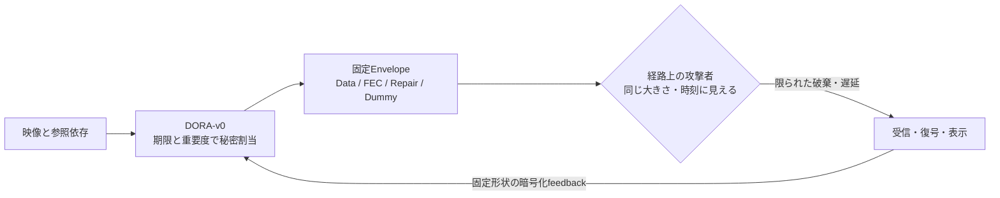

# BlindDrop-RT 研究計画書

| 項目 | 内容 |
|---|---|
| 文書状態 | 改訂研究計画・pilot前 |
| 中心分野 | Network Security / Real-Time Video / Reliable Transport |
| 中心成果 | attack benchmark、DORA-v0、RNVP v2、再現可能な実映像評価 |
| 非主張 | 完全なDoS防止、独自暗号、FEC単体の新規性、現時点での性能達成 |

## 研究題目

### 日本語題目

**BlindDrop-RT：因果的選択消失攻撃に対する、期限制約付き秘密冗長度割当によるリアルタイム映像通信**

### 英語題目

**BlindDrop-RT: Deadline-Constrained Secret Redundancy Allocation for Real-Time Video against Causal Selective Erasures**

## 一言で表すと

限られた帯域と遅延時間の中で、映像パケットごとの重要度に応じてFEC・再送・送信順序を内部的に最適化しつつ、その割当を通信経路上の攻撃者から隠す。これにより、過去の破棄結果と通信応答を利用する因果的攻撃者が得る映像破壊上の利得を、同一予算のimportance-blind攻撃に近づける。

## 30秒で分かる研究概要

暗号化された映像でも、packetの大きさ、時刻、feedback、再送burstは外から見える。攻撃者がこの「形」を利用すると、全通信を止めなくても、わずかなpacketだけを狙って映像を長く停止させられる可能性がある。

BlindDrop-RTは、外から見える送信形状を揃えたまま、その内部で重要な映像symbolへFECやRepairを多く割り当てる。攻撃者からはData、FEC、Repair、Dummyの区別がつかないため、限られた攻撃予算を重要packetへ集中しにくくなる。

| 観点 | 従来のRNVP v1 | BlindDrop-RTの目標 |
|---|---|---|
| 外から見える情報 | keyframe、chunk、FEC、再送反応が推定可能 | 最小Outer Header、固定Wire Cell、固定feedback |
| 損失対策 | 公開された規則によるFEC・再送 | private importanceとdeadlineに基づく秘密割当 |
| 想定損失 | 主に自然損失 | 自然損失に加え、観測から学習する因果的攻撃 |
| 成功条件 | 平均品質や通常損失耐性 | 絶対QoEを守りつつ、選択攻撃の追加利得を小さくする |



本研究は「攻撃を完全に防ぐ」とは主張しない。全packetを遮断できる攻撃者に可用性を保証することはできない。本研究の狙いは、自然損失に紛れる小さな予算の攻撃者が、暗号化通信の外形と反応から得る追加的な破壊能力を定量化し、制約付きで減らすことである。

## 社会的価値と利用場面

対象は、停止や同期喪失が判断・操作へ直接影響する低遅延映像である。

- 災害現場・危険区域における遠隔点検ロボット
- 遠隔操縦、ドローン、移動体からの状況映像
- クラウドゲームやXRなど、短いfreezeが操作性を損なうサービス
- 公共・産業設備の監視映像
- 悪意あるrelay、侵害された中継装置、選択的な無線妨害が疑われる経路

社会的価値は、単なる高画質化ではなく、少数packetへの攻撃で映像判断が大きく歪む非対称性を小さくする点にある。一方、Dummy通信による帯域・電力消費、既存の輻輳制御との共存、攻撃技術のdual-use性も評価対象とし、利点だけを報告しない。

## 成果物と成功判定

本研究の成果物を次の四点に限定する。

1. RNVP v1上で選択攻撃がblind攻撃を上回る条件を示す再現可能なattack benchmark
2. 固定Envelope内でFEC・Repair・Dummyを秘密割当するDORAアルゴリズム
3. RNVP v2の認証暗号、固定Cell、固定feedbackを含む動作実装
4. 同一映像・同一wire予算・同一攻撃予算による再現可能な評価datasetとLive Arena

研究継続の最低条件は、Phase 1で少なくとも一つの事前登録条件において、RNVP v1に対する選択攻撃の `DA_raw` が統計的にも実用上も無視できないことを確認することである。成立しない場合は防御実装を拡大せず、「どの条件では選択攻撃が成立しないか」を主結果へ切り替える。

## 1. 背景と問題

暗号化は映像内容を保護するが、通常はパケットサイズ、送信時刻、パケット数、burst、平文ヘッダ、feedback、再送反応まで隠さない。そのため、通信経路上の攻撃者は映像を復号できなくても、IDR、SPS/PPS、重要な参照フレーム、FEC、再送などを推定できる。

攻撃者の目的が全通信の遮断ではなく、自然損失に見える小さな予算で映像被害を最大化することである場合、ランダムな損失よりも選択的な損失が大きな被害を生む。特に、参照依存を持つ圧縮映像では、少数の同期用パケットの消失が、その後の複数フレームに影響する。

現在のRNVP v1は、次の情報を平文で送信している。

- packet type
- frameId
- chunkIndex / chunkCount
- keyframe flag
- retransmit flag
- codecType
- payload size
- ACK/NACKとmissing chunk番号
- FEC packetとFEC group情報

したがってRNVP v1は、重要度を完全に知るoracle攻撃、サイズ・時刻による推定攻撃、feedbackを利用する因果的攻撃を段階的に実装し、防御方式とのA/B比較を行う基盤として適している。

## 2. 研究課題

本研究が解く中心問題は、単なるパケットロス耐性向上でも、固定長暗号化そのものでもない。

> **因果的攻撃者のdamage advantageを、deadline・帯域・遅延制約下で最小化する秘密冗長度割当問題**

送信者は各映像symbolの重要度、参照依存、復号期限、回復状態を知っている。一方、攻撃者は暗号化された外部traceと、自分が過去に行った破棄・遅延、その後の通信応答のみを観測できる。

送信者は、固定された通信Envelopeの内部でData、FEC、Repair、Dummyを割り当てる。重要symbolへ多くの冗長度を与えても、その事実が外部のパケットサイズ、送信数、送信時刻、feedback量、再送burstとして現れないようにする。

## 3. 想定する因果的攻撃者

### 3.1 観測能力

攻撃者は送受信endpoint間の単一の観測・操作点に存在する。主実験ではsender直後のegress点を用い、攻撃判断にreceiverでの未来の到着時刻や復号結果を使わせない。receiver到着情報は、後から同じ観測点を通過した暗号化feedbackに含まれる外形としてのみ観測できる。

各wire packetについて次を観測する。

- UDP/IPの送信元・宛先
- 方向
- Outer Header
- wire packet number
- packet size
- 観測点への到着時刻と通過時刻
- 過去のpacket trace
- 過去に自分が行った破棄、遅延、並べ替え
- その後に観測された暗号化feedbackと送信tier変化

攻撃者は、現在時刻より後のpacket、receiverでの未通知の到着結果、復号後のInner Header、映像内容、秘密鍵を観測できない。

### 3.2 操作能力

攻撃者は、時刻 `t` までの観測履歴 `H_t^A` に基づき、現在のpacketに対して次の操作を選ぶ。

- 通過
- 破棄
- 制限時間内の遅延
- rolling window内の並べ替え

攻撃判断は未来のpacketを参照できない。この制約を本研究における「causal」と定義する。

### 3.3 攻撃予算

攻撃予算は、長時間平均ではなくrolling windowごとに制約する。破棄、遅延、並べ替えは別々の資源として定義し、遅延を無制限に多数のpacketへ適用できないようにする。

```text
任意のW packet窓における破棄数 <= floor(rho_drop * W)
任意のW packet窓における遅延packet数 <= floor(rho_delay * W)
任意のW packet窓における並べ替えpacket数 <= floor(rho_reorder * W)

rho_drop ∈ {0.01, 0.02, 0.03, 0.05}
rho_delay, rho_reorder は実験前に固定
連続破棄長 <= b_max
1 packetあたりの追加遅延 <= delta_A
総追加遅延量 <= Lambda_A per W
並べ替え距離 <= k_reorder
```

`W`、`b_max`、`delta_A`、`Lambda_A`、`k_reorder` は実験前に固定する。破棄のみ、遅延のみ、混合攻撃を別条件として報告し、異なる操作を恣意的に同じ「2%攻撃」へまとめない。

自然損失 `L_nat` と攻撃操作 `L_adv` の合成順序も固定する。主実験では、まず攻撃者が観測点で操作を決め、その後に記録済みnetwork traceによる自然損失・遅延を適用する。攻撃者は現在packetに対する未来の自然損失結果を知らない。自然損失のみ、攻撃のみ、自然損失と攻撃の合成を分けて報告する。

### 3.4 攻撃者の知識

攻撃者は方式、codec、公開パラメータ、学習用の別sessionを知るKerckhoffs型の攻撃者とする。秘密とするのは通信鍵、現在sessionの内部割当、秘密Permutationだけである。

同一映像の再送、既知映像、既知操作系列を利用するmulti-session攻撃も強い評価条件として含める。

### 3.5 対象外

- 全packetの完全遮断
- 物理回線の切断
- endpointの侵害
- 鍵の取得
- 暗号の解読
- 無制限の電波妨害
- 映像経路とは独立した制御系そのものへの攻撃

## 4. 形式化

### 4.1 Micro-Epochと通信Envelope

通信を `e = 1, 2, ...` のMicro-Epochに分割する。Epoch `e` のwire packet総数を `N_e` とする。

```text
x_e = (d_e, f_e, r_e, u_e)

d_e: Data packet数
f_e: FEC packet数
r_e: Repair packet数
u_e: Dummy packet数

d_e + f_e + r_e + u_e = N_e
```

外部から観測される `N_e`、wire size、送信slotは、映像の重要度やkeyframe発生ではなく、公開ネットワーク状態 `Z_e` のみによって決める。

`Z_e` に含めてよい情報は、攻撃者も観測または生成できる量に限定する。

- 集約された損失率
- RTT tier
- queue-delay tier
- 推定経路容量tier
- 事前に決めたrate-change時刻

keyframe、decoder同期状態、特定frameの欠落、Repair要求量などのprivate stateは、`N_e` やrate tierの直接入力にしない。

ここで用いる損失率とqueue情報は、映像symbolの回復成否ではなく、wire packet numberに対する認証済みの受信・時刻情報だけから集約する。同じwire受信履歴と公開パラメータが与えられれば、映像内容、keyframe位置、FEC成功の違いにかかわらず同じ `Z_e` とrate tierになることをproperty testで検証する。

攻撃者が意図的にlossを発生させてtier低下を誘発する可能性は残る。これは情報漏えいではなくavailability attackとして別に測り、tier変化回数、rate抑制時間、攻撃1 packetあたりの送信rate低下量を報告する。

### 4.2 秘密状態

送信者だけが知るEpoch `e` の秘密状態を `S_e` とする。

```text
S_e = {
  symbolごとの重要度,
  frame参照依存,
  keyframe / codec config情報,
  delivery deadline,
  receiver側の暗号化回復状態,
  Data / FEC / Repair / Dummy割当,
  FEC generation構成
}
```

DORAは `(S_e, Z_e)` を入力とし、外部Envelopeを変えずに内部割当 `x_e`、FEC generation、Repair対象、送信slotを選択する。

### 4.3 映像被害

主評価では、session時間に対する総freeze時間の割合を映像被害とする。表示frame間隔を `g_i`、事前登録したfreeze判定閾値を `theta_freeze` とし、同一のplayer・decoder・判定コードを全方式で使う。

```text
theta_freeze = max(100 ms, 3 * nominalFrameInterval)
totalFreezeTime = sum_i max(0, g_i - theta_freeze)
D(A, pi) = totalFreezeTime / sessionDuration
```

ここで `A` は攻撃方策、`pi` は送信・冗長度割当方策である。session開始前、正常終了後、利用者によるpause、capture停止はfreezeへ算入しない。decoderが前frameを再表示した時間、同期喪失、deadline missによる表示停止は算入する。判定閾値に依存した結論を避けるため、50、100、150msを用いた感度分析も報告する。

次は副評価指標として個別に報告する。

- 最大連続freeze時間
- undecodable frame率
- decoder同期回復時間
- keyframe再要求回数
- deadline内goodput
- VMAF / SSIM / PSNR
- 有効表示FPS

主指標へ恣意的な重みを導入しないため、これらを一つの合成QoE値へ統合しない。異なるdamage指標についても同じdamage advantageを別々に計算する。

### 4.4 Damage Advantage

同じ破棄率、rolling-window制約、burst分布、遅延予算を持つ、入れ子になった三種類の攻撃方策集合を定義する。

- `A_blind(B)`：session開始前にpacket indexに対する操作系列を確定するか、現在traceと独立な乱数だけで操作する。映像、packet size、feedback、過去の攻撃結果を入力にしない
- `A_selective(B)`：時刻 `t` までの外部観測履歴 `H_t^A` とprivate randomnessから現在packetの操作を決める。未来は参照しない
- `A_oracle(B)`：`A_selective(B)` の入力に、現在packetの真のrole、frame依存、marginal damage labelを追加する

構成上、次を満たすように実装する。

```text
A_blind(B) subseteq A_selective(B) subseteq A_oracle(B)
```

各集合には、同じ予算を使う複数の乱数方策、固定burst方策、学習方策を含め、その中の最大期待被害を比較する。

```text
D_blind(pi)    = sup_{A in A_blind(B)}    E[D(A, pi)]
D_selective(pi)= sup_{A in A_selective(B)}E[D(A, pi)]
D_oracle(pi)   = sup_{A in A_oracle(B)}   E[D(A, pi)]
```

これにより理論上は `D_blind <= D_selective <= D_oracle` となる。実験では無限の方策集合に対する真の `sup` を計算できないため、実装したattack ensembleによる経験的最大値を `D_hat` と表記する。論文中で `D_hat_selective` を因果的攻撃全体の真の最悪値と呼ばない。oracleも証明された情報理論的upper boundではなく、実験上の強い参照攻撃である。

生のdamage advantageを次で定義する。

```text
DA_raw(pi) = D_selective(pi) - D_blind(pi)
```

異なる映像・network condition間で正規化するため、Normalized Damage Advantageも用いる。

```text
NDA(pi) =
  (D_selective(pi) - D_blind(pi))
  / (D_oracle(pi) - D_blind(pi) + epsilon)
```

解釈は次の通りである。

- `NDA = 0`：選択攻撃にblind攻撃を超える利得がない
- `NDA = 1`：選択攻撃がoracleと同程度の利得を得ている
- `NDA < 0` または `NDA > 1`：入れ子集合に対する真値では生じないため、有限sample誤差またはattack optimizer不足を示す診断値

`D_oracle(pi) - D_blind(pi)` が事前に定めた閾値未満の場合は、正規化値が不安定になるためNDA対象外とし、`DA_raw` のみを報告する。`epsilon` と除外閾値は実験前に固定する。有限sampleでは順序が逆転する可能性があるため、点推定値だけで切り詰めずconfidence intervalとともに報告する。

NDAは解釈を助ける正規化指標であり、主たる統計検定は単位が明確なfreeze time ratioの `DA_raw` と `D_selective` に対して行う。

### 4.5 最適化問題

damage advantageだけを最小化すると、blind攻撃時の映像を意図的に悪化させて差だけを小さくする退化解が生じる。これを排除するため、BlindDrop-RTの中心を絶対QoE制約付きmin-max advantage問題として定義する。

```text
pi* = arg min_{pi in Pi_feasible}
      { D_selective(pi) - D_blind(pi) }

subject to:
  D_natural(pi)   <= tau_natural
  D_blind(pi)     <= tau_blind
  D_selective(pi) <= tau_selective
```

`D_natural` は攻撃なしの記録済み自然損失traceにおける被害である。`tau_natural`、`tau_blind`、`tau_selective` はpilot後、評価datasetを見る前に固定する。実行可能解が存在しない条件では制約を緩めて成功扱いにせず、「要求条件では実現不能」と報告する。

`Pi_feasible` は、下記のdeadline、wire帯域、追加遅延、安全性、輻輳応答制約をすべて満たす方策集合である。

実験上は一点の恣意的な閾値だけで結論を決めず、次の順序とPareto frontierを併記する。

1. 絶対被害制約を満たすか判定する
2. 実行可能な方策の中で `DA_raw(pi)` を最小化する
3. `DA_raw` の差が事前登録した実用差 `delta_DA` 未満なら、`D_selective`、追加wire byte、追加遅延の順で比較する
4. `D_selective`、`DA_raw`、wire overheadの三次元Pareto frontierを報告する

制約は次の通りである。

```text
各Epoch: d_e + f_e + r_e + u_e = N_e
wire bitrate <= 選択中のpublic bandwidth tier
p95 additional latency <= L_p95
maximum additional latency <= L_max
平均追加帯域 <= G_wire（pilot前の暫定値はg4 baseline比15%）
期限後に到着すると予測されるRepairは送信しない
輻輳signal検出後、原則として次のRTT以内にsecret-independentなrate低下を開始
feedback連続欠落時はmedia rateを低下または停止するcircuit breakerを作動
同一keyでのAEAD nonce再利用 = 0
未認証packetの受理 = 0
```

## 5. 提案方式 BlindDrop-RT

### 5.1 RNVP v2 Inner/Outer Header

Outer Headerには、配送と復号前処理に必要な最小情報だけを残す。

- protocol version
- connection ID
- wire packet number
- key phase

次の情報はAEADで保護されたInner Headerへ移す。

- Data / FEC / Dummy / Repair
- streamId
- frameId
- chunkIndex / chunkCount
- keyframe / codec config情報
- codecType
- delivery deadline class
- FEC generation
- Repair情報
- 実payload長

暗号にはAES-GCMまたはChaCha20-Poly1305などの既存AEADを用いる。独自暗号は作らない。

Outer Header全体はAEADのAdditional Authenticated Dataとして認証する。nonceは方向別keyの下で一意になるよう、key phase、方向、単調増加wire packet numberから決定的に構成する。再送は元packetのciphertextを再利用せず、新しいwire packet numberで再暗号化する。

プロトコル仕様には、key derivation、方向別key、nonce構成、packet number wrap前のrekey、replay window、認証失敗処理、key phase、connection IDのbindingを含める。暗号方式の安全性を本研究の新規性として主張せず、既知のtest vector、nonce重複検査、改ざん・replay testで実装上の安全性を確認する。

### 5.2 固定Wire Cell

RNVPのUDP payloadを原則1200 byteの固定Wire Cellとする。

```text
Outer Header
+ encrypted Inner Header
+ encrypted payload
+ encrypted padding
+ AEAD tag
= 1200 byte
```

Data、FEC、Repair、Dummy、feedbackを同じ長さと形式にする。ただしpath MTUが小さい環境では、session開始時のPath MTU検証により、より小さな固定cell sizeへ切り替える。IP fragmentationが観測されたsessionは通常結果へ混在させず、別条件として報告する。

1200 byteは初期値であり、最適値とは主張しない。800、1000、1200 byteについて、padding overhead、packet rate、CPU、loss sensitivityの感度分析を行う。

### 5.3 Public-Tier Micro-Epoch Pacing

10～20msのMicro-Epochごとに、あらかじめ定めたslotでpacketを送信する。keyframe発生、Repair発生、FEC量によってslot数や瞬間rateを変更しない。

通常のtier上昇は500ms～1秒などの固定境界に限定し、変化の入力を公開ネットワーク状態 `Z_e` に限定する。一方、輻輳、feedback連続欠落、受信者consent喪失に対するrate低下・停止は安全性を優先し、次のRTTまたは事前登録した短い境界で開始する。この緊急低下もraw wire delivery stateだけで決め、keyframeやRepair量を入力にしない。

同一の `Z_e`、wire受信履歴、攻撃履歴が与えられた場合、異なる映像重要度でも同じ外部送信scheduleになることを実装上の不変条件とする。tier変更規則、増減幅、circuit breaker、復帰条件を実験前に固定し、TCP/他UDP flowとの共存、queue delay、self-induced lossを評価する。

### 5.4 DORA: Deadline-Aware Oblivious Redundancy Allocation

DORAは、packet重要度を隠すこと自体ではなく、秘密状態を利用した冗長度割当によって因果的攻撃者のdamage advantageを最小化する機構である。

#### DORA-v0の入力・行動・損失

symbol `j` のonline状態を次で表す。

```text
s_j = {
  role: codec-config / IDR / reference / disposable,
  descendantsWithinHorizon,
  remainingDeadline,
  bytes,
  transmittedCopies,
  ackedOrFecRecovered,
  feasibleRepairRounds
}
```

重要度 `q_j` は、未来の実損失結果を参照せず、codec構造、同期role、有限horizon内の参照子孫数、残りdeadlineから計算する。係数はtraining videoだけで決め、test videoで再調整しない。oracle評価用の真のmarginal damage labelは、事前encode traceからsymbol `j` だけを除いたcounterfactual decodeと、実際のfreeze増分によってoffline生成する。online DORAはこのoracle labelを入力に使わない。

Epochの行動 `a_e` は、各slotへ割り当てるData、FEC generation、Repair、Dummyと、保護対象symbolの組である。候補行動集合は、cell数、deadline、generation size、送信済み状態を満たすものだけに限定する。

```text
L_hat(a_e, ell | S_e) =
  sum_j q_j * Pr_hat[j is unrecoverable before deadline | a_e, ell]
  + lambda_late * predictedLateCells
  + lambda_dummy * dummyCells

a_e* = arg min_{a_e in F_e}
       max_{ell in L_train(Z_e, B)} L_hat(a_e, ell | S_e)
```

`L_train` はtraining traceから作ったi.i.d.、burst、feedback probe、causal classifier攻撃の損失scenario集合である。これは全攻撃に対する証明された最適解ではなく、明示したscenario集合に対するrobust heuristicである。

DORAは各Epochで次を行う。

1. 未送信symbolと回復候補をdeadline順に列挙する
2. 参照依存、同期重要度、残り期限、回復可能性からprivate utilityを計算する
3. deadline内に有効なData、FEC、Repair候補だけを残す
4. 固定Envelope内で、最悪ケース被害を小さくする役割配分を選ぶ
5. 役割とFEC generationを暗号化する
6. slotへの配置を秘密Permutationで決める
7. 空slotはDummyで埋める

初期実装では複雑な学習器を用いない。DORA-v0は、役割ごとの候補数を事前に制限し、cell budgetを容量とする動的計画法またはbounded enumerationで解く。候補数を `M`、loss scenario数を `K` としたとき、1 Epochの計算量、p50、p95、最大実行時間を報告し、10～20ms Epoch内に終わらない場合は前Epochの安全な一様FEC方策へfallbackする。

online banditやreinforcement learningは中心実装に含めず、DORA-v0でH2が成立した後のstretch comparisonとする。これにより、改善が学習器の規模ではなく秘密割当という研究仮説から生じたかを検証できる。

以下は `N_e = 11` の説明用例であり、アルゴリズムそのものではない。

| 状態 | Data | FEC/Repair | Dummy | 合計 | 外部から見える差 |
|---|---:|---:|---:|---:|---|
| 通常 | 8 | 2 | 1 | 11 | なし |
| 高重要度symbolあり | 8 | 3 | 0 | 11 | なし |
| 公開loss tier上昇 | 7 | 3 | 1 | 11 | tier以外なし |
| 公開queue tier逼迫 | 9 | 2 | 0 | 11 | tier以外なし |

通常例ではg4相当の10 packetに対して11 packetなので、説明上のcell数増加は10%である。ただしこれは帯域目標の達成根拠ではない。実際の比較では、短い最終chunk、AEAD tag、固定長padding、両方向feedback、Dummy、IP/UDP headerを含むwire byte総量で計測する。

### 5.5 Secret Placement

Data、FEC、Repair、Dummyを、session keyから導出した配置keyによる疑似ランダム順序でslotへ配置する。

これは独立した主貢献とはせず、DORAの内部割当を外部から推定しにくくし、短いburstを複数frame・FEC generationへ分散する実現機構として位置づける。

鍵の効果を分離するため、順序変更なし、公開ランダムinterleaving、秘密Permutationを比較する。

### 5.6 Oblivious Feedback and Repair

feedbackは20～40msの固定境界で集約し、lossの有無にかかわらず同一cell数を送る。

- ACK/NACKを同じ固定Cellへ格納
- missing chunk番号を暗号化
- lossがない場合もcover feedbackを送信
- feedback送信時刻と個数を固定
- 再送には新しいwire packet numberと一意nonceを使用
- Repair、新規Data、FECを同じ形式で送信
- Repair発生時もEpoch総packet数を増やさない
- 認証されないfeedbackによってrateやRepair状態を変更しない

これにより、「候補を落とす、直後の再送を観測する、重要度を学習する」というprobe経路を抑制する。

### 5.7 Overload Policy

固定Envelopeでは、生成映像量がEnvelope容量を超えた場合の挙動が重要である。無制限にqueueへ蓄積すると、keyframe発生が将来の遅延やtier変化として漏れる。

そのため次を設ける。

- encoder target bitrateをEnvelopeの保証Data容量より低く制限する
- reserve marginを事前確保する
- deadlineを超えたsymbolは送信前に破棄する
- private backlogをrate tier変更の直接入力にしない
- overload時のframe選択はreceiver QoEのため内部で行うが、外部scheduleを変えない
- overflow、deadline miss、Dummy枯渇を必ず計測する

## 6. 学術的新規性

暗号化、header保護、固定長packet、constant-rate traffic shaping、padding、Dummy、FEC、unequal error protection、deadline-aware scheduling、interleavingには先行研究がある。

したがって、本研究は個々の要素を新規性として主張しない。

selective jammingをrandom jammingへ近づける上位目的、video-aware UEP、deadline下のFEC・再送最適化、secret-independent traffic shapingにも先行研究がある。したがって「選択攻撃をblind化する発想」や「FECと再送を最適化する発想」だけも新規性として主張しない。

本研究の新規性候補は、これらの交差部分にある次の三点へ限定する。最終的な「世界初」表現はsystematic literature review完了後にのみ使用する。

1. **実映像damage advantageを用いた絶対QoE制約付き目的**  
   分類精度や一般的情報漏えいだけでなく、因果的選択攻撃がimportance-blind攻撃を超えて獲得する実映像被害を、自然損失・blind・selectiveの絶対被害上限と同時に最適化する。

2. **外形を変えないprivate映像重要度ベースの回復資源割当**  
   deadline、wire帯域、追加遅延、固定Envelopeを同時に満たしながら、privateな映像重要度に基づいてData、FEC、Repair、Dummyを割り当て、割当自体をsize、timing、feedback、再送burstへ露出させない。

3. **feedback snoopingを含む映像システム閉ループ評価**  
   攻撃者が過去の破棄結果と双方向feedback外形を観測する条件で、暗号、FEC、再送、pacing、decoder同期、実映像QoEを一つの動作システム上で評価し、分類性能と破壊能力のずれも測定する。

| 既存領域 | 既存研究が扱う中心 | BlindDrop-RTで検証する差分 |
|---|---|---|
| Traffic Flow Confidentiality | size・timingと秘密情報の関係 | QoE破壊を目的とするactive causal attacker |
| Selective jamming対策 | high-value packetの分類阻止 | 圧縮映像のdeadline・参照依存・feedback反応 |
| Video-aware UEP | 重要frameへの公開FEC割当 | 固定Envelope内で割当を秘密化した場合の攻撃利得 |
| Deadline-aware recovery | FEC・再送と期限・帯域 | 攻撃者が回復反応を観測・利用するmin-max条件 |
| Causal erasure channel | rate・capacity・復号可能性 | 実codec、freeze、feedback、wire costを含むsystem評価 |

主張の中心を一文で表すと次のようになる。

> BlindDrop-RTは、固定通信Envelopeの内部で期限と映像依存を考慮した冗長度を秘密に割り当て、限られた予算を持つ因果的攻撃者のdamage advantageを最小化するリアルタイム映像トランスポートである。

## 7. 研究仮説

### H0: 攻撃成立性のgate

少なくとも一つの事前登録した映像・network・攻撃予算条件で、RNVP v1に対する強い因果的選択攻撃は、最良のblind攻撃よりfreeze time ratioを実用上意味のある量だけ増加させる。成立しない場合、H1以降を防御成功として評価しない。

### H1: 攻撃利得

BlindDrop-RTは、同一の破棄率、rolling-window制約、burst分布において、RNVP v1および重要度を公開するUEP方式より `DA_raw` と `D_selective` を低下させ、自然損失・blind攻撃時の絶対QoE制約も満たす。

### H2: DORAの効果

同一の固定Wire Cell、同一のEpoch数、同一の平均FEC量で比較した場合、DORAは一様FECよりも、因果的攻撃下の総freeze時間を短縮する。

### H3: Feedback秘匿の効果

固定scheduleのcover feedbackを用いることで、active probeを行う攻撃者の `DA_raw` と重要symbol分類AUCが低下する。AUC低下だけでH3成立とはせず、実際のfreeze damage低下を必須とする。

### H4: 制約適合性

探索目標として、BlindDrop-RTはg4 baseline比15%以内の平均追加wire byteと40ms以内の追加p95遅延を満たしながら、2%選択攻撃時のNDAを0.10以下にできる。

H4の数値は既知の達成値でも先行研究から導かれた閾値でもない。Phase 1と固定Cell overhead pilotの結果から実現可能区間を推定し、評価datasetを開く前に維持または修正する。修正履歴と理由を残し、探索目標と必須安全条件を分けて報告する。

## 8. 比較方式

最低限、次を比較する。

1. RNVP v1
2. RNVP v1 + Inner Header AEAD
3. AEAD + 固定Wire Cell
4. 固定Wire Cell + Micro-Epoch
5. 固定Envelope + 一様FEC
6. 固定Envelope + 重要度対応FECだが割当を外部へ公開する方式
7. 固定Envelope + DORA、feedback秘匿なし
8. BlindDrop-RT全機構
9. 完全固定レート + 一様FEC
10. IP-TFS/Pacer型のsecret-independent scheduleに相当するbaseline

配置方式は各方式について可能な範囲で次を分離する。

- interleavingなし
- 公開ランダムinterleaving
- 秘密Permutation

同じ有効Data量、同じwire byte予算、同じcodec出力を用いる比較を設け、単純な帯域増加による改善とDORAの効果を分離する。

公平性のため、比較を二種類に分ける。

- **System comparison**：各方式が同じ平均wire byte上限とlatency上限の中で最良になるようtraining setでparameterを調整する
- **Mechanism-isolation comparison**：cell size、slot数、codec output、平均FEC cell数、attack seedを固定し、比較対象の機構だけを変更する

各方式のparameter探索回数と探索範囲を揃え、BlindDrop-RTだけをtest setに合わせて調整しない。固定rate方式が帯域制約を満たせない条件も失敗として残す。

## 9. 攻撃方式

- RNVP v1平文ヘッダを読むoracle攻撃
- packet size規則攻撃
- burst・周期性攻撃
- IDR / codec-config分類器
- NACK・再送反応を利用するactive probe
- 過去の結果から方策を更新するcausal attacker
- 学習済み分類器とonline banditを組み合わせた攻撃
- 真のprivate importanceを知る実験上のoracle参照攻撃
- i.i.d. random drop
- 同じburst分布を持つimportance-blind drop
- rate tier境界を狙う攻撃
- 同一映像または既知映像を利用するmulti-session攻撃

攻撃器には防御方式と公開パラメータを知らせる。方式を知らない弱い攻撃者だけで有効性を主張しない。

攻撃器の比較にも同じ計算予算を与える。training session数、feature、model parameter数、online update回数、random restart回数を記録する。防御ごとに攻撃器を再学習し、あるbaselineで学習した分類器をそのままBlindDrop-RTへ適用した結果だけで安全性を主張しない。

最終testでは、開発中に使用した攻撃器に加え、未使用のholdout attacker familyを一つ以上用意する。攻撃者の選択を結果確認後に増減しないよう、attack ensembleと集約規則を事前登録する。

## 10. 評価設計

### 10.1 主評価指標

- selective攻撃下のfreeze time ratio `D_hat_selective`
- freeze time ratioに対するDA_raw
- 自然損失下およびblind攻撃下のfreeze time ratioが絶対QoE制約を満たす割合

NDAは異なる条件間の解釈を助ける副次的な正規化指標とする。主結論をNDAだけに依存させない。

### 10.2 副評価指標

攻撃性能:

- IDR / high-importance分類AUC
- precision / recall
- attack hit rate
- importanceと観測traceの条件付き相互情報量

映像被害:

- freeze回数
- 総freeze時間
- 最大連続freeze時間
- undecodable frame率
- decoder同期回復時間
- keyframe再要求回数
- deadline内goodput

品質:

- VMAF
- SSIM
- PSNR
- 有効表示FPS

リアルタイム性:

- capture-to-display遅延
- 平均追加遅延
- p95追加遅延
- 最大追加遅延
- jitter
- pacing queue滞留時間
- deadline前送信破棄数

コスト:

- UDP/IP wire byte増加率
- CPU使用率
- memory使用量
- AEAD処理時間
- Dummy比率
- FEC効率
- Repair成功率
- overflow回数

安全性不変条件:

- nonce再利用0件
- replay packet受理0件
- AEAD認証失敗packet受理0件
- 不正feedbackによる状態変更0件

### 10.3 実験方法

- 同じ事前encode済み映像traceを全方式へ入力する
- 同じattack seedと自然損失traceをpaired comparisonで再利用する
- 映像scene、GOP、bitrate、resolution、motion量を分ける
- 訓練映像と評価映像をvideo単位で分離する
- 同一映像の異なる区間をtrain/testへ混在させない
- network trace単位でもtrain/testを分離する
- `video × network trace × attack seed` を実験単位とし、方式間で完全に対応させる
- pilotの分散から、事前登録した最小実用差を検出するためのsample sizeを決める
- 主比較ではpaired bootstrap confidence intervalを用い、必要に応じてvideoとnetwork traceをrandom effectとする階層modelで頑健性を確認する
- 平均だけでなくmedian、p95、95% confidence interval、全paired difference分布を報告する
- H1～H4の主比較について多重比較補正を行い、探索分析と確認分析を分ける
- 主仮説、主指標、除外条件を実験前に固定する

### 10.4 再現性と失敗の扱い

- code revision、compiler、codec設定、GPU/CPU、OS、cell size、全乱数seedをmanifestへ保存する
- attack decision、wire packet、decoder event、display eventを共通時刻軸で追跡できるlog schemaを定める
- crash、decode失敗、overflow、deadline miss、認証失敗を欠測値として除外せず、原因別に報告する
- 実験途中で閾値や除外条件を変更した場合は、変更前後の結果を両方残す
- benchmarkに攻撃実装を含める場合は、閉じたtest環境、rate limit、明示的な利用許諾を前提とする

## 11. 研究目標値

目標を、安全上必ず満たす条件、pilot後に固定する実行可能性条件、達成を目指す探索目標に分ける。既知の達成値と誤解されないよう、現時点の性能数値には「暫定」を付ける。

### 11.1 必須安全条件

| 指標 | 必須条件 |
|---|---:|
| AEAD nonce再利用 | 0件、必須 |
| replay受理 | 0件、必須 |
| 未認証packet受理 | 0件、必須 |
| 未認証feedbackによる状態変更 | 0件、必須 |
| packet number wrap前のrekey失敗 | 0件、必須 |
| feedback/consent喪失時の無制限送信継続 | 0件、必須 |

### 11.2 Pilot後に固定する実行可能性guardrail

| 指標 | 暫定guardrail |
|---|---:|
| 自然損失下のfreeze増加 | g4 baselineに対する許容差をpilot後固定 |
| blind攻撃下のfreeze増加 | 一様FECに対する許容差をpilot後固定 |
| 追加p95遅延 | 40ms以下（暫定） |
| 追加最大遅延 | 60ms以下（暫定） |
| g4 baseline比の平均追加wire byte | 15%以下（暫定） |
| sender / receiver CPU増加 | 各10%以下（暫定） |

### 11.3 探索目標

| 指標 | 暫定探索目標 |
|---|---:|
| 主要attack条件でのfreeze NDA | 0.10以下 |
| 通常分類器のAUC | 0.60以下 |
| adaptive attackerのAUC | 0.65以下 |
| 2%攻撃時の総freeze時間 | RNVP v1比50%以上削減 |
| 2%攻撃時の総freeze時間 | 固定Envelope一様FEC比20%以上削減 |
| decoder同期回復時間 | RNVP v1比50%以上短縮 |

帯域は無保護映像ではなく、同じcodec出力をg4 FECで送信した場合の両方向UDP/IP wire byte総量を基準にする。探索目標を未達でも、安全条件と実験設計を満たしたnegative resultは研究失敗として隠さない。

## 12. 実装順序

### Phase 0: 仕様固定と再現性基盤

1. threat model、freeze定義、attack budget、主仮説、除外条件を事前登録する
2. `video × network trace × seed` のdataset splitを固定する
3. packet、attack、decoder、displayを結ぶ共通event logとpaired runnerを作る
4. RNVP v1 baselineの再現性と測定誤差を確認する

### Phase 1: 攻撃成立性

5. RNVP v1平文ヘッダoracle攻撃
6. packet size・時刻による分類攻撃
7. 同一予算のblind、selective、oracle攻撃比較
8. freeze damage、DA_raw、NDA計算基盤

**Gate 1:** H0が成立する条件が一つもなければ、Phase 2以降の全面実装へ進まず、攻撃が成立しなかった条件と理由をまとめる。

### Phase 2: 外部traceの正規化

9. RNVP v2 Inner/Outer Header
10. AEAD、nonce、replay protection
11. 固定Wire Cellとcell size感度分析
12. Public-Tier Micro-Epoch pacerとcircuit breaker
13. 固定schedule feedback

**Gate 2:** 固定Cellとfeedbackだけでwire overheadまたはlatency guardrailを満たせなければ、DORAへ進む前にEnvelope設計を見直す。

### Phase 3: 中心提案

14. 固定Envelope内のData/FEC/Repair/Dummy管理
15. DORA-v0とdeadline feasibility判定
16. 秘密FEC generation
17. 公開interleavingと秘密Permutation
18. adaptive causal attacker

**Gate 3:** 同一wire予算でDORA-v0が一様FECを上回らなければ、banditやRLで結果を追わず、importance modelまたは研究仮説を再検討する。

### Phase 4: 検証

19. mechanismごとのablation
20. 同一wire予算での一様FEC比較
21. 複数映像・複数network trace・複数seed評価
22. holdout attackerによる最終評価
23. BlindDrop Live Arena制作

中心研究の範囲は、H.264、現在のXOR g4 FEC、破棄中心の因果的攻撃、DORA-v0までとする。Reed-Solomon、Raptor、streaming code、online bandit、reinforcement learning、複数codecは、中心仮説が成立し時間に余裕がある場合だけ行うstretch goalとする。

## 13. デモ構成

デモ名は **BlindDrop Live Arena** とする。題材は災害現場の遠隔点検ロボットとする。

画面を三分割する。

左: RNVP v1

```text
SELECTIVE LOSS: 2%
VIDEO SYNC LOST
FROZEN: 2.84 s
```

中央: 因果的攻撃者

```text
Observed: size / time / direction / feedback envelope
Attack budget: 2%
Estimated target confidence: measured value
Damage advantage: measured value
```

右: BlindDrop-RT

同じ映像、同じwire byte予算、同じ攻撃器、同じ破棄率で映像を継続表示する。Data、FEC、Repair、Dummyは送信中には同じpacketとして表示し、受信・復号後にだけ役割を可視化する。

単に「BlindDropの方が多く送っている」デモに見えないよう、三方式の累積wire byte、破棄packet数、追加遅延を常時表示する。

デモへ表示する数値は事前収録した最良runではなく、現在runの測定値とconfidence interval、または固定済みbenchmark全体の集約値とする。目標値や説明用の仮数値を実測値として表示しない。攻撃が成立しないsceneやBlindDrop-RTが不利になる条件も切り替えて表示できるようにする。

### 13.1 限界・倫理・dual-use

- 全遮断、endpoint侵害、鍵取得に対する可用性は保証しない
- 単一観測点で有効でも、複数観測点やendpoint近傍の強い攻撃者に同じ効果があるとは限らない
- 固定Envelopeは帯域・電力を消費するため、低容量回線では保護による便益を上回る可能性がある
- 攻撃器は許諾されたlocal testbedまたはoffline traceだけで実行し、第三者通信へ適用しない
- 公開artifactでは攻撃再現性と悪用容易性のバランスを検討し、rate limit、実行範囲、利用上の注意を付ける
- 防御方式が選択攻撃を完全に検知・防止する、あるいは映像内容そのものを匿名化するとは表現しない

## 14. 先行研究に対する位置づけ

### 14.1 主要な近接研究

| 領域・文献 | 確立済みの内容 | BlindDrop-RTが重複を避ける境界 |
|---|---|---|
| Cryptex / RFC 9335 [1] | SRTPで残るRTP header extensionとCSRCの秘匿 | header暗号化自体を新規性にしない |
| IP-TFS / RFC 9347 [2] | 固定サイズpacket、aggregation、fragmentation、paddingによるTraffic Flow Confidentiality | 固定CellやDummy自体を新規性にしない |
| Pacer [3] | secret-independent traffic shapeとflow/congestion/loss-recovery signalの両立 | secret-independent schedule自体を新規性にしない |
| NetShaper [4] | 差分プライバシー保証を持つ可変traffic shapingとvideo評価 | 一般的なtraffic privacy保証ではなくactive damageを対象にする |
| Proaño and Lazos [5] | high-importance packetを狙うselective jammerと、分類を妨げrandom jammerへ近づける対策 | 「selectiveをblindへ近づける」上位発想自体を新規性にしない |
| Díaz et al. [6] | frame重要度、channel状態、bitrate制約に基づくvideo-aware FEC/UEP | importance-aware FEC自体を新規性にしない |
| Hairpin [7] | deadline下におけるData、再送、冗長packetの共同最適化 | FEC・再送の期限付き最適化自体を新規性にしない |
| Causal erasure channels [8] | 過去と現在だけを観測するonline adversaryのcapacity理論 | causal attackerという名称・形式だけを新規性にしない |
| Feedback snooping channel [9] | receiver feedbackを観測するonline adversary | feedback snooping自体を新規性にしない |

BlindDrop-RTの候補差分は、これらを単に並べることではない。privateな映像重要度を回復資源の割当に利用しながら、その割当を固定Envelopeの外形へ出さず、feedbackを利用する因果的攻撃者の追加実映像被害を、絶対QoE・deadline・wire cost制約の下で最適化・実測する点にある。

### 14.2 新規性確認の手順

実装完了を新規性の証拠にしない。論文執筆前に次を行う。

1. `selective jamming/drop + video + encrypted traffic analysis + UEP/FEC + feedback + deadline` の組合せでsystematic searchを行う
2. title/abstract screeningとfull-text screeningの採否理由を表に残す
3. 近接研究ごとにthreat model、観測、操作、目的関数、deadline、feedback、実codec、評価指標を比較する
4. 同一または包含関係にある研究が見つかった場合、世界初主張を撤回し、再現・拡張研究として位置づけ直す

### 14.3 参照文献

1. J. Uberti et al., “Completely Encrypting RTP Header Extensions and Contributing Sources,” RFC 9335, 2023. <https://www.rfc-editor.org/rfc/rfc9335.html>
2. D. E. Hopps, “Aggregation and Fragmentation Mode for Encapsulating Security Payload and Its Use for IP Traffic Flow Security,” RFC 9347, 2023. <https://www.rfc-editor.org/rfc/rfc9347.html>
3. A. Mehta et al., “Pacer: Comprehensive Network Side-Channel Mitigation in the Cloud,” USENIX Security 2022. <https://www.usenix.org/conference/usenixsecurity22/presentation/mehta>
4. A. Sabzi et al., “NetShaper: A Differentially Private Network Side-Channel Mitigation System,” USENIX Security 2024. <https://www.usenix.org/conference/usenixsecurity24/presentation/sabzi>
5. A. Proaño and L. Lazos, “Selective Jamming Attacks in Wireless Networks,” IEEE ICC 2010. <https://doi.org/10.1109/ICC.2010.5502322>
6. C. Díaz et al., “A Video-Aware FEC-Based Unequal Loss Protection System for Video Streaming over RTP,” IEEE Transactions on Consumer Electronics, 2011. <https://doi.org/10.1109/TCE.2011.5955188>
7. Z. Meng et al., “Hairpin: Rethinking Packet Loss Recovery in Edge-based Interactive Video Streaming,” USENIX NSDI 2024. <https://www.usenix.org/conference/nsdi24/presentation/meng>
8. Z. Chen, S. Jaggi, and M. Langberg, “The Capacity of Online (Causal) q-ary Error-Erasure Channels,” IEEE Transactions on Information Theory, 2019. <https://doi.org/10.1109/TIT.2019.2898863>
9. V. Suresh, E. Ruzomberka, and D. J. Love, “Stochastic-Adversarial Channels: Online Adversaries With Feedback Snooping,” 2021. <https://arxiv.org/abs/2104.07194>
10. L. Eggert et al., “UDP Usage Guidelines,” RFC 8085, 2017. <https://www.rfc-editor.org/rfc/rfc8085.html>
11. D. McGrew, “An Interface and Algorithms for Authenticated Encryption,” RFC 5116, 2008. <https://www.rfc-editor.org/rfc/rfc5116.html>

## 最終要約

本研究は、暗号化されたリアルタイム映像に対し、通信経路上の攻撃者がpacket size、時刻、burst、feedback、再送反応から重要packetを推定し、小さな予算で選択的に消失させる攻撃を扱う。

BlindDrop-RTは、固定Wire Cell、Public-Tier Micro-Epoch、固定通信Envelope、秘密feedback、秘密配置を用いて外部traceを正規化する。その内部でDORA-v0が、symbol重要度、参照依存、残りdeadline、回復状態を利用し、Data、FEC、Repair、Dummyを制約付きで割り当てる。

研究の中心的な問いは、次の一点である。

> **自然損失・blind攻撃・selective攻撃時の絶対QoE、deadline、帯域、追加遅延を守りながら、秘密冗長度割当により因果的選択攻撃者のdamage advantageをどこまでimportance-blind攻撃へ近づけられるか。**

この問いに対し、RNVP上の実装、強い因果的攻撃器、同一wire・攻撃予算のbaseline、holdout attacker、実映像QoEを用いて答える。結果が目標値を満たさない場合も、成立条件と限界を再現可能な形で示す。
