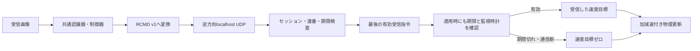

# Reach-RT G1-05：指令UDP・期限・通信断時の制動

更新日：2026-09-21。G1-05完了。G1は5/6項目、全タスクは12/38項目完了。研究ゲートはG0のみ1/7で、18初期姿勢の閉ループ確認は次のG1-06で行う。

## 1. 専門の場で説明する要約

> 受信画像から作った移動指令を、映像とは逆方向のUDPで仮想ロボットへ届ける機能を実装しました。各指令に実行セッション・連番・生成時刻・絶対期限を持たせ、古い指令が遅れて届いても新しい指令を上書きできないようにしています。ロボット側は有効な受信指令だけを適用し、期限切れでは停止指令を選びます。通信断の監視も受信側に置き、速度が瞬時にゼロになるのではなく、所定の減速度で停止することを、送受信ログと物理ログの対応から検証しました。

本体はC++。Pythonは起動と独立した検証に使う。１台のWindows PC、共通の単調時計、`127.0.0.1`、１プロセス内の論理モジュールという前提を維持する。

## 2. 実装と意図

| 実装 | 入力 → 処理 → 出力 | 意図 |
|---|---|---|
| [CommandProtocol](../research/ReachCommandProtocol.cpp) | 画像由来の指令 → 固定88 byteのRCMD v1 → 受信時の復元・検査 | 構造体の生メモリや共有状態で指令を渡さない |
| [CommandUdp](../research/ReachCommandUdp.cpp) | シリアライズ済み指令 → 別々の送信/受信UDPソケット → 受信側状態 | 実際のUDP送受信を経由した指令だけを適用する |
| `CommandGuard` | 受信バイト列・共通時計 → セッション/値/連番/期限の検査 → 最後に受理した指令 | 重複・古い指令・不正な入力による上書きを防ぐ |
| 期限・ウォッチドッグ | 絶対期限と最後の有効受信時刻 → 停止目標 | 通信断でも古い移動指令が残り続けないようにする |
| 物理更新 | 受信側が選んだ速度目標 → 100 Hzの加減速 → 新しい位置・速度 | 現実の制動時間・距離をモデル上で表現する |
| 検証とログ | 送信/受信バイト列・判定・適用指令・真の速度 → 独立照合 | 「停止させるコードがある」だけで完了にせず、実際の動きを確かめる |

`command_udp` stageでは、物理更新が参照するのはUDP受信側の`CommandApplication`だけである。制御器の`MotionCommand`をそのまま適用する経路は使わない。G1-04のローカル診断は別の`visual_control` stageに残した。



両ソケットはloopbackの自動割当ポートにbindし、受信側は予定した送信元アドレス・ポートも検査する。各runのセッション・ポート・受信状態は独立している。セッションIDとCRCは暗号学的な認証ではなく、外部ネットワークに対する認証機能を実装したとは扱わない。

## 3. RCMD v1の通信形式

整数はすべてbig endian。UDPペイロードは固定88 byte。C++構造体のメモリ配置に依存しない。未実装のACK・再送・FECを暗黙に使わず、制御周期20 Hzで新しい指令を送る。

| offset | byte数 | 内容 |
|---:|---:|---|
| 0 | 4 | ASCII `RCMD` |
| 4 | 2 | version=1 |
| 6 | 2 | packet size=88 |
| 8 | 16 | GUIDの標準表記からハイフンを除いた順のセッションID |
| 24 | 8 | 指令連番、1から開始。0は欠測用、循環再利用なし |
| 32 | 8 | 生成時刻、共通単調時計のµs |
| 40 | 8 | 絶対期限、生成時刻+100,000 µs |
| 48 | 8 | 根拠画像の撮影時刻、画像なしは0 |
| 56 / 60 | 各4 | 根拠frame ID / stream ID、画像なしは両方0 |
| 64 / 68 | 各4 | 符号付き速度 / 角速度。単位は10⁻⁶ m/s、10⁻⁶ rad/s |
| 72 / 74 | 各2 | 状態 / 理由の列挙値。対応はソースの`States` / `Reasons`で固定 |
| 76 | 4 | bit 0：画像推定上の完了。他のbitは0 |
| 80 | 4 | 予約、0 |
| 84 | 4 | 先頭84 byteのCRC-32（反転多項式0xEDB88320、初期/最終xor 0xffffffff） |

速度の量子化誤差は最大0.5×10⁻⁶。NaN/Infinity・範囲外値は送信APIで拒否し、受信側もv=0～0.30 m/s、|ω|≤0.8 rad/sなどを検査する。整数形式なのでNaNをワイヤ上の値として扱うことはない。画像なしはframe/stream/captureがすべて0で、移動・推定完了を指示する指令には有効な根拠画像が必要。

不正長、未知バージョン、予約bit、CRC不一致、未知列挙、生成時刻の矛盾、期限の延長、別セッション、未来の指令を拒否する。未来・別セッションなどの不正な大きい連番によって、後続の正常指令を締め出さない。

## 4. 期限と通信断の意味

| 判定 | 具体的な動作 |
|---|---|
| 同じ連番 | `duplicate`として拒否。有効受信時計を更新しない |
| 観測済みより小さい連番 | `reordered`として拒否。新しい指令を巻き戻さない |
| 受信時点でnow≥絶対期限 | `expired_on_arrival`。適用も監視時計の更新もしない |
| 正常形式の新しい期限切れ指令 | 連番の上限だけは進める。さらに古い指令を復活させない |
| 適用時点で期限切れ | `command_expired`、速度目標v=0/ω=0 |
| 最後の有効受信から250 ms以上 | `watchdog_timeout`、速度目標v=0/ω=0 |
| 起動後に一度も有効受信がない | 初めから停止。起点から250 msでwatchdog timeout |
| 通信回復 | 同じセッションの新しい連番で、生成時刻と期限が有効な指令だけを受理して再開 |

**100 msの期限が先に制動を始め、250 msのウォッチドッグはその後も通信断を監視する。** 「250 ms待ってから停止を始める」「受信した瞬間から100 ms有効にする」という動作ではない。適用時の時計判定は各物理更新の前に行う。

停止目標を選んでも、モデルの速度を直接ゼロにしない。並進は0.60 m/s²、旋回は1.6 rad/s²で減速する。最高並進速度0.30 m/sからなら、理想的な制動時間は0.30/0.60=0.50秒、制動距離は0.30²/(2×0.60)=0.075 m。これに期限を待つ間の移動が加わる。

この監視は実行中のプロセスが周期的に判定するソフトウェア機能である。プロセス停止・OS停止から独立したハードウェア安全装置や、実機の停止保証ではない。PCのスケジューリングが実験の許容範囲を超えた場合は、従来どおり試行を無効として記録する。

## 5. 検証結果

Release x64成功。最終exe SHA-256：`ed0a671706d0f8275d26f7a6cf4797c3c072f079b1556e6e814903d079945bdf`。

[最終７ケースのレポート](../artifacts/reach_g1_command_20260921/verification/acceptance_final_01/report.json)は、実H.264・映像UDP・画像認識・指令UDP・物理更新を含む。

| ケース | 診断条件 | 最終結果 |
|---|---|---|
| 通常、12秒 | 障害なし | 240指令受理。T2中央でUDPを経由した目標到達 |
| 重複、3秒 | 全指令を２通ずつ送る | 60受理、60重複拒否。監視時計の延命なし |
| 順序逆転、3秒 | 指令20だけ80 ms待たせる | 59受理、指令20を古い連番として１件拒否 |
| 遅着、4秒 | 全指令を150 ms待たせる | 到着76通をすべて期限切れ拒否、未送信４通は終了時保留として記録。移動せず、watchdogも動作 |
| 通信断、4秒 | 指令41以降を送信前に落とす | 40受理後に期限切れ・watchdog・制動・停止。断中の再移動なし |
| 通信断から復帰、6秒 | 指令41～80を落とす | 制動・停止後、81以降の新しい有効指令で再開。計80受理 |
| 不正入力、3秒 | 正常指令20に別セッション・CRC破損・短い電文・未来の大きい連番を追加 | 不正４通を理由付きで拒否。正常60指令の継続を妨げない |

全体で700指令生成、680 UDPデータグラム送信・680受信。送受信バイト列が一致し、意図しない指令UDP不着は0。映像は1,050枚の撮影情報が一致。3,500物理刻みについて、その時点で受理済みのUDP指令だけを使っていること、期限/監視判定、速度目標と加減速を独立に照合した。

通信断・復帰の両ケースで、制動開始前0.30 m/s、制動時間0.50秒、制動中の移動距離0.075 mを確認した。最終断の検出遅れは期限から5.288 ms、復帰ケースでは11.613 ms。最後の有効受信から物理ログ上の停止を記録するまで、それぞれ603.117 ms / 597.428 msだった。固定刻みのシミュレーション時間と、実時計の観測時間を混同しない。

指令経路のIP層送信試行量は78,842 byte。各sendto試行にUDPペイロード+28 byte（IPv4 20+UDP 8）を計上する。重複や不正な診断電文も含め、送信前に落とした80指令と未送信保留４指令は送信量に含めない。映像・FEC・ACK等も含む研究全体の予算集計を完成した値ではない。

[単体レポート](../artifacts/reach_g1_command_20260921/verification/units_final_01/report.json)：指令178、認識・制御30、世界・台帳280、基盤663の検査に合格。指令178には71刻み×２種類の減速検査が含まれ、178種類の独立した障害条件ではない。最大速度での旋回制動は単体でも確認した。認識の較正54観測も再確認した。

[基盤回帰](../artifacts/reach_g1_command_20260921/verification/foundation_regression_01/report.json)12ケース合格。旧`visual_control` stageも同じexeで３秒実行し、90枚照合・60ローカル指令の動作を確認した。旧stageの存在を新stageのUDP検証の代わりには使っていない。

途中の`outage_smoke_01`と`acceptance_01`も保存した。単体の初版では「未来の指令」のテストデータが同時に古すぎる画像を移動根拠にしており、送信APIが先に拒否した。根拠画像の時刻を直し、受信側の未来時刻検査を独立に試験した。GUIDの余分な区切りを拒否する検査も追加した。

## 6. 起動とログ

[通常のG1起動](../tools/open_reach_g1.cmd)と[G1-05専用起動](../tools/open_reach_g1_command.cmd)はT2・15秒・指令UDPの通常通信を起動する。条件は[command JSON](../config/reach_rt_g1_command.json)。画面に「生成指令」と「UDP受信後に適用する指令・理由」を分けて表示する。画面全体の文字切れ・配置の目視確認は未完了。

```powershell
powershell -NoProfile -ExecutionPolicy Bypass -File tools/build_reach_g0.ps1 -Configuration Release -OutputName reach_g1_command_20260921
python tools/run_reach_g1.py --stage command_udp --name my_udp_01 --show
python tools/run_reach_g1.py --stage command_udp --command-scenario outage --duration 4 --name my_outage_01 --show
python tools/run_reach_g1.py --stage command_udp --command-scenario recovery --duration 6 --name my_recovery_01 --show
python tools/verify_reach_command.py --name my_acceptance_01
python tools/verify_reach_visual_units.py --name my_units_01 --build-name reach_g1_command_20260921 --include-command
```

名前は未使用のものを指定する。標準の障害条件は`command_model.json`へ保存する。これらはG1の動作確認用で、G2の容量・ジッタ・ランダム損失を持つ回線モデルではない。診断用遅延キューは64通まで、受信処理は１回256通までに制限し、過大な処理で無制限に物理更新を遅らせない。

| ログ | 確認できること |
|---|---|
| `commands.csv` | 制御器が生成した指令と根拠画像 |
| `command_tx.csv` | 送信/診断破棄、予定時刻・実時刻、IP byte数、実際のバイト列 |
| `command_rx.csv` | 受信時刻、バイト列、受理/拒否理由、連番上限、最後の有効受信時刻 |
| `udp_applied_commands.csv` | 各物理刻みで選ばれた受信指令、期限、状態、実適用する目標速度 |
| `world.csv` | 加減速した後の位置・速度と真値評価。制御への入力にはしない |
| `command_model.json` / `command_udp_summary.json` | 固定条件、ポート、診断条件、送受信数、拒否内訳、終了時保留数 |

受信側の主な理由は`active`（有効指令）、`awaiting_command`（初回待ち）、`command_expired`（指令期限切れ）、`watchdog_timeout`（有効受信が250 ms途絶）、`clock_reversed`（時計異常）。`command_udp_completed`は設定時間の実行完了を示し、常時停止でも完走し得る。停止し続けた試行を作業成功に数えない。

## 7. 次工程と完了条件

次は**G1-06：理想条件での閉ループ確認**。T1/T2それぞれ９通り、計18初期姿勢を、実映像・受信画像の認識・固定制御器・逆方向UDPで実行する。真値評価器で目標到達・保持・接触・場外・期限を確認し、失敗があれば共通認識器・制御器の原因を解消して再確認する。

今回のT2中央１条件の到達や障害時停止だけで、G1全体の安定性・研究仮説・通信資源削減を主張しない。複数PCの時計同期、外部回線、実ロボット、ハードウェア安全装置は今回の検証範囲に含めない。
