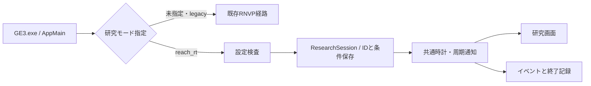

# Reach-RT G1-01：研究モードの実装と説明

更新：2026-09-21 / 対象：G1-01  
[研究仕様](Reach_RT_Research_Spec.md) / [進捗](Reach_RT_Implementation_Progress.md) / [作業ログ](Reach_RT_Work_Log.md)

## 1. 今回できたこと

**履歴としての位置付け**：本書の結果・未実装項目はG1-01完了時点の記録である。その後の仮想ロボット接続・撮影対応修正は[G1-02/03説明書](Reach_RT_G1_Robot_Video.md)を参照する。現在の`open_reach_g1.cmd`はrobot_video段階を起動する。時計のみの確認はCLIで`--stage foundation`を指定する。

**既存GE3.exeに、Reach-RT専用の研究モードを追加した。** 実行条件を検査し、一意な実行IDを作り、共通の単調時計で処理周期を管理し、条件・イベント・終了状態を保存する。ウィンドウ表示と画面なしの自動実行の両方を用意した。

今回の完了対象はG1-01。G1全体の閉ループは未完成である。仮想ロボット、実画素の送受信、認識器、速度指令はまだ接続していない。G0で発見した撮影/復号時刻の対応問題も未修正で、G1-03に残る。ログと画面も、この境界を明示する。

## 2. プロの場で説明するための要点

説明例：

> 最初に実装したのは、実験条件と証拠を管理する研究モードです。通信方式を比較するには、同じ条件で動かしたことと、どのプログラムで得た結果かを説明できる必要があります。そのため、設定を起動時に厳密に検査し、実行ごとにIDと保存先を分け、設定と実行ファイルのハッシュを記録しています。物理更新・撮影・制御には共通の単調時計を使い、処理遅れを隠して成功扱いしない構成にしました。現在はこの基盤の検証が完了しており、次に実映像と仮想ロボットを接続します。

| 実装した機能 | なぜ必要か | 実際の動作・確認方法 |
|---|---|---|
| 明示的な研究モード切替 | 既存デモと研究実験の条件・結果を区別する | `TR2_RESEARCH_MODE=reach_rt`で専用経路へ。未指定/`legacy`は既存経路。未知の値は終了コード2 |
| JSON設定と起動時検査 | 誤字や型違いが意図しない実験条件になるのを防ぐ | 必須項目、未知項目、重複、数値範囲、形式を検査。不正なら研究セッションを開始しない |
| 実行IDと専用フォルダ | 並行実行や再試行で証拠が混ざらないようにする | GUIDを生成し、セッションフォルダを新規作成。既存フォルダを再利用しない |
| 入力/有効設定とSHA-256 | 後から「どの条件・どの版か」を確認できるようにする | 入力JSON、有効設定JSON、両者とexeのハッシュを保存。起動補助はソース差分と新規コードも保存 |
| 共通時計と周期管理 | 時刻の比較と、異なる周期の処理を一貫させる | `steady_clock`のµs時刻を使い、100/30/20 Hzの期限を個別に管理 |
| 遅れの上限と終了理由 | PC負荷による遅れを通信方式の効果と誤認しない | 追いつき上限を超えたら`invalid`。途中終了・通常終了を分ける |
| 順序付きイベントログ | 後続の映像・指令を同じ時間軸で追えるようにする | session ID、連番、単調時刻、相対時刻、種類、詳細をJSONLで記録 |
| 研究画面と自動実行器 | 人への説明と繰り返し検証の両方に対応する | 画面は実行状態と時計通知数を表示。自動試験では画面を出さず同じ基盤を実行 |

ハッシュは内容の識別に使う。ソースハッシュとexeハッシュの保存だけで、再ビルドが同一バイナリになることや、ソースからexeへのビルドを暗号的に証明するものではない。

## 3. 構成と変更箇所



| ファイル | 責務 |
|---|---|
| `application/AppMain.cpp` | 既存初期化前にモードを判定し、研究モードへ分岐 |
| `research/ReachJson.*` | 上限付きJSON読取り。外部依存の追加なし |
| `research/ReachFoundation.*` | 型付き設定、SHA-256、周期期限、実行ID、記録のライフサイクル |
| `research/ReachResearchMode.cpp` | 環境変数の解釈、研究モードの実行ループ、Win32画面 |
| `config/reach_rt_g1_foundation.json` | 現在読み込めるG1-01設定 |
| `tools/run_reach_g1.py` | 新しい実行ディレクトリ、環境の整理、ソース証拠、起動と終了の記録 |
| `tools/open_reach_g1.cmd` | 画面を開く簡易入口 |
| `tools/test_reach_g1.cpp` / `reach_g1_tests.vcxproj` | JSON・設定・時計・記録の単体検証 |
| `tools/verify_reach_g1.py` | 実GE3.exeによる正常/異常/同時起動の統合検証 |
| `tools/verify_reach_g1_legacy.py` | 既存H.264 loopback経路へ切り替えられることの確認 |

既存の映像送信・回復・復号アルゴリズムは今回変更していない。研究モードは同じ実行ファイルに組み込み、起動時に経路を選ぶ。作業中のモード切替や、両モードの同時稼働は実装していない。

## 4. 設定と時刻の意味

実行用設定は[reach_rt_g1_foundation.json](../config/reach_rt_g1_foundation.json)。G0の[設計用JSON](reach_rt_initial.json)には未実装の世界・回線・制御の設定も含むため、そのまま実行用として受理しない。G1-02以降、実際に使う機能に合わせてスキーマを拡張する。

| 項目 | 初期値 | この段階での意味 |
|---|---|---|
| `schema_version` / `stage` | 1 / foundation | 対応する設定版と実装段階 |
| `task` | T1 | 将来の作業ラベル。現在は作業を実行しない |
| `seed` | 101 | 将来の試行識別用の設定値。現在は乱数を使う物理処理がない |
| `duration_s` | 60 | 時計の確認区間。0.1～3600秒を受理 |
| `tick_rates_hz` | physics 100 / camera 30 / control 20 | 周期通知の頻度。実際の映像fpsや物理演算回数ではない |
| `max_catchup_steps` | 5 | 1回の処理で遅れを回収する最大通知数 |

時刻は既存RNVPと同じ`std::chrono::steady_clock`のepochを使うµs単位。UTCは人が実行日時を把握するためだけに記録し、経過時間や期限判定に使わない。起動準備後の周期開始時刻もイベントに保存する。これはソースに共通時計を導入した段階であり、encoder/decoderのPTSを対応付けたことを意味しない。

30 Hzの期限は毎回33 msを足す方式ではなく、開始時刻と通知番号から`floor(n × 1,000,000 / 30)`µsで計算する。1時間分の離散的な検査で108,000通知を確認した。この検査は壁時計で1時間アプリを稼働させた試験ではない。

## 5. 保存する証拠と終了判定

セッションごとに次のファイルを作る。

- `manifest.json`：実行ID、開始UTC、単調時計の原点、exe/設定のSHA-256、実装済み機能。
- `config.input.json`：読み込んだ入力をそのまま保存。
- `config.effective.json`：検証後の値を正規化して保存。
- `events.jsonl`：1行1イベント。ロック内で時刻取得と連番発行を行い、複数スレッドの記録を整列。
- `summary.json`：終了理由と時計通知数。temporaryファイルからのrenameで確定。

イベントは周期通知をまとめて記録する場合がある。その行の`count`が通知数であり、行数を処理回数としない。周期ログはバッファリングし、heartbeatや開始/終了イベントでflushする。異常終了・電源断まで全ログの永続化を保証したものではない。

| 状態 | 意味 | 終了コード |
|---|---|---:|
| `foundation_completed` | 指定した時計確認区間を完走 | 0 |
| `interrupted` | 区間途中で画面を閉じた | 3 |
| `invalid` | 実行中のエラー・追いつき上限超過等 | 2 |
| `incomplete` | 正常なFinishを通らずセッションの寿命が終わった | 状況による |
| summaryなし | 起動前に拒否、強制終了、保存失敗等 | 証拠を見て個別判定 |

全結果に`task_result=not_run`、`closed_loop_validated=false`を保存する。時計の完走をタスク成功へ読み替えない。画面表示時は完了後も結果を残し、閉じるとプロセスが終了する。

起動補助を使うと、セッションの外側に`launch.json`、`source.patch`、`source_hashes.json`、新規研究ソースのコピー、stdout/stderrも保存する。強制終了でsummaryがない場合、起動補助は合格としない。

## 6. 検証結果

証拠の根：`artifacts/reach_g1_20260921/`。今回の検証exeのSHA-256：`446683a698684cd972248dd09800d03ab15f96f1570455a063ccf158acc7b495`。

| 検証 | 結果・証拠 |
|---|---|
| Release x64ビルド | 成功。修正後の増分ビルドは警告0/エラー0。`build_Release.log` |
| 単体検証 | 合格。JSON/UTF-8/設定値/時計/ハッシュ/同時ログを検査。実装中に出た型変換警告とテスト初版の型推論エラーを修正 |
| 30 Hz期限 | 1時間相当108,000通知、期限の累積ずれなし |
| 同時イベント記録 | 4スレッド×50件、欠落・連番の飛び・ID混入なし |
| 実アプリ統合検証 | 正常T1/T2、不正8ケース、同時起動2ケースの計12ケースが合格。`verification/integration_01/report.json` |
| 既存モード切替 | 同じexeでH.264生成映像loopbackを8秒実行し、終了コード0、記録対象の復号124件・表示集計82枚を確認。`verification/legacy_smoke_01/report.json`。性能比較ではない |
| 2秒の画面なし実行 | physics 200 / camera 60 / control 40通知で完走。`runs/foundation_smoke_01/` |
| ウィンドウあり実行 | ウィンドウ作成経路を通り、同じ通知数で完了ログを保存。`runs/foundation_ui_02/` |
| 画面の目視確認 | 未完了。computer-useのnative pipe接続が失敗し、再初期化でも同じエラー。文字切れ等は確認済みとしない |

ビルド出力には環境内の`pwsh.exe`が見つからない旨のメッセージもあった。MSBuildの終了コードは0で、exeの起動と上記検証は成功した。新規機能の警告修正後の増分ビルドが警告0であり、依存コードを含むクリーンビルド全体が警告0とは主張しない。

PowerShellの実行ポリシーで最初のビルド起動が拒否されたため、許可を得たうえで、その子プロセスにだけ`-ExecutionPolicy Bypass`を指定した。マシン/ユーザー全体のポリシー設定は変更していない。GUI起動補助の初版はPythonに存在しない`SW_SHOW`定数を参照して失敗し、Win32の値5へ修正して再実行した。失敗した実行フォルダも保存している。

## 7. 起動・再検証

画面を開く簡単な入口は[open_reach_g1.cmd](../tools/open_reach_g1.cmd)。Pythonが利用できる環境で実行すると、60秒の基盤確認を行い、完了表示を残す。今回開いた確認画面も、閉じるまでは残る。

リポジトリルートから実行する場合：

```powershell
# G1用の分離出力へビルド（実行ポリシーはこのプロセスだけ）
powershell -NoProfile -ExecutionPolicy Bypass -File tools/build_reach_g0.ps1 -Configuration Release -OutputName reach_g1_20260921

# 画面を表示。run名は未使用のものにする
python tools/run_reach_g1.py --name demo_01 --show

# 画面なしの2秒確認
python tools/run_reach_g1.py --name headless_01 --duration 2

# 12ケースの統合検証
python tools/verify_reach_g1.py --name integration_recheck_01
```

ビルドする前に前回のGE3.exeの研究画面を閉じる。起動時の設定は実行中に書き換えず、変更する場合は新しいセッションを作る。`artifacts`はgit対象外なので、第三者へ証拠を渡す場合は別途保全する。

## 8. 次に接続する機能

1. G1-02：仮想世界、ロボットの運動と制動、T1/T2の真値評価器。今回のphysics時計へ接続する。
2. G1-03：描画画素をH.264/RNVPへ渡し、撮影IDとencoder/decoder出力PTSを台帳で照合する。G0の50ms誤対応を修正し、画像内の番号でも検証する。
3. G1-04/05：復号画素からの認識と固定制御、逆方向UDP指令、期限とウォッチドッグ。今回のcontrol時計とイベント記録へ接続する。
4. G1-06：理想通信で18初期姿勢の閉ループを検証する。

現時点の進捗は**G1の6項目中、G1-01が完了**。研究ゲートの通過数は引き続きG0のみの1/7。
