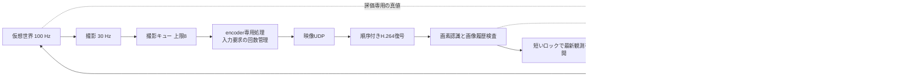

# Reach-RT G1-06：映像処理の停滞と推定誤差余裕の改善

更新：2026-09-22（JST）。作業記録E011。**18条件の本試験・回帰確認が合格し、G1-06完了、G1ゲート通過。次はG2-01。**

## 目的と固定する条件

前回は18条件中17条件が有効成功、1条件が撮影キュー超過で無効となった。また、採用推定3枚が記録された誤差余裕を超えた。今回は、処理が遅い部分を特定できる計測と処理間の分離を加え、画像だけで不自然な推定を除外し、同じ18条件を改めて検証する。前回の結果は[旧検証説明](Reach_RT_G1_Closed_Loop.md)に保存する。

実験本体はC++の既存GE3.exe内にある。Pythonはビルド補助、実行管理、CSVの独立監査、結果HTML生成を担当し、ロボットの運動や認識・制御を代行しない。

- PC1台のloopback、実H.264、画像からの推定、逆方向UDP指令。encoderはauto。
- T1：初期y=−0.05/0/+0.05 m、yaw=−5/0/+5度の9条件。T2：y=−0.15/0/+0.15 m、yaw=−10/0/+10度の9条件。x=0、seed=101。
- 各60秒。成功後も記録を続け、物理6,000刻み・撮影1,800枚・制御1,200回を検査する。成功した時点で観測窓を短縮しない。
- 100 Hz物理・30 Hz撮影・20 Hz制御、撮影キュー上限8、研究復号FIFO上限32、処理追従限界を維持。
- 最大速度0.30 m/s、加速度0.30 m/s²、制動0.60 m/s²、最大角速度0.8 rad/s、角加速度1.6 rad/s²を維持。
- T1はx=3.20～3.35 m、T2は目標(2,0)から10 cm以内かつyaw±5度以内で、速度0.02 m/s以下を1秒保持する。接触・場外・60秒未達は不合格。
- 画像の撮影年齢期限200 ms、指令TTL100 ms、有効指令途絶250 msを維持。真値は結果評価にだけ使用する。

## 実装意図と構造



### 遅い認識処理が撮影を止めないようにする

従来は認識とログ出力中にも共有ロックを保持し、撮影・encoder・制御側の状態取得が待たされ得た。`ReachRobotVideo.cpp`で画素変換、認識、ログ書き込みを共有ロックの外へ移し、撮影時刻の検索と最新観測の公開だけを短いロックで行う。画像の処理順序と番号・PTSの対応は維持する。

停滞診断ではframe 60の認識を250 ms遅らせる。その間、古い撮影画像による指令は停止し、新しい画像で再開することを検査する。研究用の観測通知には表示用の鮮度破棄を適用せず、認識・制御側の200 ms期限で採否を判断する。これにより、復号できた画像が表示都合で研究ログから消えることを防ぐ。通常の表示経路とMJPEGの鮮度判定は維持する。

### 非同期encoderの入力要求を失わないようにする

`AsyncInputCredits`はNeedInputイベント1回を入力可能回数1回として保持し、ProcessInput成功ごとに1回消費する。従来の真偽値では複数イベントが重なった回数を表せなかった。追跡付き研究経路では、既に届いたイベントを最大16件まとめて処理し、イベント間の不要な待ちを減らす。非同期MFTのイベントと入力の対応は[Microsoftの仕様](https://learn.microsoft.com/en-us/windows/win32/medfound/asynchronous-mfts)に従う。既存の通常encode経路は従来の動作を維持する。

この構造上の問題を修正したことと、前回のキュー超過の根因を確定したことは区別する。前回の大きな時刻差にはOS/電源状態・ドライバ・待ち処理も関与し得るため、今回の結果だけで唯一の原因とは断定しない。

### 記録の負荷を抑え、停滞した場所を残す

CSVは各ストリーム4 MiBの上限付きバッファへまとめ、満杯または終了時に出力する。毎回のイベントflushを避け、開始・正常終了の節目を保存する。正常終了では計測CSVを閉じてから完了を記録する。強制終了時には未書き込み分が失われ得るため、その試行は成功証拠に採用しない。

新しい記録は、撮影キュー長、待機時間、入力sample生成時間、ProcessInput時間、イベント処理時間、認識時間、観測公開の待ち時間、入力要求数、投入数、終了処理時間である。`pipeline_failure.json`はキュー超過時の処理段階、`pipeline_checkpoint.json`は終了処理の到達点を残す。Python実行器は絶対期限で自身が起動した子プロセスを終了させる。これはMFT内部の停止を強制解除する実装ではない。

### 過去の画像推定と矛盾する推定を使わない

`VisualHistoryGate`は過去500 ms、最大16個の採用済み画像推定と新しい推定を照合する。横方向の変化が最大速度・向き・角速度から到達可能な範囲に2 cmの観測揺れを加えた量を超える場合、`pose_history_inconsistent`として拒否する。拒否画像は履歴へ追加しない。古い履歴の失効やstream変更後の再取得も単体検査する。入力は画像推定と時刻であり、評価真値や指令値は参照しない。

位置誤差余裕の固定項を2 cmから2.5 cmへ変更し、既存の距離・見え方に応じた項は維持する。この余裕と履歴判定は本実験条件で較正した工学的なモデルであり、統計的な信頼区間や実機安全保証ではない。全採用画像について、保存後の真値照合で余裕内かを検査する。1枚でも超えれば新しい18条件判定は不合格となる。

### 壁方向の経時移動と前進方向を区別する

誤差余裕を増やすだけではT1が壁余裕不足で停止し続けた。そのため、画像が古くなった間の移動量を、壁と直交する横方向へ投影して差し引く。年齢をa秒として、移動量は `0.30a + 0.15a²`、横方向係数は `sin(min(π/2, |yaw| + yaw余裕 + 0.8a))`。位置誤差余裕自体は全量を差し引く。前進距離など一般の不確かさ計算は全移動量を使う。

壁余裕の追加2 cm、制動に関する既存項、成功条件と運動制限は維持する。前回E010のT1停止準備2.5 cm・解除4 cm、T2の8/10 cmも維持する。将来の比較方式にも同じ基盤・同じ判定を適用する。

## 実装箇所と予備検証

実装と証拠の対応は次のとおり。

| 担当 | 実装 | 入力と出力・確認方法 |
|---|---|---|
| 入力要求の管理 | `network/AsyncInputCredits.h`、`network/H264Encoder.cpp` | NeedInput回数→投入許可。複数要求を保持する単体検査と実際の投入数を記録 |
| 映像処理の分離・計測 | `research/ReachRobotVideo.cpp` | 撮影キュー→実符号化・UDP・復号→番号照合済み画像。段階別CSVと終了段階JSON |
| 研究観測への通知 | `network/NetworkVideoReceiver.cpp` | 追跡付きH.264出力→研究observer。表示用破棄と画像年齢による採否を分離 |
| 記録負荷の管理 | `research/ReachBufferedLog.h` | 上限付きバッファ→CSV。正常終了時に閉じ、独立監査で全行数を検査 |
| 推定と制御 | `research/ReachVisualControl.cpp` | 受信画素・画像履歴→有効観測→期限付き指令。真値は入力しない |
| 停滞診断 | `tools/verify_reach_stability.py` | 認識250 ms遅延・software遅延→時計、画像、停止・再開の証拠 |
| 全条件判定 | `tools/verify_reach_closed_loop.py` | 保存画像推定・評価真値・指令・世界ログ→18条件判定 |

`summary.json`の`command_udp_completed`は実行・記録の完了を示す。共通summaryの`task_result:not_run`と`closed_loop_validated:false`は初期の互換フィールドであり、単独では作業・ゲートを判定しない。作業の評価は`world.csv`と`visual_control_summary.json`、独立判定は行列の`report.json`、G1全体は`gate_decision.json`で確認する。

- 単体：指令178、世界280、基盤663が合格。認識・制御は76個の基本検査に加え、過去30,436行の入力検査と3個の再評価集計検査を実施し、合計30,515検査が合格。較正用の非圧縮54画像も受理。
- 過去画像の再評価：採用29,799、拒否637。旧モデルでの余裕逸脱3枚に対し、新判定で採用された画像の逸脱0枚。これは過去記録の再評価であり、新しい閉ループ18試行の代用にはしない。
- `pipeline_01`：120 ms遅延診断で復号120枚のうち観測119枚となり不合格。表示用鮮度破棄がframe 61を研究観測へ通知しなかった。これを修正し、250 msへ強めた診断で再検証した。
- `pilot_t1_01`：60秒と全時計は正常に完走したが、壁余裕停止でx≈0.00156 mのまま時間切れ。上記の横方向への投影に修正する契機となった。失敗記録を保持する。
- `pilot_t1_02`：同じT1 y=+0.05 m・yaw=+5度が19.54秒で成功し、60秒窓も完走。独立監査で誤差余裕逸脱0、最小壁距離0.124443 m、撮影キュー最大1を確認。この予備試行は18条件の本試験に含めない。
- `pipeline_final_01`：最終ビルドで250 ms遅延診断とsoftwareの古い画像拒否が合格。遅延診断のキュー最大1、認識最大251.732 ms、観測公開待ち最大2 µs。120画像・80指令・400物理刻みが揃い、期限切れ停止と新画像での再開を確認した。softwareは古い画像により移動指令を出さないことを確認した。

成果物の根：`artifacts/reach_g1_stable_20260921/`。失敗・予備試行を本試験の分母へ混ぜず、別途保持する。

## 18条件の本試験結果

`matrix_final_01`を自動再試行なし・同一exeで実行し、**18/18条件が合格**した。[結果一覧・実測軌跡](../artifacts/reach_g1_stable_20260921/verification/matrix_final_01/index.html)、[全結果JSON](../artifacts/reach_g1_stable_20260921/verification/matrix_final_01/report.json)、[原記録監査](../artifacts/reach_g1_stable_20260921/verification/matrix_final_01/evidence_audit.json)、[処理時間の監査・集計](../artifacts/reach_g1_stable_20260921/verification/matrix_final_01/pipeline_audit.json)を参照。

| 対象 | 有効成功 | 成功時刻 | 観測窓 |
|---|---:|---:|---|
| T1 通路通過 | 9/9 | 16.99～24.14秒 | 全9条件で60秒 |
| T2 位置合わせ | 9/9 | 10.26～11.47秒 | 全9条件で60秒 |

全32,400画像の番号・画素内ID・撮影時刻・PTS、21,600受信指令、108,000物理刻みを監査した。採用推定31,802枚、拒否598枚（履歴不整合509、急変88、姿勢曖昧1）。採用推定の誤差余裕超過0枚、最大位置誤差0.080470 m、最大yaw誤差1.151334度。T1の機体外縁と壁の最小実測距離は0.124758 m。接触・場外・作業時間切れ・無効試行は0件。

| 計測 | 99パーセンタイル | 最大 |
|---|---:|---:|
| 撮影キュー待ち | 15.854 ms | 22.863 ms |
| encoder入力処理全体 | 3.247 ms | 15.007 ms |
| 認識処理 | 3.080 ms | 7.071 ms |
| 観測公開のロック待ち | 0.001 ms | 0.303 ms |
| 復号時点の撮影年齢 | 84.419 ms | 115.751 ms |
| encoder出力間隔 | 63.502 ms | 79.902 ms |

撮影キュー最大は全条件で1枚（上限8を維持）。終了時のencoder待ちは最大63.088 ms、decoder/UDP停止は最大381.839 ms。終了時間は各計測区間であり、アプリ起動・記録出力を含む総所要時間ではない。入力要求1,801回に対して入力1,800回で各試行が完了した。本PCで同時に未消費となった入力要求は最大1回だったため、複数要求の保持は別の単体検査で確認している。

全試行のexe SHA-256：`6100e30bef812134b86f779c9b80e5e1e230d8ca4e4629c52689d609b5f56160`。nativeソースと事前条件の一致を確認した。前回の長時間停滞は今回は再現しなかったが、同一外乱での比較ではなく、個々の変更の寄与やOS・ドライバ起因の停止を完全に除去した証拠とはしない。

## 再実行

```powershell
powershell -NoProfile -ExecutionPolicy Bypass -File tools/build_reach_g0.ps1 -Configuration Release -OutputName reach_g1_stable_20260921
python tools/verify_reach_visual_units.py --name units_unique --build-name reach_g1_stable_20260921 --include-command --replay-history
python tools/verify_reach_stability.py --name pipeline_unique --build-name reach_g1_stable_20260921
python tools/verify_reach_closed_loop.py --name matrix_unique --build-name reach_g1_stable_20260921
```

同名の出力は上書きしない。本試験中はnativeコード・exe・判定器を固定し、他の映像実験やビルドを同時実行しない。

## G1全体の判定・残る範囲

[G1判定JSON](../artifacts/reach_g1_stable_20260921/verification/matrix_final_01/gate_decision.json)に、全条件・誤差余裕・原記録・単体・回帰確認をまとめた。G1は6/6項目、全タスク13/38項目、研究ゲートはG0/G1の2/7が完了。

- [単体・過去履歴再評価](../artifacts/reach_g1_stable_20260921/verification/units_final_01/report.json)と[停滞診断](../artifacts/reach_g1_stable_20260921/verification/pipeline_final_01/report.json)が合格。
- [指令UDP7ケース](../artifacts/reach_g1_stable_20260921/verification/command_regression_final_01/report.json)が合格。通信断で0.30 m/sから0.50秒・0.075 mの制動を確認。復帰、重複、並べ替え、遅着、不正電文も再確認。
- [基盤12ケース](../artifacts/reach_g1_stable_20260921/verification/foundation_regression_final_01/report.json)と[既存モード](../artifacts/reach_g1_stable_20260921/verification/legacy_regression_final_01/report.json)が同一exeで合格。後者は復号・表示・モード切替の動作確認であり、性能比較ではない。
- [映像欠損・IDR復帰](../artifacts/reach_g1_stable_20260921/verification/loss_idr_final_01.json)が合格。frame 20を送らず、依存する中間画像を観測へ出さず、撮影年齢超過で停止。frame 45以降のIDR復帰後に新画像で前進を再開し、94画像の対応を監査した。
- [8種類の不正記録検査](../artifacts/reach_g1_stable_20260921/verification/matrix_final_01/auditor_fault_tests.json)と[誤差余裕を過小にした検査](../artifacts/reach_g1_stable_20260921/verification/matrix_final_01/allowance_fault_test.json)が合格。前者はコピー、後者はメモリー内の変更であり、原記録は変更していない。

次工程は **G2-01：双方向の容量・直列化・有限キュー**。映像と指令それぞれに容量制約と送信時間を持たせ、既知サイズ、送信中の容量変化、キュー溢れを期待値と照合する。今回G2は未着手。

今回の18姿勢は開発用の所定条件を各1回実行した結果であり、G5の保留テストや成功確率の推定ではない。全方式の比較、未知配置、長時間負荷、他PC、実機安全性は未評価。アプリ画面全体と結果HTMLの目視確認も未実施である。

### 専門の場での説明例

「遠隔作業の制御器へ渡す画像には、いつ撮影され、どの復号出力に対応し、どの誤差を見込むかという情報が必要です。今回は、認識が遅くても撮影や制御時計を巻き込まない構造へ分離し、非同期encoderの入力要求を回数で管理しました。認識は過去の画像推定との物理的な整合を確認してから採用し、制御は撮影からの経過時間と壁方向の移動余裕を使います。実行後は、真値を制御へ渡さずに、画像・指令・運動の全記録を別プログラムで照合します。これにより、作業が成立した理由と、成立しなかった原因を記録で説明できる基盤にしています。」
