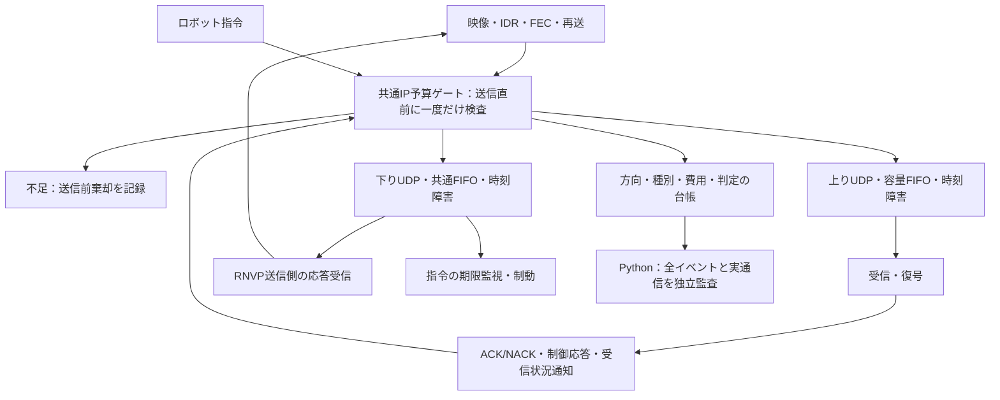

# Reach-RT G2-03：IPバイト計上・共通予算

確認日：2026-09-22。**G2-03実装・検証完了。G2は3/6項目、全体16/38項目。G2全体のゲートは未通過。**

[進捗表](Reach_RT_Implementation_Progress.md) / [仕様書](Reach_RT_Research_Spec.md) / [結果一覧](../artifacts/reach_g2_budget_20260922/verification/acceptance_02/index.html) / [完了判定](../artifacts/reach_g2_budget_20260922/verification/acceptance_02/task_decision.json)

## 1. 実装の目的

符号化ビットレートが同じでも、FEC・再送・ACK・指令に使う量が違えば、方式が消費する通信資源は同じにならない。映像だけを予算対象にすると、修復通信を増やした方式が追加費用を払わず有利になる。

今回、**すべての対象送信を、実sendtoの直前に同じIPバイト基準と共通予算で検査するゲート**へ接続した。上りは映像・IDR・FEC・再送、下りは指令・ACK/NACK・受信状況通知・制御応答。未使用だったACK受信経路も有効化し、実際の応答に基づく既存RNVPの再送を予算へ含める。

予算不足時は、そのパケットを送信前に棄却する。待ち時間を増やすペーサや、映像と指令の最適な配分方式を今回完成させたわけではない。ここでは、後続の比較方式が同じ制約を通るための基盤を作る。

## 2. 構造



| 実装 | 意図・責務 |
|---|---|
| `research/ReachIpBudget.h` | 共通＋方向別のレート・バースト・累積上限を同時判定。RNVP/RCMDの電文から種別を分類 |
| `research/ReachBudgetTransport.*` | 複数送信スレッドを同じロックで保護し、判定・課金・実sendto・台帳記録を一続きに実行 |
| `network/DatagramSendHook.h` | 既存送信器へ設定できる送信直前フック。未設定なら従来の送信経路を維持。戻り値0は送信前棄却、SOCKET_ERRORは送信失敗 |
| `NetworkManager` / `UdpReceiver` | 上りの元データ・FEC・再送、および下りの4つの応答送信箇所をゲートへ接続。全フレーム再送のDataにも既存のRetransmitフラグを付け、分類漏れを防ぐ |
| `ReachDatagramLink` | 指令とRNVP応答を同じ下りFIFO・障害表へ入れ、配送後に宛先を分ける。ボトルネックのサービス済み量も記録 |
| `ReachRobotVideo` / `ReachCommandUdp` | 共有予算を受け取り、フィードバック経路と指令を接続。終了時の新規送信停止→既存配送のdrain→応答受信確認を順序づける |
| `verify_reach_budget.py` | 生電文の分類・IP長、全送信時点の予算、方向合計、回線入出力、応答受信と指令の因果関係を照合 |

本体はC++。Pythonは実験起動・監査・集計・閲覧用HTMLの生成に使う。単体試験以外も、実H.264映像・実UDP・既存FECとACK起因の実再送を通して確認している。

## 3. バイトの定義と計上位置

1データグラムの費用は `UDPペイロード長 + 8 + 20` byte。ペイロードにはRNVP/RCMDヘッダ、映像本体、FEC付加情報、ACKの欠損リスト等をすべて含める。IPv4オプションなしが前提。

| 項目 | 意味 |
|---|---|
| `offered_ip_bytes` | 送信ゲートへ提示されたパケットのIP費用。実送信量とは異なる |
| `attempted_ip_bytes` | 予算を通過し、実sendtoを試みたIP費用。主評価の通信量 |
| `discarded_before_send_bytes` | 予算不足・観測期間終了等で送信しなかったパケットのIP換算費用。送信試行量へ加えない |
| `sent_ip_bytes` / `send_error_ip_bytes` | sendto成功／失敗の内訳。失敗しても試行費用は取り消さず、試行自体を無効とする |
| 回線内の破棄・残留 | FIFOのtail-drop、時刻損失、直列化待ち・伝搬中の終了残留。すでに送信した費用を返却しない |
| `serviced_work_bit_microseconds` | 容量FIFOがサービスした量。8,000,000で割るとbyte相当。途中終了の部分サービスを含み、送信試行量とは別 |

中継の入口・出口というPC内の実装上の2回のUDP送信を、研究上の同一パケットの費用として二重計上しない。NIC実測値、Ethernetのwire byte、無線占有時間とは呼ばない。

Dataは再送フラグを優先し、再送でなければIDR映像／通常映像へ分ける。FEC、ACK、欠損を通知するNACK、制御応答、受信状況通知、指令を別分類する。Ping/Pongの分類も用意し単体検査したが、今回の主要5ケースで発生させた通信種別ではない。将来の状態通知は実装時に同じゲートへ接続する。未分類プロトコルを黙って予算対象外にせず、試行エラーにする。

既存のAU提出数やエンジン内部統計を、実際のIP送信量へ読み替えてはならない。正本は `ip_budget.csv` とその監査結果。旧受信器の制御メッセージ出力には生成時の記録も含まれるため、送信可否は台帳で確認する。

## 4. 共通予算の規則

全体・上り・下りの3つの予算を持ち、送信時は**全体と該当方向の両方**を満たす必要がある。

- `rate_bps`：時間による送信許容量の補充速度。
- `burst_ip_bytes`：初期許容量と、アイドル中にも蓄積できる最大量。
- `max_ip_bytes`：試行中の累積送信試行量の上限。

整数のtoken bucketを使う。1 byteを8,000,000内部単位とし、1 µsにつき`rate_bps`単位を補充する。パケットの全費用が入る場合だけ送る。片方の予算で拒否されたとき、他方の予算を消費しない。

時刻tまでの送信量は `min(max_ip_bytes, burst_ip_bytes + rate_bps × t / 8)` 以下（tは秒）。また任意の時間幅Δtについて、送信量は `burst_ip_bytes + rate_bps × Δt / 8` 以下となる。これはバーストを許容する制約であり、短い瞬間に全く集中送信しないという意味ではない。

方向別予算は上限であり、指令用の最低保証帯域や優先予約ではない。共通予算が尽きれば指令も棄却され、受信側の既存期限監視・制動が働く。ゲートは送信要求が入った順に判定するため、スレッドの実行順を含む閉ループ全体がseedだけで完全一致するとは主張しない。

上限はbps最大10億、バースト28 byte～16 MiB、累積最大1兆byte。レート0／累積0も明示的な送信停止条件として許可。観測期間の終端以降は新たな送信を認めず、drainはすでに送信したパケットだけを処理する。

標準設定は[reach_rt_g2_budget.json](../config/reach_rt_g2_budget.json)。共通4 Mbps・64 KiB・20,000,000 byte、上り3.5 Mbps・64 KiB・19,000,000 byte、下り0.5 Mbps・16 KiB・1,000,000 byte。FECは4チャンク群。いずれも検証・デモ用の初期設定で、最適値や最終比較の固定条件ではない。

## 5. 検証結果

固定exe：`artifacts/reach_g2_budget_20260922/bin/Release/GE3.exe`

SHA-256：`62ad0ed68c68bdec31c00f05400f4fdff59e3d98cad82ad78c07d031976bbb5b`

### 主要5ケース

[acceptance_02/report.json](../artifacts/reach_g2_budget_20260922/verification/acceptance_02/report.json)。全5ケース合格。5,853件の送信ゲートイベント、計3,380,007 IP byteの送信試行を監査した。

| 条件 | 秒 | 上りIP byte | 下りIP byte | 合計IP byte | 送信前棄却のIP換算byte |
|---|---:|---:|---:|---:|---:|
| 全種別を実送信 | 6 | 1,369,680 | 48,368 | 1,418,048 | 19,200 |
| 共通上限10,000 byte | 4 | 9,423 | 502 | 9,925 | 837,105 |
| 共通128 kbps・4 KiBバースト | 4 | 34,250 | 32,186 | 66,436 | 951,000 |
| 下り累積26,000 byte | 6 | 1,002,068 | 25,936 | 1,028,004 | 33,660 |
| 上下に時刻損失区間 | 4 | 825,706 | 31,888 | 857,594 | 19,008 |

全種別ケースの内訳：通常映像926,516、IDR映像71,430、FEC349,440、再送22,294、ACK15,840、NACK772、制御応答480、受信状況通知17,472、指令13,804 byte。合計は1,418,048 byteに一致。

共通10,000 byteの残り75 byteは、次のパケット全体を送るには足りず使用しなかった。レート試験は全イベントの補充・消費・棄却を照合した。下り累積上限試験では指令が届かなくなり、速度0.30 m/sから0.50秒・0.075 mで停止。時刻損失試験では上下の損失費用が送信量へ残ることを確認した。上りと下りが別々の台帳になって総量制約を回避する経路は、送信台帳と回線入口の全電文照合で検査した。

ボトルネックの部分サービスは、容量表・サービス開始・終了カーソルから監査器が再計算する。最大OS配送実行遅れは17.392 ms。瞬時配送やNIC帯域を保証する値ではない。

### 単体・不正設定・回帰

| 検証 | 結果 |
|---|---|
| 回線・予算単体 | [145検査合格](../artifacts/reach_g2_budget_20260922/verification/units_final_01/report.json)。旧124検査に共通課金、方向拒否の原子性、1 µsの補充境界、バースト上限、電文分類等を追加 |
| 既存単体 | 同報告：指令178、認識等76、世界280、基盤664が合格 |
| 不正予算設定 | [17ケース拒否](../artifacts/reach_g2_budget_20260922/verification/config_final_01/report.json)。負・小数・bool・上限超過、未知キー、回線指定欠落等 |
| 監査器 | [6種類の改変を拒否](../artifacts/reach_g2_budget_20260922/verification/acceptance_02/auditor_fault_tests.json)。IPヘッダ除外、FEC誤分類、合計改変、棄却への課金、ゲート迂回、応答欠落 |
| G2-02回帰 | [5ケース合格](../artifacts/reach_g2_budget_20260922/verification/trace_regression_01/report.json)。予算を省略した旧経路でトレース公平性・損失・順序逆転・終了残留を確認 |
| 指令回帰 | [7ケース合格](../artifacts/reach_g2_budget_20260922/verification/command_regression_01/report.json)。予算なしで重複・逆順・遅着・途絶・復帰・不正電文を確認 |
| 基盤・既存モード | [基盤12ケース](../artifacts/reach_g2_budget_20260922/verification/foundation_regression_01/report.json)、[既存RNVPモード](../artifacts/reach_g2_budget_20260922/verification/legacy_regression_01/report.json)を同じexeで確認 |
| 証拠の対応 | [nativeソース335ハッシュ照合・制動計算](../artifacts/reach_g2_budget_20260922/verification/acceptance_02/evidence_audit.json)。全試行のexe・要求予算・有効予算を照合 |

G1の全18姿勢・各60秒の再評価、研究方式の優位性、アプリ／HTML全体の目視確認は今回実施していない。

## 6. 途中で検出した問題と扱い

- `units_01`はテスト電文のmagic/version/headerSize/chunkCount未設定により分類検査で失敗。正しいRNVP電文へ直し、`units_02`と最終単体で確認した。分類器が不正電文を受け入れる変更はしていない。
- [acceptance_01](../artifacts/reach_g2_budget_20260922/verification/acceptance_01/report.json)は5件目の損失復帰条件で、下り中継から送出した応答190個に対して送信側受信が189個となり無効。元ログとソースを残し、集計から黙って消していない。
- 研究モードの応答受信を、既存のタイムアウト付き受信から非ブロッキング受信・1 msの待機と4 MiB受信バッファへ変更した。モデル外の欠落1個の根本原因は、単発ログだけでは特定していない。変更後の主要5ケースと[同条件の追加2試行](../artifacts/reach_g2_budget_20260922/verification/loss_repeat_01/report.json)では送出・受信電文がすべて一致。今後も不一致は試行エラーとして扱う。
- 送信経路の確認で全フレーム再送のDataに再送フラグが付かない経路を見つけ、既存のフラグを付与するよう修正した。選択再送と同じ分類基準にし、電文フォーマットは変更していない。

## 7. 起動・再現

リポジトリ直下から実行。既存の証拠を上書きしないよう、`--name`には未使用の名前を指定する。

```powershell
powershell -NoProfile -ExecutionPolicy Bypass -File tools/build_reach_g0.ps1 -Configuration Release -OutputName reach_g2_budget_20260922
python tools/run_reach_g1.py --stage command_udp --build-name reach_g2_budget_20260922 --duration 6 --link-config config/reach_rt_g2_link.json --budget-config config/reach_rt_g2_budget.json --packet-trace --name budget_demo_01
python tools/verify_reach_budget.py --build-name reach_g2_budget_20260922 --name acceptance_03
python tools/report_reach_budget.py artifacts/reach_g2_budget_20260922/verification/acceptance_03/report.json
```

[G2-03画面を起動](../tools/open_reach_g2_budget.cmd)すると、G2-02の固定60秒トレースと共通予算で実行する。画面上部に予算設定を表示する。詳細なIP内訳は保存した台帳・[結果HTML](../artifacts/reach_g2_budget_20260922/verification/acceptance_02/index.html)で確認する。60秒起動の用意と、60秒の作業成功検証を区別する。

## 8. 技術レビューでの説明例・次工程

> 映像のビットレートだけを揃えても、再送やFEC、ACKの費用が違えば公平な比較になりません。そこで、全対象の実送信直前に共通ゲートを設け、IPv4とUDPのヘッダを含めて課金しました。上下方向と総量の制約を同時に検査し、送信前の棄却と送信後の損失を分離しています。実映像・修復・応答・指令の内訳が総量と一致することに加え、予算を使い切ると指令も止まり、受信側が所定の制動で停止することを確認しました。

次は **G2-04「復号状態・参照世代・期限の追跡」**。パケットが揃ったことと、デコーダが利用可能な画像を得たことを区別し、IDR/Pフレーム欠損・遅着・再同期を実デコーダと結び付けて記録する。G2-05の新しい状態通知は、実装時に今回の共通ゲートと下り回線へ接続する。
