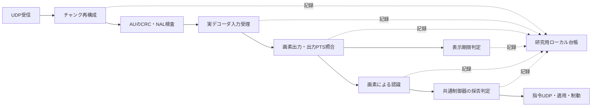

# Reach-RT G2-04：復号状態・参照世代・期限の追跡

更新：2026-09-22。対象：G2-04。C++で計測を実装し、Pythonで実験実行・独立監査・結果HTML生成を行う。

## 現在地と目的

G2-04を実装し、実H.264／UDPの8条件を検証した。G2は4/6項目、全体17/38項目完了。G2全体のゲートは未通過で、次はG2-05「受信・作業状態の通知と送信側推定」。

今回の目的は、通信が成功したことと、ロボットの判断に使える画像を得たことを分けることである。たとえば、Pフレームのデータが全て届いても、参照画像を失っていれば利用できない。反対に、表示には遅すぎる画像でも、順序どおりに復号器へ入れられれば後続画像の参照として役立つ場合がある。この違いを実際の入力・出力と時刻で説明できるようにした。

## 実装した経路



| 段階 | 成功として記録する根拠 | 実装箇所 |
|---|---|---|
| 再構成完了 | `FrameReassembler`が完全なAUを返した | `UdpReceiver`の完了通知。AU内容の妥当性や復号成功はまだ意味しない |
| AU検査 | CRC、NAL、IDR／SPS／PPS等の既存検査を通過 | `NetworkVideoReceiver` |
| 入力受理 | Media Foundationの`ProcessInput`が成功 | 実デコーダ内部。単なる復号関数呼び出しと区別 |
| 実画像出力 | 有効な画素を取得し、出力PTSを受理済み入力へ照合 | `FrameIdentityLedger`で撮影ID・世代・受理時刻を引き継ぐ |
| 表示採用 | 画像内ID／撮影時刻の照合、保守的な参照条件、撮影から200 ms以内 | `ReachRobotVideo`の研究用表示画像の更新 |
| 認識採用 | 受信画素に対するマーカー認識・履歴検査が成功 | 既存`MarkerRecognizer`。真値は渡さない |
| 制御利用 | 共通制御器が観測の妥当性・鮮度を通過し、その推定を判断に使用 | `MotionCommand.observationUsed`。停止判断への利用も含む |

指令の`sourceFrameId`は棄却時にも残るため、IDが入っているだけでは「制御利用」と数えない。`observationUsed`はローカル監査情報であり、RCMDの通信形式は変更しない。実際のロボットへの適用は、従来どおり`udp_applied_commands.csv`に別記録する。

デコーダに受理された入力が画像を出す前にflushされた場合は`input_abandoned`を記録する。検証器は終了時に「受理された入力＝実画像出力＋出力前破棄」を照合する。空出力・追加入力待ちを画像として数えない。

## 参照状態と世代

| 状態 | 遷移の根拠 |
|---|---|
| `AwaitingRandomAccess` | 初期IDRをまだ受理できていない |
| `RecoveryPending` | 欠損後の再同期待ち、またはIDR受理後で、その世代の実画像出力をまだ確認していない |
| `Synchronized` | 現在世代の画素出力を確認し、連続性・出力PTS・報告された破損情報の条件を満たす |
| `ReferenceUncertain` | 受理入力列の欠番、ストリーム変更、復号エラー、報告された画像破損を検出 |

欠番時は`ReferenceUncertain → RecoveryPending`を別イベントとして記録し、従来のflush／IDR待ちを明示する。IDRはNAL type 5とSPS/PPS等の検査を通った実AUに基づき、`ProcessInput`受理時に世代を進める。要求を出しただけでは世代を進めない。入力45でのエンコーダへの更新要求は`encoder_keyframe_requested`、実際のIDR出力は`encoded.csv`の`idr`として分離する。既存RNVPのネットワーク上の更新要求は従来の制御／IPログに残る。

遅延出力に「現在入力中の世代」を付けない。受理時にPTS台帳へ世代と時刻を保存し、その出力自身のPTSで取り出す。古い世代の正常な遅延出力が、新世代の同期確認へすり替わることも防ぐ。

研究モードでは処理済みID以下の遅着AUを再投入せず、`late_or_duplicate_no_replay`として棄却する。さらに手前のjitter bufferで古いAUが落ちる場合もある。再構成件数だけから、デコーダまで届いたと推測しない。

これはG0で採用した**保守的な実IDR世代モデル**である。完全な参照グラフや、デコーダが報告しないエラー隠蔽の不存在を証明したものではない。検知された破損出力は認識・表示へ採用せず、参照状態をリセットする。

## 期限と待ち時間の定義

| 項目 | 記録・扱い |
|---|---|
| 表示期限 | `capture_us + 200000`。境界時刻ちょうどは許可。研究用表示への採用時刻で再確認 |
| 認識の鮮度 | 既存の認識入口で撮影から200 msを検査。認識結果が返った後、制御側でも鮮度を再検査 |
| 参照回復の時間限界 | 再構成器が実際に設定した`recovery_deadline_us`を記録。NACK・猶予延長等の既存ロジックを観測し、新しい期限へ置き換えない |
| 参照回復の順序制約 | 欠番によるflush／処理済みID／IDR世代を記録。時間余裕があっても履歴の再投入が必要な修復は実行不能 |
| 作業上の期限 | 実験の開始単調時刻＋指定観測時間。検証試験は4秒、T1/T2の本来の作業判定窓は60秒 |
| 指令期限 | 生成時刻＋100 msを各制御イベントへ記録。実適用側の期限・ウォッチドッグは既存どおり |
| 復号待ち時間 | 入力受理から実画素出力まで。認識完了待ちは既存`decode_timing.csv`で別計測 |

参照回復期限の0は「未設定／不明」であり、無期限を意味しない。フレーム全体が届かなければ、受信側はそのチャンク数を知れない。欠番と、実際に観測した未回復チャンクを区別する。欠落インデックス列は既存ACKの上限を引き継ぎ、全件を列挙できない場合は`indices_complete=0`を残す。

既存の再構成回復期限は通常、送信時刻を起点に約110 ms（IDR等の条件で猶予あり）であり、撮影起点の200 msとは異なる。250 msの一様遅延では、分割されたAUが完成する前に回復期限へ達し、初期IDRを失うことを観測した。長遅延網で有効な回復方式を実装済みと主張しない。

表示期限を超えたAUを常に捨てることはしない。まだ順序どおりに受理可能なら実デコーダへ投入する。ただし、既にflushした過去の参照を挿入し直して後続を修復する機能はない。IDR更新が代替となる。

## 成果物と検証

証拠の正本：[8ケースの結果HTML](../artifacts/reach_g2_decode_20260922/verification/acceptance_final_02/index.html)、[機械可読レポート](../artifacts/reach_g2_decode_20260922/verification/acceptance_final_02/report.json)。全ケースとも実MFデコーダ、640×360、30 fps、4秒、T2、実UDPを使用した。

| 条件 | 再構成 | 入力受理 | 実画像 | 表示採用 | 認識採用 |
|---|---:|---:|---:|---:|---:|
| 理想通信・自動エンコーダ | 120 | 120 | 120 | 120 | 113 |
| 初期IDRを送信前に欠損 | 119 | 76 | 76 | 76 | 76 |
| 参照Pの画像20を送信前に欠損 | 119 | 95 | 94 | 94 | 94 |
| 画像60の認識を300 ms停滞 | 120 | 120 | 120 | 113 | 104 |
| 上りを一様250 ms遅延 | 23 | 0 | 0 | 0 | 0 |
| 上り遅延300 ms→0、順序逆転 | 100 | 76 | 76 | 76 | 76 |
| 部分損失＋FEC／再送／共通予算 | 115 | 57 | 56 | 56 | 54 |
| ソフトウェアエンコーダ | 120 | 120 | 120 | 0 | 0 |
| 合計 | **836** | **664** | **662** | **535** | **517** |

初期IDR／参照P欠損では、送らなかった実AUも`diagnostic_dropped_au.h264`へ保存し、NAL／slice type／参照フラグをPythonで独立解析した。P欠損では入力済み1件が出力前にflushされ、その後の24件は再構成できても復号入力へ採用されなかった。IDRで実画像出力が復帰した。

処理停滞では表示棄却7件を確認した。表示期限後の入力受理と、同じ世代の後続画像の表示採用が両方存在することを機械検査した。これが今回確認した「遅い画像の参照利用」であり、過去履歴の巻き戻し修復ではない。

ソフトウェアエンコーダの120画像はすべて期限超過だった。復号成功を作業に使える画像の成功へ換算せず、表示・認識・制御採用を0として記録した。本PCでの低遅延制御適性が確認できたという意味ではない。

| 保存ファイル | 用途 |
|---|---|
| `decode_events.csv` | 段階別イベント、状態、実IDR世代、最後の完全受信／出力／制御利用ID、期限、待ち時間 |
| `reassembly_events.csv` | 完了・期限切れ等、受信数、未回復チャンク、実回復期限 |
| `decode_model.json` | 固定した判定条件、再投入非対応、主張の限界 |
| 既存`encoded.csv`、`decoded_audit.csv`、`observations.csv`、`commands.csv` | 実出力・画像内ID・認識・指令との独立照合 |

単体は回線／予算145、指令178、画像制御81、世界／PTS282、基盤664が合格。200 ms境界の制御利用、期限超過時にsource IDが残っても利用扱いしないこと、世代をまたぐ遅延出力を追加確認した。[監査器の改変試験](../artifacts/reach_g2_decode_20260922/verification/acceptance_final_02/auditor_fault_tests.json)は世代・時刻・状態・制御利用・破棄・欠損数・IDRを改変した8件を全て拒否した。

最終exeのSHA-256は`4c35906132a8b0d3fa42680e81572b57a1c0d34c2bb6c29bb2b8a07ede0598a5`。[予算の5ケース](../artifacts/reach_g2_decode_20260922/verification/budget_regression_final_01/report.json)、[指令の7ケース](../artifacts/reach_g2_decode_20260922/verification/command_regression_01/report.json)、[既存RNVPのsmoke試験](../artifacts/reach_g2_decode_20260922/verification/legacy_regression_01/report.json)を同じexeで回帰確認済み。既存モードは139復号行・95表示フレームを確認。指令断では0.30 m/sから約0.50秒・7.5 cmの制動を維持。[証拠照合](../artifacts/reach_g2_decode_20260922/verification/acceptance_final_02/evidence_audit.json)と[完了判定](../artifacts/reach_g2_decode_20260922/verification/acceptance_final_02/task_decision.json)に最終の検査結果を保存する。

最初の`acceptance_01`は、250 ms通信遅延で多数の復号画像が得られるという試験前提が成立せず不合格。記録は保持した。期限を緩めず、通信中の回復期限切れと処理停滞を分けた`acceptance_02`は8/8。その後、欠損AU保存と実slice検査を追加した`acceptance_final_01`も8/8。最後に表示中の画像IDと最後の復号IDを分離し、最終ビルドの`acceptance_final_02`で8/8確認した。途中版を最終版の証拠に混ぜない。

## 再実行と説明の仕方

```powershell
powershell -NoProfile -ExecutionPolicy Bypass -File tools/build_reach_g0.ps1 -Configuration Release -OutputName reach_g2_decode_20260922
python tools/verify_reach_decode.py --name acceptance_repeat_01 --build-name reach_g2_decode_20260922
python tools/test_reach_decode_audit.py artifacts/reach_g2_decode_20260922/verification/acceptance_repeat_01/report.json
```

既存証拠を保持するため、試行名には未使用名を指定する。結果はHTMLを直接開いて閲覧でき、Pythonを起動しなくても段階別件数と状態遷移を確認できる。アプリのライブ画面は今回全面改修しておらず、HTML／アプリ全体の画面目視確認も未実施。

技術レビューでの説明例：

> 通信成功をパケットの到着率だけで評価しないために、再構成、デコーダ入力受理、実画素出力、期限内の表示・認識・制御利用を分離しました。参照Pを1枚失った試験では119件を再構成できましたが、利用可能性を確認する手前の実画像出力は94件でした。出力PTSで世代と撮影時刻を照合し、期限切れや再同期待ちを成功として数えない計測基盤です。これから、この受信側の状態を遅延と損失のある逆方向回線で送信側へ通知します。

## 次工程と限界

G2-05では受信・作業状態をシリアライズし、下り回線と共通IP予算を通して送信側へ届ける。未到着の最新状態を送信側が読めないこと、古い通知・通知欠損時の推定と不確実性を確認して完了を判定する。今回の台帳は評価専用のローカル記録であり、そのまま共有メモリで送信判断に使うAPIはない。

G1の18姿勢・各60秒の合格はE011固定版の証拠を保持し、今回の新exeで18条件を再実行していない。今回の4秒試験は計測と障害応答の検証であり、タスク成功率・方式の優位性・完全な参照グラフ・実機安全性の検証ではない。
