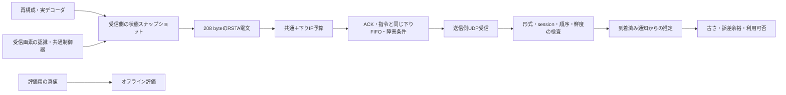

# Reach-RT G2-05：受信・作業状態の通知と送信側推定

更新：2026-09-22。対象：G2-05。実装はC++、実験実行・独立監査・HTML生成はPython。

## 現在地と実装意図

G2-05を実装し、実通信8ケースで受信状態通知と送信側推定の因果関係を検証した。G2は5/6項目、全体18/38項目完了。G0・G1の2ゲートが通過済みで、G2全体は次のG2-06で判定する。

G2-04で分かった「再構成できたが復号できない」「復号できても古くて使えない」という状態を、送信側へ通知する。ここで共有メモリから最新状態を読めてしまうと、逆方向通信の遅延や損失が評価から消える。そこで、送信側の推定器には**実際にrecvfromで受信した電文・ローカル単調時計・セッションの事前条件だけ**を入力する。

この段階で実装した判断は、受信報告に基づく「参照状態が未確認」「観測を使えない」「報告に基づく判断が可能」といった入力の有効性判定である。REPAIR／FEC／IDR等を選択するG4の送信方策はまだ変更しない。

## 構造と情報の境界



| 部品 | 入力と出力・意図 |
|---|---|
| `ReachDecodeJournal`の受信側スナップショット | G2-04の実イベントと画素認識・共通制御器の結果を保存。通知生成時に同じmutexでコピーし、途中更新の混在を避ける |
| `ReachStateProtocol.h` | RSTAの明示的なバイト列化と復元、入力検査、送信側の因果的推定器。世界・評価器・ジャーナルへの参照を持たない |
| `ReachStateFeedbackUdp` | 通知用の送受信UDPソケット、生成／受信／推定の記録。送信処理と受信・推定処理のAPIを分離 |
| `ReachDatagramLink` | 同じ下りキューでRCMD、RNVP応答、RSTAを処理。配送が確定した後だけ宛先ポートを振り分ける |
| `BudgetTransport` | RSTAを`downlink/state_notification`として全体＋方向別上限へ計上。通常1電文はIPv4＋UDP込み236 byte |
| `ReachResearchMode` | 50 ms周期で受信側が最新スナップショットを生成。送信側のPoll／Estimateにはスナップショットを渡さない |

研究設定に`"state_feedback": true`を追加した場合に有効になる。`command_udp`、模擬回線、共通IP予算が必須で、不足・誤型・falseを拒否する。省略時はG2-04以前の経路を維持する。状態を送らない比較条件で誤って共有状態を読む仕組みは追加していない。

既存RNVP v1は拡張せず、RSTAを独立した電文にした。論理的な`ReachCapability`、`ReceiverState`、`TaskState`を一つのスナップショットへまとめ、対応機能を毎回再送する。最初の通知を失っても後続の1通を独立に解釈できる。別途ハンドシェイクが成功したと仮定しない。

## 通知周期と情報の定義

- 通常は制御周期と同じ50 ms。今回は状態遷移時の追加通知は実装せず、次の周期で最新状態を送る。
- 最短生成間隔20 ms。スケジュールの偏りで近接した場合は抑制件数を記録し、古い通知をアプリ内へ積み上げない。
- 1プロセス・loopback・共通のsteady clockを前提とする。別PC間の時計同期まで解決したものではない。
- 最後の完全受信、最後の実画像出力、最後の制御利用は別ID。参照世代はG2-04の実IDR世代。
- 作業段階・位置・方位・誤差範囲は受信画素と共通制御器に由来する。`RobotTruth`の位置・衝突・成功判定は送らない。
- `estimatedComplete`は共通制御器が画像から推定した完了であり、評価器による作業成功ではない。根拠となる指令・画像を別記録する。
- 未回復チャンクは**最後に観測した1フレームのスナップショット**である。全欠損の合計、全未到着AUの数、最新時点の完全な欠損一覧と読み替えない。
- 受信側イベント番号は監査用に通知時点の確定済み記録の範囲を示す。送信側はその番号でローカルファイルや受信側メモリを検索しない。

## RSTA v1：固定長208 byte

すべてネットワークバイト順（big endian）。時刻は共通単調時計のµs、位置・角度はそれぞれµm・µrad。符号付き整数は32 bitの2の補数。C++構造体のメモリを直接送らない。欠測ID／時刻は0、座標の有効性はflagsで判断する。

| offset | 幅byte | フィールド |
|---:|---:|---|
| 0 | 4 | magic `RSTA` |
| 4 / 6 | 各2 | version=1 / length=208 |
| 8 | 16 | session UUID。16進表記順の16 byte |
| 24 / 32 / 40 | 各8 | 通知sequence / 生成時刻 / 実験終了期限 |
| 48 / 52 / 56 / 60 | 各4 | stream / 最後の完全受信ID / 実画像ID / 制御利用ID |
| 64 | 8 | 実IDR参照世代 |
| 72 / 74 | 各2 | 参照状態 / 推定作業段階 |
| 76 | 4 | flags：bit 0 観測有効、bit 1 推定完了、bit 2 チャンク情報既知 |
| 80 / 88 | 各8 | 最後の出力画像の撮影時刻 / 入力受理→画素出力の待ち時間 |
| 96 / 100 | 各4 | 観測画像ID / チャンク情報の対象画像ID |
| 104 / 112 / 120 | 各8 | 観測撮影時刻 / 認識入口時刻 / 参照状態イベント時刻 |
| 128 / 132 / 136 | 各4、signed | 推定x / y / yaw |
| 140 / 144 / 148 | 各4 | 位置誤差余裕 / 方位誤差余裕 / 対象画像の未回復チャンク数 |
| 152 / 160 | 各8 | チャンク観測時刻 / その画像の実回復期限 |
| 168 / 176 | 各8 | 共通制御器の指令生成時刻 / 指令sequence |
| 184 / 188 | 各4 | 指令の根拠画像ID / capability mask=7 |
| 192 | 8 | 生成時点の残り実験時間 |
| 200 | 4 | スナップショットまでに確定した受信側イベント番号 |
| 204 | 4 | 先頭204 byteのCRC-32（IEEE） |

参照状態：0=`AwaitingRandomAccess`、1=`Synchronized`、2=`ReferenceUncertain`、3=`RecoveryPending`。作業段階：0=`OBSERVE`、1=`APPROACH`、2=`ALIGN`、3=`HOLD`。capability maskのbit 0=受信状態、bit 1=画素由来の作業状態、bit 2=保守的IDR世代モデル。v1は値7を必須とし、未知の機能組合せは拒否する。

形式、長さ、CRC、enum、機能値、session、時刻、IDと時刻の欠測整合、値域を検査する。位置±100 m、yaw±3.141593 rad、位置誤差0～10 m、方位誤差0～6.283186 rad、チャンク数0～65,535、復号待ち0～60秒を実装上限とする。認識器の非有限値は有効観測として送らない。整数電文にはNaN表現を設けない。

送信前に拒否された電文はIP送信量へ加算しない。回線で失われた通知、重複通知、診断用の不正電文は実際の長さで課金する。長さを80 byteへ壊した診断電文はIP込み108 byteであり、236 byteに丸めない。

## 送信側の推定と失効

生成時刻が未来の通知、別session、実験期限不一致、不正形式を拒否する。重複と順序逆転は既存状態を更新しない。構造とsessionが正しいが250 ms以上古い通知は順序番号だけを進め、有効状態や受信時刻を更新しない。高い番号の不正・未来電文で後続の正しい電文が排除されないことも検証する。

| 判定 | 定義 |
|---|---|
| 通知の古さ | 現在時刻−通知生成時刻。受信時刻から数え直さない |
| 通知有効 | 通知の古さが250 ms未満。250 msちょうどで失効 |
| 観測の古さ | 現在時刻−根拠画像の撮影時刻 |
| 観測利用可能 | 通知有効、通知時点の観測有効フラグ、画像の古さが200 ms以下 |
| 参照状態 | 有効な通知が報告した同期状態。通知が古くなれば未確認扱い |
| 残り時間 | 事前に共有した終了期限−ローカル現在時刻、下限0 |

位置の中心値は最後に受信した推定値を保持する。位置誤差余裕は`報告された余裕 + 0.30 m/s × 画像の古さ`、方位は`報告された余裕 + 0.8 rad/s × 画像の古さ`で広げ、µ単位で安全側へ切り上げる。既知の速度上限による到達範囲であり、確率的な信頼区間・実機の安全保証ではない。

判定理由は`awaiting_notification`、`notification_stale`、`reference_unconfirmed`、`observation_unavailable`、`reported_state_usable`、`task_deadline`等で記録する。「報告時点で同期していた」ことから、通知生成後にも参照欠損が起きていないと断定しない。最新の受信側状態は部分観測である。

## 検証結果

[8ケースのHTML](../artifacts/reach_g2_feedback_20260922/verification/acceptance_01/index.html)、[全記録への入口](../artifacts/reach_g2_feedback_20260922/verification/acceptance_01/report.json)。各4秒・T2・実H.264／UDP、上り6 Mbps、通知とRCMD・RNVP応答が同じ下り回線と共通予算を使用する。正常ケースにも下り20 ms遅延を設定した。

| 条件 | 通知送信 | 通知受信 | 送信側で確認したこと |
|---|---:|---:|---|
| 正常・下り20 ms | 79 | 79 | 到着済み通知で推定、56回で利用可能判定 |
| 下り1.2～2.5秒を全損失 | 79 | 53 | 24回で通知失効。受信側の画像が進んでも未着通知の値へ更新せず、回線回復後に新報告へ復帰 |
| 遅延180 ms→0 | 79 | 79 | 追い越された古い通知3件を棄却 |
| 一様300 ms遅延 | 79 | 79 | 全79件が到着時に期限切れ。80推定すべて未確認のまま |
| 各通知を複製 | 158 | 158 | 79件の重複を棄却。複製分も課金 |
| 別session・CRC破損・不正長・未知version・未来番号 | 84 | 84 | 5種類各1件を拒否し、正常通知の継続受理を確認 |
| 下り累積15,000 byte上限 | 25 | 25 | 状態通知55件を送信前棄却。50回で通知失効 |
| 下りを最初から全損失 | 79 | 0 | 受信側では118画像が復号されても、送信側の80推定すべて通知未到着 |

合計640通知スナップショットと640推定を独立監査。通知の送信試行量は156,104 IP byte。通常ケース等の最後の1件は実験終端で送信前棄却され、重複ケースは2件が棄却された。模擬回線の配送数、UDP実受信、IP予算台帳、復号ログ、認識結果、指令の根拠を突き合わせた。

検査器は各推定時刻までの受信列を順に処理し、採用通知・古さ・誤差余裕・有効性・判断理由を再計算する。受信側スナップショットは通知内のイベント番号までの記録と照合し、生成後のイベントを混ぜない。観測座標は認識ログの値と照合する。[8件の改変試験](../artifacts/reach_g2_feedback_20260922/verification/acceptance_01/auditor_fault_tests.json)では、未到着画像の混入、新しい通知の借用、位置の捏造、受信時刻での古さのリセット、古い同期状態の復活、誤差拡大の隠蔽、受理理由の改変、配送前受信をすべて検出した。

単体は通知形式・因果推定83、回線／予算145、指令178、画像制御81、世界／PTS282、基盤／設定671が合格。200 ms／250 ms境界、古い通知による復活防止、未来の大きいsequenceによる汚染防止、値域・機能・設定検査を含む。

最終exeのSHA-256は`19a9bd19919d5a0b0a6dbd81e3e25004a913d37aa76f7bc4387165dd908d555d`。[単体結果](../artifacts/reach_g2_feedback_20260922/verification/units_final_01/report.json)、同じexeでの[G2-04回帰8/8](../artifacts/reach_g2_feedback_20260922/verification/decode_regression_01/report.json)、[既存RNVPモード回帰](../artifacts/reach_g2_feedback_20260922/verification/legacy_regression_01/report.json)も合格した。既存モードは8秒・準備2秒のスモーク試験で、復号サンプル145行・表示97フレームを確認したものであり、性能測定ではない。

[証拠監査](../artifacts/reach_g2_feedback_20260922/verification/acceptance_01/evidence_audit.json)で各実行のexeと保存ソースを照合し、ネイティブソースのハッシュ照合1,152件が一致した。[完了判定](../artifacts/reach_g2_feedback_20260922/verification/acceptance_01/task_decision.json)はG2-05を完了とし、G2全体の通過判定はG2-06へ残す。

## 保存場所と再実行

| ファイル | 記録 |
|---|---|
| `state_model.json` | 電文、周期、期限、ポート、診断条件、前提 |
| `state_tx.csv` | 通知生成時刻・sequence、送信／予算棄却、実バイト列 |
| `state_rx.csv` | 実受信時刻、受理／棄却理由、最新／採用sequence、実バイト列 |
| `sender_estimates.csv` | 採用通知、2種類の古さ、世代、位置、拡大した誤差余裕、有効性、判断理由 |
| `state_summary.json` | 生成・送信・受信・予算棄却・間隔抑制・各受理理由の集計 |
| 既存IP・回線・復号・認識・指令ログ | 別工程を含む独立照合の根拠 |

```powershell
powershell -NoProfile -ExecutionPolicy Bypass -File tools/build_reach_g0.ps1 -Configuration Release -OutputName reach_g2_feedback_20260922
python tools/verify_reach_state.py --name acceptance_repeat_01
python tools/test_reach_state_audit.py artifacts/reach_g2_feedback_20260922/verification/acceptance_repeat_01/report.json
```

未使用の試行名を指定する。[G2-05画面起動](../tools/open_reach_g2_feedback.cmd)は固定の60秒トレース・共通予算で実行し、送信側が実際に採用した通知番号・古さ・報告世代を表示する。旧G1／G2起動ファイルと固定ビルドは保持する。画面全体の目視確認は今回の合格条件へ含めていない。

## 技術レビューでの説明例

> 映像の復号状態と画像由来の作業状態を208 byteのUDP電文にし、ACKや指令と同じ逆方向回線・予算で通知します。送信側は届いた電文だけを使い、撮影からの古さと通知生成からの古さを分けて評価します。逆方向を全損失にした試験では、受信側で118画像を復号できても、送信側は80回の判断すべてで状態不明を維持しました。通信が途絶えると誤差余裕が増え、古い情報が新しい情報として復活しないことを検証しています。

## 次工程と主張の限界

次はG2-06「障害条件での統合記録」。障害→復号→認識→指令→実際の動作・作業結果を一つの時間軸で関連付け、全体で真値・未来情報が漏れていないことと通信量の整合を確認してG2の通過を判定する。

今回の合格は通知と推定の計測・因果性に関するもの。G1全18姿勢・60秒を新exeで再実行したものでも、Reach-RT送信方策の性能優位性を示すものでもない。完全参照グラフ、巻き戻し復号、別PC間同期、実機・商用網の保証は含まない。通知は暗号化認証されておらず、研究用loopbackに限定する。
