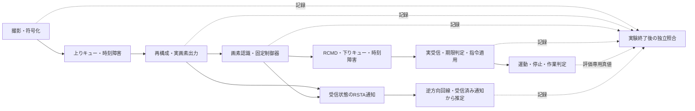

# Reach-RT G2-06：障害条件での統合計測

更新：2026-09-22。対象：G2-06完了、G2通過。G2は6/6項目、全体19/38項目、研究ゲートはG0・G1・G2の3/7。実験本体はC++、今回追加した事後照合・実行計画・集計はPython。

## 目的と判定範囲

G2の通過条件は「通信障害による影響をログから説明でき、通信量と情報の因果関係が正しい」こと。障害下の作業成功率を保証する工程ではない。正常条件ではT1／T2の成功を要求し、画像全損失や指令の全期限切れでは、動かず時間切れとなることを要求する。その他の障害では成功・失敗をそのまま残す。

G2-01～05で個別に検査した回線、予算、復号状態、通知を、画像ID・指令番号・物理刻み・共通単調時計でつなぐ。各試行は成功後も60秒まで通信・撮影を続け、早く終了した試行だけ通信費用が安く見える集計を避ける。

## 実装意図と構造



| 追加物 | 内容と意図 |
|---|---|
| `tools/verify_reach_integration.py` | 8条件を実行前に固定。全60秒の記録を統合し、画像由来の指令と指令由来の運動・作業結果を再計算する |
| `frame_chain.csv` | 撮影→上り配送／損失／キュー破棄→再構成→実画素→認識を画像IDで結ぶ。段階に到達しなかった時刻は空欄 |
| `actuation_chain.csv` | 全物理刻みについて根拠画像、認識時刻、指令生成、実受信、適用理由、位置・速度、成功／時間切れを対応付ける |
| `audit_reach_stage_conservation.py`／`frame_terminal.csv` | 全撮影を未再構成、順序制約による棄却の推定、入力拒否、出力前破棄、実画素出力へ重複なく分類。順序棄却を導く場合は先行した新しい画像の取出し記録を根拠に添付 |
| `tools/test_reach_integration_audit.py` | 実ログのコピーへ10種類の誤りを入れ、因果順序・運動・作業判定の不正を検出することを確認 |
| `tools/finalize_reach_integration.py` | 計画と実設定、exe、保存ネイティブソース、過去の個別合格証拠を照合し、G2ゲート判定と集計を保存 |
| `index.html` | 実測の速度推移、作業結果、通信費用、各段階の件数と根拠CSVへの入口を表示 |

今回C++実験本体、制御則、物理定数、成功条件、RSTA／RCMDの電文は変更していない。使用exeはG2-05最終版の`artifacts/reach_g2_feedback_20260922/bin/Release/GE3.exe`、SHA-256は`19a9bd19919d5a0b0a6dbd81e3e25004a913d37aa76f7bc4387165dd908d555d`。新しい実験ログと監査コードは既存証拠を上書きせず保存する。

## 因果関係の検査

1. 既存の回線・共通予算監査で、全電文のIP長、予算判定、容量積分、有限キュー、障害区間、UDP送受信の一致を確認する。RSTA、ACK、再送、FEC、指令を除外しない。
2. 撮影・符号化・上り配送と復号イベントを照合。再構成の前に対応する画像データの配送があること、実画素出力と画素内ID、認識採否が一致することを確認する。FECのビット単位での再実装ではなく、既存の再構成・実復号監査も併用する。
3. 固定制御器の全指令を、ログの画像認識値だけから独立に再計算する。OBSERVE／APPROACH／ALIGN／HOLD、画像期限、推定誤差、壁余裕、速度・角速度を照合し、真値から作った指令が混入しても一致しないようにする。
4. 指令の生成→下り実送出→実受信→適用の順序と根拠画像を検査する。指令期限100 msとwatchdog 250 ms、棄却時に期限を延長しない挙動は既存指令監査で再確認する。
5. 全6,000刻みを受信指令から積分し直す。加減速、旋回、接触、境界外、目標内1秒保持、成功後／失敗後の停止、60秒の時間切れを再計算する。撮影時の評価用真値も、その物理刻みと照合する。
6. 送信側の推定は、その時点までに実受信したRSTA列から独立に再計算する。受信側が知っている未到着の状態は与えない。

真値を読むのは実験終了後の評価器。C++認識器は`ReceivedLuma`、固定制御器は`VisualObservation`、送信側推定器は受信電文とローカル時刻を入力とする構造を確認した。これは対象実装と固定試行の検査であり、あらゆる将来変更に対する形式証明ではない。

## 事前固定した条件

各条件1試行、60秒、初期姿勢は中央・向き0、実H.264・30 Hz撮影・20 Hz制御・100 Hz物理。通常は上下り6 Mbps、片道10 ms、キュー65,536 IP byte。既存の共通IP予算・FEC設定を全条件で使用する。

| 条件 | 変更点 | 事前に要求する確認 |
|---|---|---|
| T1正常 | 上記の通常条件 | 作業成功と全工程の整合 |
| T2正常 | 同上 | 作業成功と全工程の整合 |
| T1上り断 | 2～3秒、上りの時刻区間を全損失 | 実際の停止、回復後の再開、結果の記録 |
| T2下り断 | 2～3秒、下りの時刻区間を全損失 | 指令失効による停止、回復後の再開、結果の記録 |
| T2容量低下 | 上り6→0.75 Mbpsを2～4秒、キュー8,192 byte | 有限キュー破棄が発生し、後段と対応する |
| T1複合障害 | seed 206、100 ms区間、上り1.5／6 Mbps、上下り損失設定3%、遅延10～20 ms、キュー16,384 byte | 上下りに実際の損失があり、全工程が追跡できる |
| T2映像全損失 | 上りを全区間損失 | 動かず60秒で時間切れ |
| T2指令期限超過 | 下りを一律300 ms遅延 | 指令を採用せず、動かず時間切れ |

1秒の通信断は、指令失効と所定の制動が終わるまで観測するための統合診断条件。仕様の100／300／500 ms系列を一括検証した意味ではない。seed条件の「3%」は100 ms時間セルの生成確率であり、実測パケット損失率3%を意味しない。将来の回線表は模擬回線だけが読み、制御器へ渡さない。

[実行前計画](../artifacts/reach_g2_feedback_20260922/verification/integration_01/plan.json)に条件、期待結果、共通予算、exe・監査コードのハッシュ、再試行0、失敗後も全条件を続ける方針を保存した。

## 検証結果

**統合計測9/9合格、G2ゲート通過。作業結果は成功5件・時間切れ4件。** [元の8条件の結果](../artifacts/reach_g2_feedback_20260922/verification/integration_01/index.html)、[追加容量試験](../artifacts/reach_g2_feedback_20260922/verification/integration_capacity_01/index.html)、[全9件の集計](../artifacts/reach_g2_feedback_20260922/verification/integration_01/aggregate.json)、[G2ゲート判定](../artifacts/reach_g2_feedback_20260922/verification/integration_01/gate_decision.json)。

| 条件 | 計測 | 作業結果 | 成功時刻（物理時刻） | 実画素出力 | IP送信試行byte |
|---|---|---|---:|---:|---:|
| T1正常 | 合格 | 成功 | 18.33秒 | 1,798 | 17,163,579 |
| T2正常 | 合格 | 成功 | 10.61秒 | 1,798 | 17,203,126 |
| T1上り断 | 合格 | 成功 | 18.89秒 | 1,750 | 17,207,295 |
| T2下り断 | 合格 | 成功 | 11.77秒 | 1,798 | 17,188,648 |
| T2容量低下＋8 KiBキュー | 合格 | 時間切れ | — | 0 | 17,398,846 |
| T1複合障害 | 合格 | 時間切れ | — | 66 | 17,325,100 |
| T2映像全損失 | 合格 | 時間切れ | — | 0 | 16,789,154 |
| T2下り300 ms | 合格 | 時間切れ | — | 1,798 | 17,160,433 |
| 追加：T2容量低下＋32 KiBキュー | 合格 | 成功 | 14.10秒 | 1,692 | 17,188,569 |

各条件60秒を維持し、合計16,200撮影・10,800指令・54,000物理刻み・10,800送信側推定・154,624,750 IP byteを監査した。採用認識の誤差余裕超過は0。全撮影の段階別終端分類も一致した。新規の[10改変試験](../artifacts/reach_g2_feedback_20260922/verification/integration_01/auditor_fault_tests.json)と[段階保存則の3改変試験](../artifacts/reach_g2_feedback_20260922/verification/integration_01/stage_conservation_fault_tests.json)がすべて不正を検出した。

初期8条件の後、8 KiBキューでは途中の容量低下以前にIDR入力が成立しないことが分かったため、32 KiBキューの追加試験を[別計画](../artifacts/reach_g2_feedback_20260922/verification/integration_capacity_01/plan.json)として実行前に固定した。初期2秒以内の画素出力・走行と、2～4秒の容量低下中のキュー破棄を必須とし、261パケットのキュー破棄を記録して成功した。元の失敗条件を置き換えたものではなく、事前8条件と追加1条件を区別して保存する。

### 障害から結果までの説明

- **上り断**：2～3秒の損失後、古い画像を使えず停止。単調実時刻2.257秒で停止し、3.691秒に再開。再開指令の根拠は撮影3.589秒の画像107。その後T1成功。
- **下り断**：画像が復号されても指令が途絶え、期限切れ・watchdogによる制動で実時刻2.552秒に停止。3.050秒に新たな有効指令で再開してT2成功。全刻みの制動を受信指令から再計算した。
- **8 KiBキュー**：1,984パケットをキュー破棄。1,697画像の再構成のうち4画像は、より新しい画像が取り出された後に完成したIDRだった。`JitterBuffer::PushFrame`の旧画像棄却条件をログとコードから導いた。残る1,693入力は`awaiting_initial_idr`で拒否され、画素出力0・全1,200指令が`no_image`・実移動0となった。「再構成成功」を「使える画像」と数えると誤判定する具体例。
- **複合障害**：上り時刻損失303・キュー破棄1,463、下り時刻損失113。再構成1,333→画素66→認識採用50。観測期限・履歴不一致等で停止が続き、最終xは約0.1393 mで時間切れ。これを成功例から除外しない。
- **映像全損失**：利用できる観測がなく停止したまま時間切れ。
- **下り300 ms**：1,798画像を復号・認識しても、100 ms期限の指令が到着時に失効し、ロボットは動かず時間切れ。映像だけの指標では説明できない。

元の監査JSONの`control_loop_aoi_max_ms`は、停止指令へコピーされた**不採用画像の番号**も含む古さであり、実際に制御利用した画像のAoIとしては使わない。集計ではこれを`source_tag_age_max_ms`と明示し、`control_used`の指令を適用中の値だけを`control_used_image_age_at_application_max_ms`として別計算した。例えば複合障害は前者36,192.644 ms、後者255.926 ms。古い観測を使って36秒間走行したという意味ではない。

### G2通過の根拠と再利用した証拠

G2-01～05の各完了判定と、今回の9条件を集約した。全実行のexe一致とネイティブソース720件のハッシュ照合を確認。C++を変更していないため、同じG2-05実行版の単体（状態83、回線／予算145、指令178、画像制御81、世界282、基盤671）、G2-04回帰8条件、既存通信モードの合格証拠をソース一致を確認して再利用した。今回それらを新たに全再実行したという意味ではない。

監査コードは`auditor_source`と`auditor_source_hashes.json`へ保存。過去の個別試験は旧ビルドの検証として保管し、今回の実行版の証拠と取り違えない。作業失敗4件を含む全結果の説明が成立したため、G2の観測基盤を合格とする。研究方式の効果は次段階で検証する。

## 再実行

```powershell
python tools/verify_reach_integration.py --name integration_repeat_01
python tools/verify_reach_capacity_transition.py --name integration_capacity_repeat_01
python tools/finalize_reach_integration.py --name integration_repeat_01 --supplement integration_capacity_repeat_01
```

未使用の実行名を指定する。最終判定は8条件と追加1条件が完走・監査合格し、事前に定めた正常成功、重大障害時の不動・時間切れ、通信断の停止・再開、途中の容量低下を満たす場合にだけ保存する。失敗時のログは削除しない。

## 技術レビューでの説明例

> 通信の損失数や復号枚数だけでは、ロボットが止まった理由や作業に失敗した原因を説明できません。そこで撮影した画像から、認識に使った画像、生成した指令、UDPで受理した指令、実際の動作までを番号と時刻でつなぎました。さらに画像の推定値から指令を再計算し、受信指令から運動と作業判定を再計算しています。受信していない情報の利用や、計測上の成功と実際の成功の取り違えを検出するための仕組みです。

## 限界と次工程

合成回線・このPC・中央初期姿勢・各条件1回の統合確認である。G1全18姿勢の再認定、統計的成功率、実網・実機の安全性、別PC間時計同期、完全H.264参照グラフ、Reach-RT方式の性能優位性は今回の判定範囲外。制御に使った画像の古さと、指令が実際に適用される時点の画像の古さは異なるため、後者が200 msを超える場合も別途記録する。シミュレーション時刻と単調実時刻を両方残し、OSによる遅れを隠さない。

G2通過後の次工程はG3-01「B0固定・B1の実装と調整」。今回の基盤を使って、既存方式と強い期限・回線ベース方式を同じ作用空間・予算・障害条件で比較できるようにする。アプリとHTML全体の目視確認は今回まだ実施していない。
