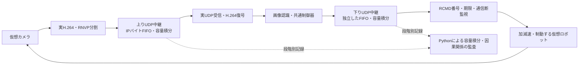

# Reach-RT G2-01：双方向の容量・直列化・有限キュー

更新：2026-09-22。作業記録E012。**G2-01完了。単体・不正設定・実通信5ケース・回帰確認が合格。G2全体は未通過、次はG2-02。**

## 何を実装したか・なぜ必要か

映像の圧縮ビットレートを下げたり、各パケットに一定の待ち時間を加えたりするだけでは、回線が混み合うときの待ち行列を再現できない。今回は、実UDPのパケットを受け取り、方向ごとの通信容量で順番に送り出す中継器を実装した。届いたバイト列は変更せず、実際のH.264復号と指令受信へ渡す。

上りは映像、下りはRCMD指令である。別々の容量設定・キュー・ソケット・処理スレッドを持ち、同じ実験開始時刻を使う。一方の混雑によって他方の容量やキューが消費されることはない。実験本体・回線モデルはC++、実行管理と保存記録の独立監査はPythonである。



| 実装 | 役割 | 入力→出力 |
|---|---|---|
| `research/ReachLinkModel.h` | 時計やOSに依存しないFIFOサービス計算 | 時刻・容量・IP長→受理/破棄・送信完了予定時刻 |
| `research/ReachDatagramLink.*` | 実UDPとの接続 | 実データグラム→モデル→所定時刻以降の実sendto |
| `research/ReachFoundation.*` | 設定の検査と保存 | 方向別JSON→検査済み設定・manifest |
| `research/ReachRobotVideo.*` | 上り中継を映像経路へ接続 | RNVPの実断片→復号画像と撮影時刻の照合 |
| `research/ReachCommandUdp.*` | 下り中継を指令経路へ接続 | RCMD実電文→期限検査済みの適用指令 |
| `tools/verify_reach_link.py` | 実行と独立監査 | 元データグラム・回線CSV・受信記録→合否 |

## モデルの前提と定義

### 容量と送信時間

容量はbps（bit/s）、時刻は実験開始からの整数µsで表す。区分一定の容量表は時刻0から始まり、変更時刻は厳密に増加する。容量0はサービス停止を意味し、途中まで送った量は保持する。容量の上限は1 Gbps、設定点は最大128個、キューは28 byte～16 MiB。未知キー、型違い、負値、非整数、時刻重複、空の容量表は拒否する。

パケットのサービス対象長は `UDPペイロード + UDPヘッダ8 + IPv4ヘッダ20` byte。RNVPヘッダはペイロード内に含まれる。1,000 IP byte（UDPペイロード972 byte）を800 kbpsで送る時間は10 ms。5 ms後に400 kbpsへ変えた場合、残る500 byteに10 msかかるため、合計15 msになる。

実装は `IP byte × 8 × 1,000,000` を未処理仕事量として保持し、各時間区間で `bps × 経過µs` を差し引く。完了は十分なサービス量が得られた最初の整数µsへ切り上げる。パケットごとに1 µs未満の余剰サービスを次へ繰り越さない保守的な離散化である。キューが空の時間を将来の送信権として貯めない。ポーリング間隔を変えてもモデルの完了時刻は変わらない。

### FIFOとtail-drop

キュー占有は**待機中および送信中のパケットのIP長の合計**とする。送信中のパケットは完了時に全長を解放し、途中まで送ったからといって空き容量を増やさない。満杯のときは新しく来たパケットをtail-dropし、既に入っているパケットを追い出さない。ちょうど同時刻の完了と新規到着では、完了による解放を先に処理する。

既定の[回線設定](../config/reach_rt_g2_link.json)は上り3 Mbps・下り0.5 Mbps、方向ごと16 KiB。これは無損失を保証する設定ではない。IDR画像の送信が集中すると、平均映像ビットレートが容量未満でもキューが溢れ得る。

### 実時刻とモデル時刻

中継器の入口で実際にrecvfromした時刻を到着時刻とする。モデル完了時刻より早くsendtoしない。OSの実行待ちで遅れた量は `actual_send_us - completion_us` として別に記録する。モデルのサービス時間にOS待ちを混ぜて「計算どおりの物理回線遅延」とは呼ばない。画面には現在の上下方向の設定容量を表示する。

入口と送信ソケットを分け、受信側からの応答が同じ方向へ反射しないようにする。G1と同様、RNVPのACK受信・再送・FEC適応はこの研究経路で無効であり、既存受信側が生成する未利用のRNVP応答はこの回線モデルへ戻さない。下りで今回接続したのはRCMD指令。全ACK・状態通知を含む共通予算はG2-03/G2-05で扱う。

この中継はPC内の実装方法であり、前後2本のloopback UDPを2つの研究用回線として課金しない。ログのIP長はモデルに投入した1回分。NICの実測バイト、Ethernetや無線の占有時間ではない。

### 終了・失敗の区別

観測窓終了後、方向ごと最大250 msだけ実時間で残りを送り、空なら20 ms以降に終了する。残りは`cancelled_at_close`としてIP長・未処理仕事量を残す。指令や世界の観測窓を延長して作業を成功させる処理ではない。破棄・配送・終了時残留を分けて保存し、途中までサービスしたパケットの全長を配送済みバイトに含めない。

G1の理想回線では全画像配送を要求する。G2の容量制約では、意図したtail-dropや期限切れによって画像が0枚になることがあるため、`validation_scope`を別に記録する。`command_udp_completed`や映像`validation_passed`は回線実行・記録の完了であり、作業成功ではない。作業は世界ログと別の判定で確認する。OS側での予期しないUDP紛失をモデルのtail-dropとして隠さず、送信元・モデル入口・モデル出口・受信側を照合する。

## 検証手順と証拠

1. 純粋C++モデルを既知値で検査する。一定容量、途中の増減、容量0と復帰、FIFO、キュー境界、上下方向独立、丸め、時計逆行、ポーリング分割を扱う。
2. 実アプリで回線設定の不正入力を拒否することを確認する。
3. 実H.264・実RCMDを5種類の回線に流す。全パケットの到着から、容量積分で開始・完了時刻を独立に再計算し、tail-drop判断・占有・保存則・実送信時刻を照合する。
4. 映像は送受信トレースのRNVP番号・フレーム番号・断片番号・長さを照合する。指令は実電文の全バイトと、受信後の適用・加減速・期限監視を照合する。
5. モデルを指定しない従来G1経路と既存モードを回帰確認する。

最初の`acceptance_01`は中継の入口と出口に同じソケットを使い、未利用RNVP応答が映像キューへ折り返された。送信トレースとモデル入口が一致せず監査で拒否された。別ソケットへ修正し、`acceptance_02`の5ケースは合格した。これらの開発試行を保持する。`units_01`はビルド環境変数Path/PATHの重複で失敗し、環境辞書を正規化した`units_02`でモデル29検査が合格した。

`acceptance_final_01`では、指令回線停止前の速度が最大0.228 m/sで、制動試験の前提である0.25 m/s超を満たさなかった。容量・キューの監査は一致したが、そのケースは不合格として保存した。速度条件は維持し、指令回線停止を1.5～2.2秒から3～4秒へ、観測窓を4秒から6秒へ変更して走行準備時間を確保した。その他の4ケースは4秒のまま。これはG1の60秒・作業成功条件の変更ではない。

### 最終版の結果

[全件表と証拠への入口](../artifacts/reach_g2_link_20260922/verification/acceptance_final_02/index.html)、[全結果JSON](../artifacts/reach_g2_link_20260922/verification/acceptance_final_02/report.json)、[集計・制動距離](../artifacts/reach_g2_link_20260922/verification/acceptance_final_02/aggregate.json)を保存した。`acceptance_final_02`の5ケースが全て合格した。

| ケース | 上り容量・キュー | 下り容量・キュー | 映像入力パケット | 上りtail-drop | 下りtail-drop | 復号画像 |
|---|---|---|---:|---:|---:|---:|
| 広い回線 | 6 Mbps・64 KiB | 0.5 Mbps・16 KiB | 538 | 0 | 0 | 120 |
| 映像方向停止 | 3→0→6 Mbps・16 KiB、1.5～2.2秒停止 | 0.5 Mbps・16 KiB | 548 | 77 | 0 | 42 |
| 指令方向停止 | 6 Mbps・64 KiB | 0.5→0→0.5 Mbps・232 byte、3～4秒停止 | 898 | 0 | 18 | 180 |
| 映像方向の溢れ | 64 kbps・4 KiB | 0.5 Mbps・16 KiB | 549 | 514 | 0 | 0 |
| 指令送信途中の変更 | 6 Mbps・64 KiB | 1→2 kbps・232 byte、0.5秒に変更 | 544 | 0 | 70 | 120 |

合計22秒、2,200物理刻み、660撮影、440指令。上り3,077パケット・下り440パケットをモデルの入口と元送信で照合し、配送分を最終受信と照合した。復号462画像の対応が一致。上りtail-drop591、下りtail-drop88。終了時の残留は映像低容量ケース1パケット、指令途中変更ケース2パケットで、破棄と区別して保存した。

指令回線停止では、期限切れ後に0.30 m/sから0.50秒・0.075 mで制動停止し、回線復帰後の新指令で再開した。途中容量変更では、実際に変更時刻をまたいで直列化された指令を1パケット確認し、全配送の予定時刻が独立計算と一致した。遅着指令は拒否され、ロボットは動かなかった。映像低容量ケースの復号0枚は期待した通信不能であり、作業成功には数えない。

全方向・全ケースの最大OS送信実行遅れは15.214 ms。これはモデル計算誤差ではなく、予定完了から実sendtoまでの追加時間として記録した。実送信の早着はない。この結果を任意のPCで1 µs精度の実ネットワーク遅延が得られる証拠にはしない。

最終exe SHA-256：`d24be093df38d62e95cfdd66cdcc079db6f3ebe6f458e02a468175cd681c62bb`。[ソース・条件監査](../artifacts/reach_g2_link_20260922/verification/acceptance_final_02/evidence_audit.json)で全5ケース、315個のnativeソースハッシュ照合と方向別設定の一致を確認した。

- [単体検証](../artifacts/reach_g2_link_20260922/verification/units_final_01/report.json)：回線29、指令178、認識・制御等76、世界280、基盤663が合格。非圧縮54画像の較正も維持。
- [回線設定の不正入力12ケース](../artifacts/reach_g2_link_20260922/verification/config_final_01/report.json)：全て実アプリが起動前に拒否。
- [監査器の異常記録検査](../artifacts/reach_g2_link_20260922/verification/acceptance_final_02/auditor_fault_tests.json)：早すぎる完了、誤った開始時刻、占有量、誤ったtail-dropの4改変を拒否。原記録は変更していない。
- [既存指令UDP7ケース](../artifacts/reach_g2_link_20260922/verification/command_regression_final_01/report.json)、[基盤12ケース](../artifacts/reach_g2_link_20260922/verification/foundation_regression_final_01/report.json)、[既存RNVPモード](../artifacts/reach_g2_link_20260922/verification/legacy_regression_final_01/report.json)が同一exeで合格。G1の全18姿勢を今回の新exeで再実行したとは扱わない。
- [容量モデルなしのT1中央60秒](../artifacts/reach_g2_link_20260922/verification/g1_t1_regression_final_01.json)は17.04秒で成功。1,800画像・1,200指令・6,000物理刻みを独立監査し、誤差余裕超過0。旧G1の全18条件の証拠は旧ビルドとともに保持する。

## 再実行と画面

```powershell
powershell -NoProfile -ExecutionPolicy Bypass -File tools/build_reach_g0.ps1 -Configuration Release -OutputName reach_g2_link_20260922
python tools/verify_reach_visual_units.py --name units_unique --build-name reach_g2_link_20260922 --include-command --include-link
python tools/verify_reach_link_config.py --name config_unique
python tools/verify_reach_link.py --name acceptance_unique
```

[G2画面を起動](../tools/open_reach_g2.cmd)。[G1の画面](../tools/open_reach_g1.cmd)は以前の合格版を使う。G2に任意の回線設定を渡す場合は `run_reach_g1.py --stage command_udp --build-name reach_g2_link_20260922 --link-config 設定.json --duration 60 --name 固有名 --show`。G2回線とG1指令診断シナリオの混用は拒否し、今回の診断条件を曖昧にしない。

## 専門の場での説明例

「映像と制御指令の両方向に、容量を持つFIFO回線を実装しました。送信中の容量変化は未処理のビット数へ反映し、キューが満杯なら新しいパケットを破棄します。実UDPの送受信記録から、どのパケットが待ち、どれが落ち、指令がいつ期限切れになったかを追えます。計算上の送信完了とPCの実行遅れを分けて保存することで、回線条件による影響と実装環境の影響を区別して説明できます。」

## 現在地と次工程

[G2-01判定JSON](../artifacts/reach_g2_link_20260922/verification/acceptance_final_02/task_decision.json)で完了を記録した。**G2は1/6項目、全体14/38項目完了。研究ゲートはG0/G1の2/7で、G2ゲートは未通過。** G2全体では、障害時刻・乱数の分離、共通IP予算、復号状態、状態通知、統合記録が残る。次はG2-02「時刻基準の障害トレース・乱数分離」。今回の容量表は決定的な設定であり、損失・ジッタ・乱数系列の分離まで実装したものではない。

アプリ画面全体・結果HTMLの目視確認は未実施。設定容量の表示は実装したが、ライブのキュー可視化や方式比較画面が完成したとは扱わない。各診断1回の結果であり、研究方式の成功確率や優位性の評価ではない。
