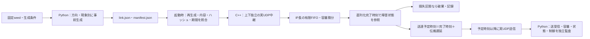

# Reach-RT G2-02：時刻基準の障害トレース・乱数分離

確認日：2026-09-22。対象：G2-02。**実装・検証完了。G2は2/6項目、全体15/38項目。G2全体のゲートは未通過。**

[進捗表](Reach_RT_Implementation_Progress.md) / [研究仕様](Reach_RT_Research_Spec.md) / [検証結果一覧](../artifacts/reach_g2_trace_20260922/verification/acceptance_01/index.html) / [機械可読の完了判定](../artifacts/reach_g2_trace_20260922/verification/acceptance_01/task_decision.json)

## 1. 何を解決する実装か

パケットが到着するたびに共通乱数を1個消費する模擬回線では、同じseedでも、送信数の多い方式は乱数列を早く進める。その結果、比較方式ごとに障害の時間帯が変わり、通信方式の違いと回線条件の違いが混ざる。

今回、実験開始前に容量・損失区間・遅延の時系列を生成し、実行中は経過時刻で参照する構造へ拡張した。G2-01の容量積分はすでに時刻基準だったため、その仕組みを保ち、直列化後の損失・伝搬遅延を追加している。

**公平性は、同じ時刻に同じ外生的な回線状態を与えること。パケット損失数や作業結果を一致させることではない。** 送信数・サイズ・時刻が違えば、待ち時間、直列化完了時刻、障害区間に入るパケットは変わる。それが比較したい方式の効果の一部である。

## 2. 構造と処理の順序



| 実装 | 役割・意図 |
|---|---|
| `tools/generate_reach_trace.py` | パケット情報を入力に持たず、外生条件を事前生成。生成器の版、seed、各乱数キー、条件、ハッシュを保存 |
| `research/ReachLinkModel.h` の `LinkConfig` | 容量表と損失・遅延表を検査。時刻から状態を検索し、乱数消費状態を持たない |
| 同ファイルの `PropagationModel` | 直列化後の損失を判定し、伝搬中のパケットを配送予定時刻順に管理 |
| `research/ReachDatagramLink.cpp` | 実UDPへ適用。原トレース、状態参照位置、配送予定と実送信、破棄・残留を記録 |
| `ReachFoundation.cpp` / `ReachJson.cpp` | 厳密な設定検査・有効設定保存。長いトレースに対応するため入力上限を64 KiBから4 MiBへ拡張 |
| `tools/run_reach_g1.py --trace-bundle` | 起動前に生成結果を照合し、トレース一式を各試行へコピー。未来の回線状態を認識器・制御器へ渡す経路は追加しない |
| `verify_reach_link.py` / `verify_reach_trace.py` | パケットログから容量積分と時間区間を再計算し、実際の損失・遅延・送受信対応を検査 |

実験本体はC++。Pythonはトレース生成、実行補助、監査、結果整理に使用する。既存G1の認識・制御・指令期限・制動定数は変更していない。

## 3. 時刻と障害の定義

- 共通原点はコーデック起動後の実験用単調時計。上下方向が同じ原点を使う。時刻単位は整数µs。
- 各点は、その時刻を含み、次の点の時刻を含まない区間 `[at_us, next_at_us)` に適用する。先頭は必ず0、厳密な昇順。最後の状態は継続する。
- 容量はG2-01と同じく直列化中に積分する。損失と伝搬遅延は、**モデル上の直列化完了時刻**で1回だけ選ぶ。到着時刻、パケット番号、OSが処理した時刻では選ばない。
- `drop=true` の区間に直列化が完了したパケットを破棄する。破棄前に消費した回線容量は取り消さない。キュー満杯による `tail_drop` と区別する。
- 遅延は非負、最大1,000,000 µs。予定送達時刻は `completion_us + delay_us`。その後に状態が変化しても、伝搬中の予定は変更しない。
- 遅延が短くなると後続が先行を追い越す。予定時刻が同じ場合はパケットID順。独立した「重複率」設定は今回追加していない。
- 実送信は予定送達時刻以降。OSの実行遅れは `actual_send_us - scheduled_delivery_us` として別記録し、合成ジッタに混ぜない。
- 終了時は従来どおり方向ごと最大250 msの実時間drain。直列化待ちと伝搬中の残留を分けて記録し、遅延を短縮して強制配送しない。
- 伝搬待ちには16 MiB・131,072パケットの実装上限がある。超過時は試行をエラー終了させる。合成損失として隠して継続しない。この上限は回線FIFOの容量とは別。
- 容量表・障害表はそれぞれ最大4,096点。旧設定で障害表を省略した場合は、損失なし・遅延0となる。

記録には `propagating`、`trace_drop`、`delivered`、`propagation_cancelled_at_close` を追加。各行に `trace_index`、`trace_at_us`、`delay_us`、`scheduled_delivery_us` を持たせた。方向ごとの完全な表を `uplink_trace.json` / `downlink_trace.json` として保存し、正規化したJSONのSHA-256を要約に記録する。

## 4. 乱数系列の分離と生成前提

生成器版は `reach-time-trace-sha256-v1`。共有PRNGの消費順には依存せず、名前付きキーと時間セル番号から整数値を得る。

```text
stream_key = SHA256("Reach-RT/rng/v1\0" + seedの4 byte big-endian + domainのASCII)
value      = SHA256(stream_key + 時間セル番号の8 byte big-endian)
sample     = floor(valueの256 bit整数値 × 選択肢数 / 2^256)
```

上り・下りそれぞれ `capacity` / `loss` / `jitter` の6系列を独立した名前で分離。`scene` / `perception` / `policy` の3系列も予約し、キーを記録する。現在の世界・認識器・制御器は決定的で、この予約系列を新たに使って誤差や探索を加えたわけではない。既存の研究設定の `seed` ラベルとは別に、トレースの `root_seed` を記録する。

標準の固定デモトレースはseed 201、60秒、100 msセル。上り容量は0.75 / 1.5 / 3 / 6 Mbps、下りは0.5 Mbps。各方向の損失区間の生成確率はセルごと10%、伝搬遅延は5 ms＋0～15 msのジッタ。キューは上り64 KiB・下り16 KiB。上り64 KiBは今回の分離検証・デモ設定であり、研究仕様のINITIAL 16 KiBを全体的に置き換えたものではない。

**これは時間セルのブラックアウトモデルであり、パケットごとの独立10%損失ではない。** 有限試行の損失区間割合も厳密な10%にはならず、パケット損失率は送信時刻によってさらに変わる。実5G/IOWNの測定分布への適合性は未検証。

観測期間の終端には明示的な正常状態を追加し、終了処理中もその状態を保持する。起動時にトレースが観測期間を覆うことを検査する。手動の `--link-config` は任意の合成診断用に残すが、その場合は乱数生成由来の保証を付けない。

## 5. 検証結果

新しい固定ビルド：`artifacts/reach_g2_trace_20260922/bin/Release/GE3.exe`

SHA-256：`b79b26732444db4b2a956034967cfa41f2c81f54d1f949be65ad3442df6083f0`

### 実通信5ケース

[全結果JSON](../artifacts/reach_g2_trace_20260922/verification/acceptance_01/report.json)。実H.264映像とRCMD指令を同一exeで実行。合計3,737パケットを監査した。

| ケース | 観測時間 | 上り入力 | 上り時刻損失 | 下り時刻損失 | 伝搬中の終了残留 | 判定 |
|---|---:|---:|---:|---:|---:|---|
| 固定トレース・T1 | 6秒 | 917 | 136 | 8 | 0 | 合格 |
| 同じ固定トレース・T2 | 6秒 | 900 | 155 | 8 | 0 | 合格 |
| 指令の3～4秒損失区間 | 6秒 | 899 | 0 | 20 | 0 | 合格 |
| 下り遅延250 ms→0 | 4秒 | 541 | 0 | 0 | 0 | 合格 |
| 下り遅延1秒・短い試行 | 0.5秒 | 30 | 0 | 0 | 10 | 合格 |

T1/T2は入力の違いを作る診断用であり、異なるタスク間の性能比較ではない。上り送信数917/900と損失数136/155が異なる一方、上下方向の容量・損失・遅延表のハッシュはそれぞれ一致した。全パケットについて、参照した時刻区間が記録と一致し、モデル外のUDP紛失がないことを照合した。

指令損失では0.30 m/sから0.50秒・0.075 mで停止し、区間終了後の新しい有効指令で再開した。遅延短縮による配送順序の逆転、期限切れ指令の拒否、終了時に残る10個の指令の分類も合格。

実送信のOS実行遅れの最大は16.549 ms。モデル時刻のµs単位の計算と、実配送がµs精度であるという主張を区別する。障害下で復号できた画像はT1で11枚、T2で12枚であり、作業成功や研究方式の性能向上を主張する結果ではない。

### 単体・監査器・回帰

| 検証 | 結果・証拠 |
|---|---|
| C++回線単体 | [124検査合格](../artifacts/reach_g2_trace_20260922/verification/units_01/report.json)。G2-01の29検査に、区間境界、10倍の送信数40/400、順序逆転、同時刻順序、終了残留、資源上限等を追加 |
| 生成器・系列分離 | [48検査合格](../artifacts/reach_g2_trace_20260922/verification/generator_01/report.json)。再生成のバイト一致、方向／現象／予約系列の変更の独立性、600/6,000時刻参照、期間延長、改変・期間不足の拒否 |
| 不正設定 | [22ケースを実アプリが拒否](../artifacts/reach_g2_trace_20260922/verification/config_01/report.json)。数値で指定したdrop、負・過大・小数の遅延、非配列、重複時刻、過剰点数等 |
| 監査器の検出能力 | [6種類のログ改変を拒否](../artifacts/reach_g2_trace_20260922/verification/acceptance_01/trace_auditor_faults.json)。区間番号・区間時刻・遅延・予定時刻・早すぎる送信・偽の損失。原記録は変更しない |
| 証拠の対応 | [nativeソース315ハッシュ照合](../artifacts/reach_g2_trace_20260922/verification/acceptance_01/evidence_audit.json)、exeと要求・有効設定、方向別原トレースを照合 |
| G2-01回帰 | [既存5ケースが合格](../artifacts/reach_g2_trace_20260922/verification/link_regression_01/report.json)。容量停止・再開、tail-drop、送信途中変更を維持 |
| 基盤・従来単体 | [基盤12ケース](../artifacts/reach_g2_trace_20260922/verification/foundation_regression_01/report.json)。同じビルド元で指令178、認識等76、世界280、基盤664の単体検査も合格 |
| 長いトレース | [97,273 byteの有効設定を読み込み](../artifacts/reach_g2_trace_20260922/verification/long_trace_smoke_01.json)、60秒分の固定表で1秒を実行・監査。60秒の作業成功試験を意味しない |

今回の新exeでG1の全18姿勢・各60秒を再実行したわけではない。旧G1合格証拠は保持する。アプリ画面全体・HTML全体の目視確認は未実施。

## 6. 再現と確認画面

リポジトリ直下のPowerShellから実行する。証拠を上書きしないため、同名の出力先が存在する場合は新しい名前を使う。

```powershell
powershell -NoProfile -ExecutionPolicy Bypass -File tools/build_reach_g0.ps1 -Configuration Release -OutputName reach_g2_trace_20260922
python tools/generate_reach_trace.py --output artifacts/my_trace_01 --seed 201 --horizon-us 60000000 --slot-us 100000
python tools/run_reach_g1.py --stage command_udp --build-name reach_g2_trace_20260922 --duration 6 --trace-bundle artifacts/my_trace_01 --packet-trace --name my_trace_run_01
python tools/verify_reach_trace.py --build-name reach_g2_trace_20260922 --name acceptance_02
python tools/test_reach_trace.py --output artifacts/reach_g2_trace_20260922/verification/generator_02
```

[G2-02画面を起動](../tools/open_reach_g2_trace.cmd)すると、保存済みの60秒トレースを使い、現在時刻の上下容量・損失区間・遅延を表示する。過去の[G2-01起動](../tools/open_reach_g2.cmd)と[G1起動](../tools/open_reach_g1.cmd)は各固定版のまま保持。

[結果一覧HTML](../artifacts/reach_g2_trace_20260922/verification/acceptance_01/index.html)には2試行の固定損失区間、異なるパケット数、全ケース、原記録へのリンクを掲載した。これは完了した試行の記録閲覧であり、2方式を同時に動かすライブ比較画面ではない。

## 7. 技術レビューでの説明例と次工程

> 比較方式の送信数によって回線障害が変わると、公平な評価になりません。そこで容量・損失・遅延を実験前に時間表へ固定し、上下方向と現象ごとに乱数系列を分離しました。C++の実UDP中継はパケットの直列化完了時刻で表を参照し、Pythonの監査器が全パケットの適用区間と配送時刻を再計算します。実際に送信数が917個と900個に変わっても回線表が一致し、損失やキュー滞留は各送信の結果として変化することを確認しました。

次は **G2-03「IPバイト計上・共通予算」**。映像だけでなくACK・FEC・再送・指令等を同じIP層の基準で計上し、方向別・総量の一致と予算上限を検査する。現在の下り実接続はRCMDであり、未利用RNVP応答・状態通知を含む全通信量の予算管理はまだ完了していない。複製設定、復号状態、方式比較・実測回線への適合も今回の合格に含めない。
