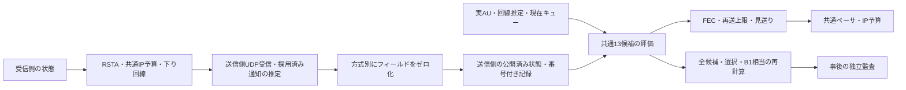

# G3-02：復号情報・作業情報の寄与分離

更新：2026-09-23。**G3-02完了。** B2/B3を実装し、v5で調整30試行・固定後の比較12試行すべてが計測監査に合格した。回帰と証拠の整合確認も合格し、[完了判定](../artifacts/reach_g3_ablation_v5_20260923/verification/study_01/task_decision.json)を保存した。全体21/38、G3は2/5、研究ゲート3/7。G3全体は未通過。

[v5の事前計画](../artifacts/reach_g3_ablation_v5_20260923/verification/study_01/plan.json)に沿って、各方式5係数×2条件で調整し、B1/B2はλ=0.1、B3はλ=1を検証前に固定した。初版～v4の無効・開発試行も保存し、最終比較へ混ぜない。

### 固定後の比較結果

各セルは作業結果／完了時間／60秒窓全体の通信量。MBは1,000,000 IP byteで、映像・FEC・再送・通知・指令等を含む。

| 同じ条件 | B1：回線情報 | B2：＋復号情報 | B3：＋作業情報 |
|---|---|---|---|
| 正常T1 | 成功／17.38秒／13.316 MB | 成功／18.26秒／13.240 MB | 成功／18.92秒／13.006 MB |
| 正常T2 | 成功／11.65秒／13.249 MB | 成功／10.24秒／13.157 MB | 成功／10.30秒／13.038 MB |
| 複合障害T1（seed 333） | 時間切れ／12.956 MB | 成功／36.52秒／12.349 MB | 成功／52.28秒／12.476 MB |
| 小キューT2（seed 334） | 時間切れ／13.354 MB | 時間切れ／5.379 MB | 時間切れ／13.338 MB |
| 作業成功数 | **2/4** | **3/4** | **3/4** |

復号情報・作業情報を使う両方策に、B1が時間切れとなる条件で成功する例が見られた。一方、正常T1の時間短縮や小キューT2の完了は実現していない。各条件・各方式1回の初期比較であり、統計的優位性・他環境への一般化・両情報を併用する方式Rの価値は未判定。

同一入力・同一λでv=1へ戻したB1相当からの選択変化は、各方式の検証7,200判断中、B2で1,743回、B3で1,527回（B1は0）。これは各方式が実際に通った履歴上の一段階の比較である。特にB3の比較相手はλ=1のB1相当であり、表のλ=0.1で実行したB1の軌跡と同じではない。

B2の4条件合計通信量が小さい理由には、作業を完了できない小キューT2で送信を多く見送ったことも含まれる。合計通信量の減少を、そのまま作業効率の改善と呼ばない。また調整用T2は全15試行が時間切れであり、この難条件を解決できたという結果ではない。

## 1. 目的と説明例

通信状況だけでは、届く画像が復号できるか、作業のどの段階で必要かを判断できない。G3-02では、追加情報を利用する仕組みと、その情報が選択・通信量・作業結果へ与える影響を切り分ける。

> B1の通信制御を共通基盤にして、復号情報だけを加えたB2と、作業情報だけを加えたB3を作りました。どちらも受信通知が実際に届くまで情報を使えません。同じ通信予算・候補・調整回数で比較し、同じ瞬間の同じ入力でも選択が変わるかを別途検算します。情報を増やしただけで性能が上がるとは仮定せず、悪化や無効果も結果として残します。

## 2. 情報の境界

| 入力 | B1 | B2 | B3 |
|---|---|---|---|
| 実受信RNVPの損失・連続損失・RTT、送信側BWE・現在キュー量 | 使用 | 使用 | 使用 |
| 自分が生成したAUの長さ・撮影時刻・IDR属性 | 共通に取得 | 使用 | 共通に取得 |
| 受信済みRSTAの同期状態・復号世代・直近復号待ち時間 | 隠す | 使用 | 隠す |
| 受信済みRSTAの作業段階・観測撮影時刻・位置誤差余裕・作業期限 | 隠す | 隠す | 使用 |
| 受信側の直接スナップショット、真の位置・成功判定、未来の障害 | 使用禁止 | 使用禁止 | 使用禁止 |

通常のRNVP再送・IDR要求は全方式で共通。RSTAも全方式で同じ周期・電文長で送信し、同じ予算へ課金する。したがって通知の「利用価値」を分ける比較であり、RSTAを送らないシステムに対する総費用比較ではない。

B3の観測年齢や作業段階は、復号不成立の影響を間接的に含み得る。明示的な復号フィールドの遮断を検証するもので、情報論的に完全独立な観測を実現したとは言わない。B2にも通常NACK等からの間接的な情報がある。

## 3. 実装構造と意図



- `ReachBaselineState.h`：方式ごとのマスクと有用性の重み。入力は受信済み推定から作る小さな構造体で、受信側の状態管理器や障害トレースを持たない。
- `ReachStateProtocol.h` / `ReachStateFeedbackUdp.cpp`：推定の番号と採取時刻をローカルの来歴として付加する。RSTA電文208 byteや回線上の課金は変更しない。
- `ReachResearchMode.cpp` → `RobotVideo::PublishBaselineState`：20 Hzで生成済みの送信側推定を渡し、B2/B3用のフィールドだけを残す。受信側通知の生成と、送信側が採用済みの通知を使う経路を分離する。
- `Baseline::PublishState` / `Plan`：状態の公開とAU判断を同じロックで整列し、判断時点で公開済みの番号を記録する。古い状態の有効期限は判断時刻で再評価する。
- `audit_reach_ablation_state.py`：RSTA実受信電文、採用済み推定、マスク後の公開記録、判断の接頭履歴を突き合わせる。未到着・未来・隠すべきフィールドを使う記録は拒否する。

実時間処理はC++、起動・実験計画・事後監査・結果HTMLはPython。真値は事後の作業判定と監査にだけ使う。

## 4. 同じ候補を、異なる情報で評価する

B1から、FECなし／群2・4・8 × 再送要求上限0・1・2、および見送りの13候補を引き継ぐ。キャッシュ24フレーム、撮影から200 msの期限、共通IDR処理、500 msの試験送信規則、コーデック、制御器も共通である。実装詳細は[G3-01](Reach_RT_G3_Baseline.md)を参照。

新しい評価式は次の形とする。

```text
送信候補の費用 = v × (1 − 完全配送確率の近似) + λ × 正規化した期待IP費用
見送りの費用   = v
```

B1は常にv=1。B2/B3は状態の種類だけでvを変え、配送確率・候補数・FEC能力・期限判定を変えない。v=1の経路はB1の演算結果をそのまま使う。これは明示した工学的な重み付けで、校正済みの復号成功確率や作業成功確率ではない。

**B2：** 通知が同期済みで復号世代があるときは基準値1。同期未確認では、実際に生成済みのIDRを2、P画像を0.15とする。これに`1 − 0.5 × min(1, 直近の復号待ち時間 / 200 ms)`を掛ける。過去に観測した復号待ち時間による価値の割引であり、現在のデコーダキュー残量や将来待ち時間とは呼ばない。世代は同期報告の妥当性の条件に使い、送信側から受信側の完全な参照グラフを復元したものではない。

**B3：** 作業段階の基準値をOBSERVE=2、APPROACH=1、ALIGN=1.5、HOLD=2とする。観測年齢/200 ms（上限1）、位置誤差余裕を0.30 m/sで年齢分だけ広げた値/0.10 m（上限1）を加える。観測なしはそれぞれ1。残り作業時間が0～5秒なら0.5を加え、全体を4以下にする。これは接近・整列・保持を区別する初期ヒューリスティックで、実機の停止安全性を保証しない。

通知未到着、生成時刻から250 ms以上経過、時刻の不整合がある場合はv=1へ戻る。500 ms試験送信では全方式でv=1・実効λ=0に揃える。未知の状態を不利な値として固定して送信を永久に止めないためである。期限・IP予算は試験送信でも迂回しない。

重みの関数・定数は長い調整試行に入る前に固定し、調整対象は全方式共通のλ=0、0.1、0.3、1、3だけとする。vの導入は実効的な費用重みの時間変化でもあるため、「新しい情報を含むこの方策」の効果として解釈し、情報一般の最適価値とは主張しない。

## 5. 二つの比較を区別する

1. **作業全体の対応比較：** B1/B2/B3をそれぞれ5係数×2調整条件で再調整し、選定を固定してから別の4条件で比較する。各60秒、同じ予算上限と時刻基準障害。異なるλを選ぶことも認め、調整機会を揃える。
2. **同一入力での一段階の比較：** B2/B3の各判断について、同じAU・回線推定・キュー・λでv=1に戻した場合のB1の選択を計算する。実行した選択との差を記録する。後続の映像・ロボット軌跡は変化するため、これを反実仮想の作業成功結果へ外挿しない。

調整はseed 301/302の既存2条件。B1も新しいexeで同数を再調整する。検証は正常T1/T2と、未使用seed 333のT1複合障害、334のT2小キュー。正常条件は既知の回帰条件であり、全条件が未知の最終テストという意味ではない。

選定は作業成功数→総完了時間（失敗60秒）→総IP費用→事前のλ順。成功後も60秒窓まで課金する。方式順を回転し、T2では係数順を逆にする。調整中の監査不合格は選定前に停止し、失敗を削除して成功だけで選ばない。検証を見た後の再調整は別版として扱う。

## 6. 現時点の検証と実行上の問題

以下は初版の記録。初版Releaseのexe SHA-256は`c5696bb77f51b3ed6718f84622fdebb507a464fcb8e45abafb28fb225e48ebf3`。後続版と試行を混ぜない。

- 単体1,992検査（方式542、通知83、回線145、指令178、認識81、世界282、設定681）が合格。隠したタスク値を変えてもB2が変わらず、隠した復号値を変えてもB3が変わらないことを含む。
- 実ログへの10改変を全検出。B2への作業情報漏れ、B3への復号情報漏れ、未来の公開番号・受信時刻、偽の観測値・有用性・IDR属性・比較選択を検出する。既存B1の11改変検出も再確認した。
- 8秒の実通信9条件が機能監査を通過。B2/B3の通常・通知断、B2の遅着・不正通知、B3の通知未到着・重複、およびB1通常を確認した。遅着・未到着時の選択は、同じ入力・係数のB1と全件一致した。
- 最初の遅着確認は実時間更新の追随上限超過で無効終了し、残り4条件を別名の追加機能確認として実行した。元の不合格記録は保持する。初回単体の設定検査にも旧仕様「B2は不正」が残っており、B2/B3を正規値、B4を不正値として修正して再確認した。
- 当初の長い調整計画では複数方式で周期取りこぼしが発生し、係数選定前に実行を中断。原因を外部負荷と断定せず、無効試行も実装の安定性に関する未解決事項として残す。

### 実行条件の確認とv2

初版`study_01`は無効4件と完走1件を保持し、選定前に中断した。実験用子プロセスだけをAboveNormalにしたB1・60秒の確認は成功したが、続く別計画`study_02`ではB1成功後にB2が撮影周期を取りこぼした。優先度変更だけによる安定性は確認できなかった。

v2では`--precise-wait`を追加し、研究ループの待機を1 msの高精度waitable timerへ切り替えられるようにした。Windowsの[高精度タイマーAPI](https://learn.microsoft.com/en-us/windows/win32/api/synchapi/nf-synchapi-createwaitabletimerexw)を使用する。全OSのタイマー設定は変えず、既定の起動では従来の待機を維持する。周期の取りこぼしを許可したり、後から過去の画素を作ったりする変更ではない。

`schedule_model.json`に待機設定を、`schedule_timing.csv`に2 msを超えた待機・状態poll・制御・物理・撮影等の区間を記録する。区間中のOSによる中断も含む所要時間であり、区間名だけからCPU計算やI/Oを原因と断定しない。高精度タイマーもWindows上の最悪時間保証ではない。

v2のB2・60秒確認は撮影1,800・指令1,200・物理刻み6,000を照合して作業成功。記録された待機最大は4.752 ms、撮影区間31.924 ms、状態poll区間22.558 msだった。単体1,992検査、実通信9条件、10＋11改変検出もv2で再確認した。初版の成績と混ぜず、3方式を同じ新exe・高精度待機・AboveNormalで調整する。

本節の結果は初期機能確認で、G3-02完了や研究上の価値をまだ示さない。

### 計上ロックと大きな通信ログの分離

v2の長い調整はλ=0のB1/B2/B3が成功・監査合格した後、B2・λ=0.1が約12秒の計測時点で更新周期に追いつかなくなった。区間記録では直前の状態確認が163.041 ms、同じ時間帯のIP台帳のイベント間隔が164.138 ms。送信側の候補評価そのものの計算停滞を示す記録ではない。

状態確認が取得する共通予算ロックは、UDP送信と電文のファイル記録でも使っていた。ファイルI/Oを原因と確定できたわけではないが、I/O待ちが通信・制御へ伝わる構造を除くため、v3ではIP台帳・受信フィードバック・双方向回線ログを`DeferredLog`へ変更する。

`DeferredLog`は64 KiBずつ確保し、ストリームごとに128 MiBを上限として記録をメモリに保持する。挿入中はディスクへ書かず、計測終了後のcloseで順番どおり保存する。上限超過は例外で試行を無効にし、記録を黙って捨てない。強制終了では未保存の記録を失うため、その試行を認定しない。単体検査では計測中のファイル長0、複数ブロックの完全一致、上限超過の例外と保持量を確認する。

`budget_timing.csv`には2 msを超えた処理について、ロック待ち・sendto・記録の時間を残す。IP費用・課金時刻・sendto呼出し・制約の順序は維持し、記録の保存時期を変える。B1/B2/B3は同じ変更を使用し、初版やv2の成績と混ぜない。

v3の単体1,996検査（ログ検査4件追加）、実通信9条件、監査への10＋11改変検出は合格。長い調整では最初の5件が60秒窓を完走し、4件の全監査が合格したが、5件目のB3・λ=0.1で次の記録不足を検出し、選定前に停止した。

### ジッタバッファでの棄却を直接記録するv4

v3の5件目は作業成功だったが、画像420の再構成後にデコーダ取出しの記録がなかった。画像421の再構成は420より先、デコーダによる421の取出しは420より後だった。ジッタバッファから出した時刻と、デコーダが取り出した時刻の間に間隔があるため、既存の「先に観測した新画像のデコーダ取出し」を使う推論だけでは、この棄却を説明できない。元試行の監査不合格は保持する。

v4はジッタバッファの既存棄却ガード内で、最後に送り出した画像番号を返し、`completed_rejected`として直接記録する。棄却規則や並べ替え規則を変更しない。監査は棄却記録・新旧画像番号・stream・各再構成時刻を照合し、直接観測した棄却と、旧ログのデコーダ取出しから推論した棄却を別分類する。証拠がない画像は引き続き不合格とする。

ネイティブ単体で「421をジッタバッファから出し、デコーダが消費する前に420が届く」順序を再現する。監査側も、正しい棄却記録があれば分類でき、記録を削除した場合や架空番号・古い番号・未来時刻・別streamなら拒否することを検査する。

### 研究ログ全体の保存を計測後へ移すv5

v4は単体2,000検査と棄却監査の5改変検出に合格したが、短時間確認のB2通知断で物理更新区間が775.740 msを要し、周期追随上限を超えた。通信ログだけを分離しても安定性を確認できなかった。区間の長さからディスクI/Oを原因と断定はしない。

v5は世界・指令・状態・方式判断・イベント等に共通の`BufferedLog`も、32 MiB/ストリームを上限とする`DeferredLog`へ変更する。通信台帳・回線ログは128 MiB/ストリームを維持する。計測中のファイル書込みを除き、終了時の明示的closeで保存し、イベント保存成功後に完了マーカーを公開する。上限超過・保存失敗の試行は認定しない。記録量を削減したり、時計の合格条件を緩めたりする変更ではない。

v5はReleaseビルドと[単体2,000検査](../artifacts/reach_g3_ablation_v5_20260923/verification/units_01/report.json)が合格（方式550、通知83、回線145、指令178、認識81、世界282、設定681）。exe SHA-256は`2b12db7c79c254636ebc20b9d789a272b11358c2cb4fd477705e53906ec3da1c`。[短時間9条件](../artifacts/reach_g3_ablation_v5_20260923/verification/preflight_01/report.json)・[情報分離の10改変検出](../artifacts/reach_g3_ablation_v5_20260923/verification/ablation_fault_tests.json)・[既存B1の11改変検出](../artifacts/reach_g3_ablation_v5_20260923/verification/baseline_fault_tests.json)も合格した。同じexeの42試行は、周期違反・記録監査不合格なく完走した。旧版での停滞原因の断定や、Windowsでの実時間保証を意味しない。

42試行で撮影75,600件・指令50,400件・物理刻み252,000件・候補982,800行・455,562,264 IP byteを照合し、採用推定の誤差余裕超過は0件。[集約](../artifacts/reach_g3_ablation_v5_20260923/verification/study_01/aggregate.json)、[選定記録](../artifacts/reach_g3_ablation_v5_20260923/verification/study_01/selection.json)、[証拠ファイルのハッシュ](../artifacts/reach_g3_ablation_v5_20260923/verification/study_01/evidence_audit.json)を保存した。

最終exeで[復号8条件](../artifacts/reach_g3_ablation_v5_20260923/verification/decode_regression_01/report.json)、[状態通知8条件](../artifacts/reach_g3_ablation_v5_20260923/verification/state_regression_01/report.json)、[従来モード](../artifacts/reach_g3_ablation_v5_20260923/verification/legacy_regression_01/report.json)も合格。従来モードは表示85枚を確認した。G1全18初期姿勢の再実行、GUIの目視確認、他PC・実網・実機での性能確認は行っていない。

## 7. 成果物・現在地・次工程

成果物は方式別C++実装、マスク・公開時刻の記録、独立監査、同一入力での比較、事前計画付き実験ツールと実測HTMLである。アプリの同時比較リプレイや画面全体の目視確認は含まない。

[比較HTML](../artifacts/reach_g3_ablation_v5_20260923/verification/study_01/index.html)は実行中も更新する。[起動ファイル](../tools/open_reach_g3_ablation.cmd)はv5の結果を開く。完了判定が保存された後は、次のコマンドで固定条件を使う新しい試行を起動できる。過去の試行記録を上書きしない。

```powershell
python tools/run_reach_ablation_case.py --mode B2 --case valid_T2_normal --show
python tools/run_reach_ablation_case.py --mode B3 --case valid_T2_normal --show
```

現在：**G3-02完了。全体21/38、G3は2/5完了、研究ゲート3/7。** 次はG3-03「小規模モデル・厳密解」。B1/B2/B3の近似と状態情報が意味を持つ条件を小規模な問題で調べ、到着済み情報だけを使う最適解と未来を知る事後オラクルを区別する。今回の実測だけから、両情報の併用価値や一般的な最適性を結論しない。
