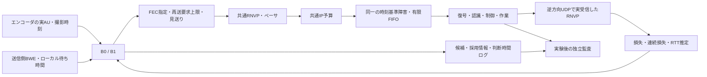

# G3-01：比較に耐えるB0/B1の固定・実装・調整

更新：2026-09-22。**G3-01の実装・初期調整完了。** v1の待ち時間入力をv2で修正し、v2調整で判明した送信見送りの停滞へv3で試験送信を追加。最終版は22試行中、60秒窓21件の監査が合格、撮影周期の取りこぼしによる無効1件を別記。旧2版の計40試行も保持し、最終版の成績へ混ぜない。

## 1. 実装の目的

Reach-RTの研究では、通信が悪いときに「何を送れば遠隔作業の成功につながるか」を調べる。その価値を説明するには、既存方式も適切に動かし、同じ資源と障害条件で比較する必要がある。

G2では計測の切り分けを目的にペーシングと適応FECを止めていた。この診断設定を弱い比較相手として流用せず、G3のB0では既存RNVPの送信平滑化・帯域推定・適応FEC・期限付き再送を有効にして固定する。B1では、届いた回線情報に基づき、画像サイズに合うFECと再送上限を選ぶ。

**B0は既存RNVPを研究用の共通回線へ接続した固定プロファイル、B1はRNVP/XORの能力内で調整する独自の期限・回線参照方式である。** 商用方式や最先端論文の完全再現を意味しない。

対外説明例：

> 比較対象が不利な設定にならないよう、既存の回復機能を有効にした基準方式と、回線状態に応じて回復量を選ぶ方式を用意しました。両方式は同じ通信予算と時刻基準の障害を使います。送信側が実際に受け取った情報だけで判断したか、実際のFECや通信費用が記録と一致するかを検査できます。

## 2. 何をどの意図で実装したか

| 機能 | 実装内容 | 意図 |
|---|---|---|
| B0固定 | 同じexe内で既存適応FEC、RNVP再送、帯域推定、ペーサを利用。設定・ソース・exeのハッシュを保存 | 比較中の基準変更を防ぐ |
| B1候補生成 | FECなし／群2・4・8 × 再送要求上限0・1・2、送信見送りの計13候補 | 無条件の冗長化を避け、AU長・期限・回線に応じて回復費用を選ぶ |
| 到着済み情報の利用 | 実際のRNVP受信電文から損失・連続損失・RTTを更新 | 模擬回線の未来や受信側の真値を使わない |
| 共通IDR処理 | 届いた通常RNVPのIDR要求を保留し、要求可能な時点でエンコーダへ渡す。要求間隔500 ms、既存の入力45でのIDRも共通 | 同期回復機能を揃え、要求連発と保留中の取りこぼしを抑える |
| B1の試験送信 | AU提出が500 ms以上ない場合、既知の上限レート・実効λ=0で同じ候補を評価。期限・予算の検査を維持 | 送信見送りで新しい回線情報を得られなくなる停滞を避ける |
| 実通信への接続 | AUごとのFEC指定、再送要求ゲート、共通ペーサ・共通IP予算 | シミュレートした評価値だけでなく、実UDPの挙動を変える |
| 調整と固定 | 5つのλを2つの調整条件で比較し、別の検証条件へ進む前に選定結果を保存 | 検証結果を見て設定を選び直すことを防ぐ |
| 独立監査 | Pythonで電文→推定値→13候補→選択→実FECを再計算。G2の全工程監査も併用 | 判断理由と実動作の食い違いを検出する |

実時間の映像・通信・選択処理は**C++**で動く。Pythonは起動、実験計画、ログ検算、結果HTML作成を担当し、ロボットの実時間制御へ真値を渡さない。

## 3. 構造と情報の境界



- `research/ReachBaselinePlanner.h`：通信関連の数値だけを受け取る候補評価。ロボット位置、復号世代、RSTA、障害トレース型を入力に持たない。
- `research/ReachBaseline.cpp`：受信済みRNVPの推定と実送信への接続。コンストラクタへ渡すのは方式名、λ、既知のペーシング上限、記録先だけ。
- `research/ReachRobotVideo.cpp`：共通映像経路から選択を呼び、通常のIDR要求とペーサ終了待ちを接続。
- `NetworkManager::RnvpFrameProtectionOptions::disableFec`：AU単位のFEC無効を明示。指定がなければ既存経路の動作を維持。
- `NetworkManager::SetResearchRepairGate`：RNVPが選んだ欠損チャンク再送へ追加判定。B0は許可、B1は選択した要求回数・期限を検査。研究ゲートが未設定なら従来経路。
- `tools/run_reach_baseline_study.py`：試行を直列実行し、選定前後の証拠を保存。
- `tools/verify_reach_baseline.py`：実験後の独立再計算。

RSTAは両方式で同じように送信・計上するが、B0/B1の候補評価には渡さない。通常のNACK/IDR要求は共通に利用するため、復号に関係する兆候を一切観測しないという意味ではない。B2/B3で追加する詳細通知との境界である。

これは同じ通知通信条件で「追加情報を判断に使う効果」を分離するための基準である。RSTAを送らないB0/B1と比べたシステム全体の費用対効果は別の比較を要する。今回の結果を、通知コストのない既存システム全般への優位性として扱わない。

## 4. B0の固定範囲

既存の`UpdateAdaptiveFec`、帯域推定、RNVP送信キャッシュ、再送TTL・優先度・FEC救済を利用する。λは0.1で設定を固定するが、B0の判断には使わない。

ここで「固定」とは、実装・適応則・初期設定・利用できる情報を固定すること。通信中のFEC量や送信レートを一定にする意味ではない。B1もλを固定した後、同じ評価規則に従って画像ごとの動作を変える。

既存アプリ全体のQoE品質変更を研究モードへ移植したものではない。コーデックは両方式で640×360・30 fps・目標1.5 Mbpsに固定し、ビットレート・解像度・fpsの適応は行わない。B0の適応FECには、実受信した損失・ACK欠損率・NACK数、ローカル待ち時間、帯域推定を渡す。遠隔で未取得の期限切れ数・FEC回復数と、本プロファイルで集計していないFEC送信累積は0とする。これらを直接受信側から読むことはしない。この差はB0の解釈上の制限として残す。

送信キャッシュ24フレーム、実装済みの再送期限・優先度は両方式共通。B0のログの`rounds=3`は基準方式を識別する記録値であり、この追加ゲートで3回に制限する意味ではない。実際の制限は既存RNVP側にある。

## 5. B1の判断式

損失推定はTransportFeedbackに含まれる未処理のsequenceだけを採用し、係数0.05のEWMAで更新する。同時に連続するMissingのEWMAを保持し、損失に対する比率を連続損失指標にする。パケット到着数と独立な未来トレースを参照しない。損失・連続損失の初期EWMAはともに0.01で、初回は保守的な連続損失指標1から開始する。

RTTは実受信PONGの送信元タイムスタンプとの差から、係数0.125のEWMAで更新する。初期値40 ms。単一PCの共通単調時計を使うため、別PC間の時計同期を検証したものではない。BWEの推定レートを100 kbps～既知の上り／総量予算レートの小さい方へ制限し、ペーサへ設定する。

ローカル待ち時間は、ペーサのロック内で集計した**現在のUDP payload残量÷設定レート**から切り上げ計算する。過去に処理したパケットの滞留時間`currentQueueDelayMs`とは分離する。空キューなら、過去の滞留時間が長くても見積もりは0。既存ペーサの送信制御は変えず、現在残量を取得する項目を追加した。クレジットや再送優先枠による短縮までは近似式に入れない。

候補ごとの目的は次式である。

```text
目的値 = 1 − 期限内の完全配送確率近似
       + λ × 期待IP費用 / 群2の初回送信IP費用

到着見積時刻 = 判断時刻 + ローカル待ち時間 + RTT/2 + 8 ms
             + 期待IP費用の直列化時間 + 再送要求上限 × RTT
```

到着見積時刻が撮影時刻＋200 msを超える候補は選ばない。送信見送りの目的値は1。最小値を選び、差が1e-12以内なら定義済みの候補順で決まる。候補数は13で、AUが出力されるたびに評価する。G0の20 ms周期・上限64候補は設計初期値であり、今回は実AU出力に同期する構成へ具体化した。

v3のB1は、新規AUを送信処理へ提出してから500 ms以上経過すると、回線を確かめるための評価へ切り替える。このときだけ実効λ=0、設定レート=既知の共通／上り予算の小さい方とし、同じ13候補から選ぶ。撮影期限・IP予算・有限キューを迂回せず、全候補が時間的に不成立なら見送りを維持する。最初のAUもこの評価を行う。

これは現在の容量が上限まであると断定する操作ではなく、上限内で到達性を確かめ、実際に届いたフィードバックで通常判断へ戻るための試験送信である。タイマーは送信処理への提出時刻を基準にし、予算拒否や実配送損失を送信成功と数えない。`probe`、`effective_lambda`、`previous_offer_us`、`decision_start_us`で判断を再計算できる。B0の既存適応則にはこの追加方策を挿入しない。B2/B3/RにはB1と同じ試験送信規則を共有させる。

IP費用はRNVP 44 byte＋IPv4/UDP 28 byte、データ最大1,200 byte、XORパリティ用8 byteを数える。群末尾が1チャンクならパリティを作らない。初回送信費用は電文と整合する一方、再送の期待費用・配送確率は近似値であり、実際の請求額ではない。実費は既存の`ip_budget.csv`で別に数える。

この候補費用は映像・FEC・再送分の近似で、候補ごとに発生するACKやRSTAまで予測した値ではない。これらも実際の共通予算には全て含まれる。候補計画が参照する予算値は既知のレート上限であり、現在のトークン残量や残り累積バイトを入力する計画ではない。実送信直前の共通ゲートが、残量を含む厳密な制約を適用する。

連続損失指標に応じて独立損失確率を上方補正する。群間独立、再送後の残存損失をべき乗で近似するため、相関損失の厳密モデルではない。再送上限は**要求ゲートを通す回数**であり、必ずその回数の送信が成功する保証ではない。既存RNVPのより短い再送TTLや予算によって、候補の期待効果が実現しない場合がある。

通常のIDR要求は全方式の共通処理とし、B1の13候補でIDR生成を最適化する実装ではない。未生成のIDRのサイズ・生成時刻を先読みしない。遅延分布を使う厳密計画も未実装で、今回はRTTの平滑値と固定余裕を用いる。これらのモデルの限界はG3-03の小規模厳密解との比較で扱う。

## 6. 公平な比較の条件

| 共通条件 | 固定内容 |
|---|---|
| 試行窓 | 60秒。成功後も終了窓まで通信量を数える |
| 映像 | 同じH.264実エンコーダ・解像度・fps・目標ビットレート |
| 総予算 | 4 Mbps、burst 65,536 IP byte、累積20,000,000 IP byte |
| 上り | 3.5 Mbps、burst 65,536、累積19,000,000 IP byte |
| 下り | 0.5 Mbps、burst 16,384、累積1,000,000 IP byte |
| 課金対象 | 映像、再送、FEC、ACK/NACK、PING/PONG、通常制御、指令、RSTA |
| 障害 | seed・プロファイルから先に固定した時刻基準トレース、同じ容量・有限キュー |
| 世界・認識・制御 | G2のモデルを維持。中央初期姿勢でT1/T2 |
| 実行 | 同じexe、直列実行。別方式の試行とPC資源を競合させない |
| 検証順 | 検証4条件でB0→B1とB1→B0を交互にする |

同じ予算とは、同じ上限と数え方を使うこと。使用量を無理に等しくすることではない。同じ障害とは、同じ時刻に同じ外生回線状態になること。方式ごとに送信時刻・キュー滞留が変わるので、同じパケット数が失われる保証ではない。作業の進み方が変われば映像内容も変わる。

ペーサ自身の平滑化はUDP payload量で動くが、共通予算と模擬回線の直列化はIP長で動く。上限の厳密な適用は共通IP予算が担う。BWEとローカルペーサ待ち時間は既存処理から取得した観測値を記録し、独立監査は範囲を検査する。既存BWE内部の全数値更新まで別実装で再現したものではない。

## 7. 調整・監査・再実行

最終候補版の事前計画：[plan.json](../artifacts/reach_g3_baseline_v3_20260922/verification/study_01/plan.json)。

- 調整条件：seed 301のT1軽度障害とseed 302のT2複合障害。
- B1のλ候補：0、0.1、0.3、1、3。5候補×2条件、各60秒。B0も同じ2条件を各1回測定する。
- 選定順：作業成功数を最大化、同数なら総完了時間を最小化（失敗は60秒）、次に総IP使用量、最後に事前のλ順。
- 調整後の検証：正常T1/T2、seed 323のT1複合障害、seed 324のT2小キュー。B0/B1の4組8試行。旧版に使った303/304・313/314を、最終版の未使用障害seedとして再利用しない。
- 失敗もすべて残す。調整中に監査不合格があれば自動選定を中止する。検証中の無効試行も元記録を保持し、追加試験を行う場合は別計画・別集計として扱う。
- B2/B3/Rにも、同じ2調整条件・5係数の調整機会を用意する。係数やモデルを変更する場合は新しい版と計画にする。

これはG3-01の**初期調整・機能検証**であり、仕様16.4の10～20対応試行／条件による統計的予備評価は未達である。G5の最終固定や研究方式の優位性を意味しない。

開発途中のv1/v2には別に計40試行を使用した。最終版は当初20試行に加え、撮影周期を取りこぼした正常T2のB0を受けて、同条件のB0/B1を追加の一組として実行した。元の無効試行も保持する。修正・強化の経緯と開発試行数を開示し、最終版だけで開発全体が済んだとは説明しない。後続方式にも修正済みの共通基盤と試験送信を適用し、追加の調整機会を記録する。

記録：`baseline_feedback.csv`は受信電文と推定、`baseline_decisions.csv`は判断時点で使った受信履歴の位置と入力・選択、`baseline_candidates.csv`は全13候補、`baseline_repairs.csv`はキャッシュに残る画像への再送ゲート判定を保存する。キャッシュ外はB0が既存処理へ渡し、B1が拒否する固定フォールバックで、このCSVの回数には含めない。

`robot_video_summary.json`の既存`sent`は、G1経路との互換のため残るAU処理数であり、B1の見送りも含む。これを実送信画像数や通信量として集計しない。見送りは`baseline_decisions.csv`の`defer`、実送信と送信前破棄は`ip_budget.csv`、配送は回線ログから区別する。パケット再構成・実画素・作業成功も別指標として扱う。

監査では、受信電文との一致、未来情報を含まない接頭履歴、EWMA、RTT、AUサイズ、候補費用・期限・最小値、実パケットのXOR群、再送判定を照合する。加えてG2の予算・回線・復号・RSTA・画像からの全指令再計算・全物理刻み・作業結果・全撮影の終端分類を適用する。

再実行例（新しい名前を指定し、旧証拠を上書きしない）：

```powershell
powershell -NoProfile -ExecutionPolicy Bypass -File tools/build_reach_g0.ps1 -Configuration Release -OutputName reach_g3_baseline_v3_20260922
python tools/run_reach_baseline_study.py --name study_02 --build-name reach_g3_baseline_v3_20260922
```

ビルドを更新すると固定exeのハッシュが変わる。公表済みの証拠を再確認する場合は保存済みexeとソースを使い、新版と混同しない。

完了判定後に1条件を動かす場合は、固定したλ・予算・トレースを読み込む次の起動方法を使える。新しい試行として保存され、元の比較結果は変えない。`--show`は既存の研究画面を表示する指定で、B0/B1の結果比較は[比較HTMLの起動](../tools/open_reach_g3_baseline.cmd)から行う。

```powershell
python tools/run_reach_baseline_case.py --mode B1 --case valid_T2_normal --show
python tools/run_reach_baseline_case.py --mode B0 --case valid_T2_normal --show
```

## 8. 先行方式との関係・主張の範囲

[Hairpin論文](https://www.usenix.org/system/files/nsdi24-meng.pdf)と[公開実装](https://github.com/hkust-spark/hairpin)は関連する比較の出発点である。本実装はHairpinのRS符号・MDPを移植したものではない。XORの13候補内での単体検算を、原論文の再現や全方式中の最適性と呼ばない。

G3-03では小規模モデル・厳密解・公開モデルとの対応を扱う。FEC能力差が結果を説明し得る場合には能力を揃えるか、結論をRNVP/XORの範囲へ限定する。B1に勝っただけで「最新手法を上回った」とは主張しない。

G1の18姿勢全ての新exeによる再実行、別PC・実回線・実ロボット、画面全体の目視確認は今回の証拠に含めない。

## 9. 修正前v1の結果と不合格理由

v1では調整12試行と検証8試行の記録監査が合格し、B1のλを0.1へ固定した。しかし入力値の意味に誤りがあり、**G3-01完了の根拠としては不合格**とする。[旧選定記録](../artifacts/reach_g3_baseline_20260922/verification/study_01/selection.json)と[不合格理由](../artifacts/reach_g3_baseline_20260922/verification/study_01/semantic_review.json)を保持する。下表は修正前の記録で、新版の選定ではない。

| λ | 調整2条件の成功数 | 選定用の総時間（失敗=60秒） | 総IP使用量 |
|---|---:|---:|---:|
| 0 | 0/2 | 120.00秒 | 3,856,414 byte |
| **0.1** | **1/2** | **79.84秒** | **14,731,464 byte** |
| 0.3 | 1/2 | 84.13秒 | 14,057,283 byte |
| 1 | 0/2 | 120.00秒 | 1,733,770 byte |
| 3 | 0/2 | 120.00秒 | 918,992 byte |

成功数が同じ0.3に対し、0.1は総完了時間が短かった。通信量は0.1の方が多い。成功と時間を先に評価する事前基準に従う選定であり、全指標が最良だったという意味ではない。T2複合障害はB0を含む全候補で時間切れ。λ=3は両調整条件で位置x=0のままであり、通信量が少ないことだけを研究上の改善とみなせない。

修正前exeのSHA-256：`595e6b6ded7dea6f0db33a682f49990fc7b19fafc56634bd6a1d4827e05f39a7`。

小キュー条件の終盤で、`queue_us=155916`が残り続け、全候補が期限超過とされた。ソース確認により、元の`currentQueueDelayMs`は最後に処理したパケットの滞留時間であり、キューが空でも残る値と判明した。式と記録が一致するだけの監査では、この意味の誤りを検出できなかった。

v2では現在のキュー残量を追加取得し、過去値を別の列に保存する。実ペーサを空にした後も過去の滞留時間が残る状況を単体試験で再現し、未来の待ち時間が0になることを確認する。調整10試行・B0参照2試行・別条件8試行を新exeでやり直し、旧版の成功例への差し替えをしない。

## 10. v2の結果と追加強化

v2は20/20試行の監査が合格し、調整条件でλ=0.3を選定。調整後4条件の作業成功はB0が2件、B1が3件だった。しかし調整T2のλ=0.3では、空キューにもかかわらず1,736/1,800判断で見送りとなり、終端の損失推定が0.626445に留まった。送信を止めると新しいTransportFeedbackが得られず、過去の高損失推定から回復しにくいという、選択方策の弱点を確認した。

[v2の20試行](../artifacts/reach_g3_baseline_v2_20260922/verification/study_01/report.json)、[設計見直し](../artifacts/reach_g3_baseline_v2_20260922/verification/study_01/design_review.json)を保持する。v2の検証成績を理由にλを選び直すのではなく、調整ログで見つかった探索不足を修正し、別の障害seedで評価する。[v3設計記録](../artifacts/reach_g3_baseline_v3_20260922/design_decision.json)はv2の検証完了前に保存した。

v3は500 msの試験送信規則をB1へ追加し、B0/B1共通でIDR要求を間隔制限中も保留する。保護量の候補や真値の入力を増やしたものではない。v2との違いが複数あるため、成績差を試験送信単独の因果効果としては扱わない。

## 11. 固定版v3の結果・現在地・次工程

調整12/12試行の監査が合格し、**λ=0.3を固定**した。[選定記録](../artifacts/reach_g3_baseline_v3_20260922/verification/study_01/selection.json)は検証試行の開始前に保存している。

| λ | 調整2条件の成功数 | 選定用の総時間（失敗=60秒） | 総IP使用量 |
|---|---:|---:|---:|
| 0 | 1/2 | 89.68秒 | 31,048,093 byte |
| 0.1 | 1/2 | 82.23秒 | 26,475,841 byte |
| **0.3** | **1/2** | **81.49秒** | **25,681,486 byte** |
| 1 | 1/2 | 110.74秒 | 7,948,030 byte |
| 3 | 0/2 | 120.00秒 | 3,298,796 byte |

T2複合障害はB0を含む全候補で時間切れ。例えばλ=0.1は752画像を再構成しても実画素は72、制御利用は53件で、最終xは0.194 mだった。入力拒否679件、認識済み画像の期限切れを理由とする指令1,133件を記録した。送信を再開できることと、利用可能な映像を継続して作業を完了することは異なる。失敗原因の寄与を完全に分離したものではない。

固定exeのSHA-256：`761b6d20d808ea1d0aa9cc3278b42938e4e6fc73a46d08ecc7c2e9162e1a2c7e`。

調整後の対応比較は次のとおり。各方式・各条件1回、成功後も60秒窓の通信費用を計上する。完了時刻は物理シミュレーション時刻（0.01秒単位）。

| 条件 | B0の作業結果 | B0のIP費用 | B1の作業結果 | B1のIP費用 |
|---|---|---:|---|---:|
| 正常T1 | 成功・16.57秒 | 14,936,321 byte | 成功・16.94秒 | 13,053,662 byte |
| 正常T2（追加の対応試験） | 成功・12.92秒 | 15,334,717 byte | 成功・11.87秒 | 13,059,472 byte |
| T1複合障害・seed 323 | 時間切れ | 9,123,437 byte | 成功・49.91秒 | 12,811,707 byte |
| T2小キュー・seed 324 | 時間切れ | 7,112,249 byte | 時間切れ | 12,169,321 byte |

作業成功はB0が2/4条件、B1が3/4条件。B1は複合障害T1で通信を多く使って成功した一方、小キューT2では通信費用が増えても時間切れだった。したがって「B1が常に省通信・高性能」とは解釈しない。各検証試行の判断時間p95はB0が0.303～0.813 ms、B1が0.558～1.100 ms。ログ記録を含む本PCでの測定で、最悪時間保証ではない。

### 無効試行と追加試験の扱い

当初の正常T2・B0は経過46.716秒で`camera deadline missed; historical pixels cannot be reconstructed`により無効終了した。原因は未特定であり、通信方式の失敗や成功に分類しない。当初の[20試行の原記録](../artifacts/reach_g3_baseline_v3_20260922/verification/study_01/report.json)は`passed:false`のまま保持している。

全20試行の終了後、同じexe・係数・予算・回線・初期姿勢で正常T2のB0/B1を一組追加する[別計画](../artifacts/reach_g3_baseline_v3_20260922/verification/supplement_01/plan.json)を保存し、両試行とも作業成功・監査合格を確認した。係数は再調整していない。対応比較の正常T2には追加の両試行を使い、元の有効B1も単独の補足記録として残す。これは事前計画20試行が全て有効だったという主張ではない。

[試行の扱い](../artifacts/reach_g3_baseline_v3_20260922/verification/study_01/trial_disposition.json)と[対応比較の集約](../artifacts/reach_g3_baseline_v3_20260922/verification/study_01/qualified_report.json)を原記録から分離した。最終版は計22試行、完全監査した60秒窓21件、無効1件。比較用集合は調整12件＋検証4組8件で、元の有効な正常T2・B1はその集合へ重複算入しない。

### 検証結果と完了範囲

- 21件の完全窓で、撮影37,800件・指令25,200件・物理刻み126,000件・候補351,000行・230,405,047 IP byteを照合。採用画像の推定誤差余裕超過は0件。[集計](../artifacts/reach_g3_baseline_v3_20260922/verification/study_01/aggregate.json)。無効試行の途中データは元セッションに残し、この完全窓集計には含めない。
- B1の試験送信提出は396件。その画像に対応する映像・FEC・再送の実計上は3,475,018 IP byte。フィードバックは共通総額に含めるが画像別へ配賦しない。[提出・見送り・実費の区別](../artifacts/reach_g3_baseline_v3_20260922/verification/study_01/frame_offer_accounting.json)。
- [単体1,876検査](../artifacts/reach_g3_baseline_v3_20260922/verification/units_01/report.json)、[監査への11改変検出](../artifacts/reach_g3_baseline_v3_20260922/verification/study_01/auditor_fault_tests.json)が合格。
- 同じ最終exeで[復号8条件](../artifacts/reach_g3_baseline_v3_20260922/verification/decode_regression_01/report.json)、[状態通知8条件](../artifacts/reach_g3_baseline_v3_20260922/verification/state_regression_01/report.json)、[従来モードの起動・復号・表示](../artifacts/reach_g3_baseline_v3_20260922/verification/legacy_regression_01/report.json)が合格。従来モードは表示98枚を確認した機能確認で、性能比較ではない。
- ソース・exe・計測スクリプトのハッシュ、係数選定、対応条件の一致を[証拠監査](../artifacts/reach_g3_baseline_v3_20260922/verification/study_01/evidence_audit.json)で確認。

成果物は[比較結果HTML](../artifacts/reach_g3_baseline_v3_20260922/verification/study_01/index.html)、実行可能な固定exe、条件・電文・全工程の記録、再実行ツールである。HTMLは実測値から生成した。アプリの同時比較リプレイや画面全体の目視確認は未実施。

**現在地：G3-01完了、G3は1/5項目、全体20/38項目、研究ゲート3/7。** [完了判定](../artifacts/reach_g3_baseline_v3_20260922/verification/study_01/task_decision.json)。G3全体は未通過で、統計的優位性・提案方式Rの効果は未確認。

**次工程はG3-02「B2/B3による寄与分離」。** B1の候補・試験送信・予算・調整機会を揃えたまま、届いた復号情報を使うB2と、作業情報を使うB3を実装する。情報の有無以外の差を明示し、通知到着前の情報を参照しないことと、同じ条件で再調整・比較できることを完了条件とする。
