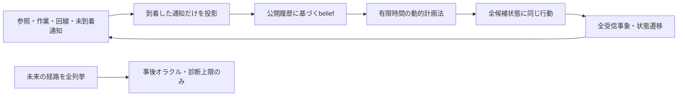

# G3-03：小規模モデルと厳密解

更新：2026-09-24。**G3-03完了。全体22/38、G3は3/5、研究ゲート3/7。** 有限モデル・厳密計算・現行近似の診断を実装し、[完了判定](../artifacts/reach_g3_exact_20260924/study_03/task_decision.json)を保存した。最終証拠は[study_03](../artifacts/reach_g3_exact_20260924/study_03/report.json)、[結果画面](../artifacts/reach_g3_exact_20260924/study_03/index.html)を参照する。G3全体は未通過。

## 1. 何を作ったか、なぜ必要か

> 追加情報が役に立つかを、方策の作り方の良し悪しから分けて調べる計算器を作りました。小さな世界の全状態・全損失・全通知を確率付きで調べ、届いた情報だけで選べる最良の成功確率を求めます。未来を知る比較用の解も別に計算し、実装が達成できる値と混同しません。さらに、現在のC++判断式を直接呼び、期限や通信費用の近似が外れる例を検算します。

今回の中心は**オフラインの理論実験**。Python標準ライブラリの有理数計算と、既存C++ヘッダーを呼ぶ小さな診断実行ファイルを追加した。GE3.exe・ライブのB1/B2/B3・制御器は変更していない。旧G3-02のソース固定表とexeハッシュの一致を実行時に検査する。

以下のB1/B2/B3は**情報マスクの名前**であり、その情報で最適化したモデル内の方策を指す。G3-02のヒューリスティックそのものではない。JOINTも両情報を使うモデル内最適解であり、提案方式Rの実装・実測ではない。

## 2. モデルの前提

| 要素 | 定義・範囲 |
|---|---|
| 時間 | 有限の抽象スロットH=1～4。実アプリの30 fpsや200 msへ換算しない |
| 参照状態r | 前スロットの画像が復号できたか。P画像はr=1が必須。直前参照IP鎖の限定モデル |
| 作業段階s | 0→1→2。新たな復号画像が1枚得られるごとに1段階進み、2で成功を保持 |
| 回線c | 隠れた良／悪の2状態。パケット受信確率3/4・1/4、状態維持確率3/4 |
| パケット | 各スロットに2個の潜在受信結果。回線状態を条件とすれば独立。時系列には回線の持続性がある |
| 通知 | 初期境界と各スロット終了時に生成。固定dスロット後に届き、確率qで欠落。途中の通知も隠れ状態に含む |
| 観測 | 到着済み通知の生成番号・送信したパケットの配送結果を共通入力とし、r/sを方式別に追加 |
| 予算 | データbパケット分。1パケット=1,272 IP byte。通知は全方式で(H+1)×64 IP byteを予約して消費 |
| 目的 | H時点の作業成功確率を最大化。同率なら期待データ送信量を最小化し、それも同率なら固定候補順 |
| 初期分布 | r=0/1、s=0/1、c=良/悪の8状態を等確率。別途、初期r/sが既知の対照条件も用意 |

確率・初期分布は理論検証用の設計値で、G3-02の記録から推定した実網分布ではない。通知64 byteはこの小規模モデル専用の固定電文であり、実RSTAの208 byteやRCMDを再現した長さではない。配送通知と状態通知をまとめて抽象化する。実世界の認識誤差、制動、衝突、画像AoI、指令UDP、可変IDRサイズ、デコーダの並列処理、通知用FIFOは含まない。sは位置・速度の代用モデルで、実機安全性を証明しない。

Hを変える際には共通通知の予約量も変わる。予算表のbは**データ部分の予算**であり、総IP予算は`1272b + 64(H+1)`。通知費用を無料扱いしてはいないが、通知自体を止める最適化は対象外。

| 共通候補 | データ数 | 復号条件 |
|---|---:|---|
| WAIT | 0 | 今回の画像を見送り、次のPの参照は失われる |
| P | 1 | 前画像が利用可能かつパケット受信 |
| P_REPEAT | 2 | 前画像が利用可能かつ2コピーのどちらかを受信 |
| I | 2 | 2チャンク両方を受信し、参照を回復 |

P_REPEATは1チャンクの反復保護で、実RNVPのXOR群ではない。Iはこのモデルでの既知サイズの画像生成を含む候補。ライブの13候補にIDR生成判断を追加したわけではない。情報マスク間では、4候補・時間・予算・損失分布を完全に共有する。

## 3. 因果性と厳密解の構造

1. 境界tで到着した通知だけを観測する。
2. 公開履歴に条件付けた候補状態と確率（belief）を更新する。
3. 同じ公開履歴を持つ全ての候補状態に、同じ判断を適用する。
4. 送信→復号→作業段階更新→通知生成→回線遷移を列挙する。
5. 終端から逆に計算し、期待成功確率が最大の判断を選ぶ。



内部状態は`(r,s,c,未到着通知列)`。到着待ち通知には生成時点の内容を保持する。過去のr/sを、到着時点の現在値として置き換えない。配送結果からr/sを間接的に推測できる場合もbeliefが自然に扱う。短い最新通知ベクトルを十分統計量と仮定しない。

終端値は`V_H(b)=Σ_s b(s) 1[作業段階=2]`。途中は、到着観測ごとに事後分布を作り、その分布に対して`max_a E[V_{t+1}]`を取る。**観測で区別できない真の状態ごとにmaxを取らない**。全確率・事後更新・目的値は`Fraction`で計算し、JSONに分数と表示用小数を両方残す。浮動小数の丸めで最適候補を決めない。

上限を二つに分ける。

- **全現在状態を知る因果的上限**：現在のr/s/cを知るが、未来の受信結果は知らない。
- **事後オラクル**：初期状態と全期間の潜在受信結果を知り、経路ごとに最適化してから期待値を取る。実用方式と同列には並べない。

事後オラクルでも候補・期限・予算は共通。P/I/反復で同じスロット内の潜在パケット位置を共有し、都合のよい別乱数を各候補へ与えない。通知の欠落は未来・全状態を知るオラクルの判断に不要だが、共通通知費用は残る。

## 4. 情報に価値がある条件／ない条件

事前固定した格子はH∈{1,2,3}、b=0～5、d∈{0,1,3}、q∈{0,1/2,1}の162条件。これに基準例・既知初期状態・H=4の規模確認を加え、計165条件を計算した。基準例は格子中の1条件を説明用に重ねて保存しており、165件を独立標本数とは呼ばない。

### 基準例：H=3、b=3、即時通知、欠落なし

| 情報 | モデル内の最適成功確率 | 共通情報だけからの増分 |
|---|---:|---:|
| B1情報：配送通知 | 37/128 = 28.90625% | — |
| B2情報：＋参照状態 | 25/64 = 39.0625% | +10.15625ポイント |
| B3情報：＋作業段階 | 43/128 = 33.59375% | +4.6875ポイント |
| JOINT：両方 | 101/256 = 39.453125% | +10.546875ポイント |
| 全現在状態の因果的上限 | 889/2048 = 43.408203125% | 実用比較対象外 |
| 未来を知る事後オラクル | 2317/4096 = 56.5673828125% | 実用比較対象外 |

参照情報がないと「安いPで進める」か「Iで回復する」かを隠れた状態ごとに選び分けられない。作業情報は残り1段階と2段階で通信予算の配分を変える。この限定例では併用の増分はB2情報単独に対し0.390625ポイントであり、二つの増分を足した値にはならない。

基準例の最初の判断は、B1情報ではP。B2情報では参照なしならWAIT、参照ありならP_REPEAT。WAITの後にIへ回す計画も候補に含むため、常に今すぐ送ることが最適とは限らない。全候補の条件付き値は`report.json`の`root`へ保存する。

### 遅延と無効果の対照

H=3、b=3、通知欠落なしでd=1にすると、B1/B2/B3/JOINTは順に`9/32、19/64、85/256、85/256`。この条件では作業情報に復号情報を加えても値が増えない。d=3で全通知が判断に間に合わない場合は全方式`9/32`に一致する。q=1の全欠落でも全方式が一致する。

データ予算0なら全方式の成功確率0。初期参照と作業段階が既知で、配送通知からその後の状態を追える対照条件では全方式`3/8`に一致する。追加情報の価値は、未解消の不確実性、到着の早さ、行動を変える余地が揃った場合に生じる。通信状態やAoIを揃えたH1の本格的な成立領域はG3-04で扱う。

## 5. 近似の限界は二種類の実験で調べる

### 5.1 将来を計画しない近似の診断

同じbeliefと4候補で、`期待する今回の段階増分 − 0.1×送信パケット数`だけを最大化する近視眼的方策を追加した。この方策も未来の真値を使わない。これは計画範囲を短くする影響の診断で、G3-02のB1/B2/B3の移植ではない。

165条件中の最大成功確率差は、H=3・b=5・d=1・欠落なし・B3情報で13.28125ポイント。基準例では、B2情報の近視眼的方策は最適解と一致するが、B1/B3/JOINT情報では差が残った。情報を増やすだけで、利用する方策が自動的に最適になるわけではない。

### 5.2 実際のC++候補式の診断

`reach_planner_probe.cpp`が現行`ReachBaselinePlanner.h`と`ReachBaselineState.h`を直接呼ぶ。Pythonへの式の書き写しだけで一致を主張しない。

比較先は同じ13候補を持つ、2～4チャンクの単一画像モデル。独立損失、初回XOR、保持したパリティ、完全な選択ACK、再送上限0～2を仮定し、全パケット受信パターンを列挙する。送信はラウンド単位の一括完了として時刻を判定する。参照・作業・実デコーダ・キャッシュ破棄・ACK損失は含まない。費用は現行予測式と同じ映像部分の期待IP量に限定し、ACK費用を含むライブ予算台帳とは区別する。65,536 byteの上限内で全候補が収まる。

損失1/10・1/4・1/2、2/3/4チャンク、撮影後経過0/60/80/100/120/150/180 msの**63条件・756候補**を検算した。

- **合う部分**：余裕のある期限では、現行のXOR配送確率が独立損失モデルの全列挙と108候補すべてで一致した。式全体が常に誤りという結果ではない。
- **期限の限界**：3チャンク、損失1/4、撮影後80 ms、3.5 Mbps、RTT 40 msで、現行式はFECなし・再送上限2を選び、配送確率を約95.385%と見積もる。一括完了時刻を経路別に判定すると約82.397%。平均IP量による完了見込み119.448 msは残り120 ms以内でも、再送が増える経路は期限を超える。
- **選択への影響**：同条件のモデル内最適候補はXOR群4・再送上限1。目的`1−配送成功確率+0.1×正規化期待映像IP量`の差は`445789/4014080 ≈ 0.111056`。これは単一画像の目的値差で、作業成功確率の差ではない。
- **費用の限界**：現行の期待再送IP量は、XORで早期回復して再送しなくて済む効果を十分には反映しない。同候補の予測6,050 byteに対し、理想選択再送モデルでは5,647.53125 byte。
- **損失相関の限界**：AUと再送全体に同じ失敗コインを適用する9対照条件も保存した。この完全相関モデルの成功確率は1−pで、独立損失を補正した現行の推定とは一般に一致しない。burst入力はブロック内の条件付き損失1とし、実EWMA履歴を再生した試験ではない。

全条件・各候補・分数・ネイティブの入出力は[transport.json](../artifacts/reach_g3_exact_20260924/study_03/transport.json)に保存した。

さらに現行の状態重みv>0には、次の性質がある。

```text
v(1−P) + λ C = v × [(1−P) + (λ/v) C]
```

見送り費用もvなので、同じ入力・可否判定なら選択はB1の実効係数λ/vに一致する。実C++で15組を照合した（係数の許容範囲内、同率の丸め境界を除く）。λ=0や試験送信では、正のスカラーvだけによる選択変化は生じない。現在のB2/B3は、参照世代ごとの将来価値を動的計画しているものではなく、通信費用との交換比を変えるヒューリスティックである。

## 6. 公開モデルとの照合と検証

[Hairpin原論文](https://www.usenix.org/system/files/nsdi24-meng.pdf) Appendix B.1の式6・8～11について、理想MDSブロックの遷移を超幾何／二項式と受信マスク全列挙の二通りで計算した。データ1～4、追加パケット0～2、損失0/0.1/0.25/0.5/1の60遷移分布が有理数で完全一致。有限の追加パケット選択による18再帰計算も一致した。データ2＋追加1、損失1/4の未回復数0/1/2の分布は`27/32、3/32、1/16`。

これは公開式の限定的な整合確認であり、Hairpinの実装全体、式7の正規化BWC、ブロックサイズ最適化、論文の性能値を再現したものではない。RNVP/XORとRSの能力差を解消したとも主張しない。[照合記録](../artifacts/reach_g3_exact_20260924/study_03/hairpin.json)。

検証は次を含む。

- 9テスト群。小さな世界の全経路を先に生成する別実装と、belief動的計画法を16条件で成功確率・期待費用とも完全一致させた。
- 未来の通知をまだ観測しないこと、隠すフィールドを同じ観測にまとめること、全欠落時の情報価値0、確定的な成功／不能、予算・期限の単調性、計算上限での拒否を検査。
- 165条件で、情報の多い最適解が少ない最適解を下回らないこと、近視眼的方策≤同一情報の最適解≤全現在状態上限≤事後オラクルを検査。
- 全分岐の確率和1、各方式の期待IP量が経路上の上限を超えないこと、ソース固定、ライブエンジン不変更を検査。データ予算は遷移前の合法候補選択で全経路に強制する。

最大計算範囲は4スロット・データ8パケット分までAPIで受け付け、今回の規模確認はH=4・b=4。計算ノード上限は20万で、超過時は不合格にし、近似値へ黙って切り替えない。今回の最大探索ノードは887。実行時間はJSONに残すが、Windows上の単発Python測定で実時間性能保証には使わない。H>4が計算不能／近似必須と証明したわけではなく、より大きな問題の測定は今後必要。

開発時の`development_01`はMSBuildへ継承されたPath/PATH重複でビルド失敗。子プロセスへ正規化した環境辞書を渡して修正し、`development_02`から計算が通った。`study_01`も合格。`study_02`で情報マスク名の表示を明確化し、予算別結果を分数付きの表へ整理した。最終`study_03`は、スロット数等に小数を与えた場合の入力拒否も強化した版。過去の記録は上書きしない。

[再現性検査](../artifacts/reach_g3_exact_20260924/study_03/reproduction.json)は証拠64ファイル・ソース51ファイルのハッシュを照合し、前版の165条件と、現行C++・公開式の全診断結果が一致した。実行時間だけを一致判定から除外する。ブラウザ上の目視確認やライブGUIの変更は行っていない。

## 7. 実行方法と次工程

必要環境：このWindowsプロジェクト、Python標準ライブラリ（検証環境3.13）、Visual StudioのMSBuild・v145・SDK 10.0.26100.0。追加Pythonパッケージは不要。新しい出力名を使う。

```powershell
python tools/test_reach_exact.py
python tools/run_reach_exact_study.py --name study_new
python tools/verify_reach_exact_artifacts.py
tools\open_reach_g3_exact.cmd
```

起動ファイルは認定結果`study_03`を開く。新しい計算結果は指定した名前の`index.html`で確認する。プロジェクトの既存G3-02証拠も不変更検査に必要。新しいPCへの最小配布パッケージ化はG6の残作業。

成果物はモデル、厳密解、独立検算器、ネイティブ候補診断、通知遅延・欠落の全条件表、ソースのスナップショット、ハッシュ付き記録である。次は**G3-04「H1の反例と成立領域」**。ネットワーク統計とAoIを明示的に揃えた状態対を作り、予算・残り時間・参照状態ごとの境界を詰める。今回の有限モデルの差だけで、実コーデック一般の新規性や提案Rの優位性を結論しない。
