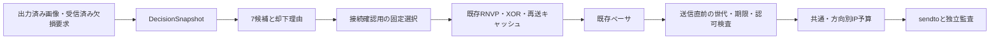

# Reach-RT G4-01：有限候補生成と実行接続

更新：2026-09-24。対象：G4-01。実装と短時間の動作検証を完了。**全体25/38項目、G4は1/5、研究ゲート4/7。次はG4-02。** G4全体および提案方式Rの効果は未判定。

[完了判定](../artifacts/reach_g4_actions_20260924/verification/final_01/task_decision.json)、[結果画面](../artifacts/reach_g4_actions_20260924/verification/final_01/index.html)、[実UDP記録](../artifacts/reach_g4_actions_20260924/verification/acceptance_02/report.json)を参照。

## 1. 目的と説明に使える要約

> 通信の回復操作を、実際のデータと通信予算に結び付ける実行層を作りました。生成済み画像、受信済みの欠損要求、実際に計算できるXOR冗長データから有限個の候補を作り、選べない理由も記録します。送信待ちの間に画像が古くなる場合があるため、送信直前にも世代・期限・予算を確認します。IDRは生成要求と実際の出力を分けて記録し、要求だけで復号回復が成功したことにはしません。今後、この共通の実行層の上で、どの操作が作業成功に役立つかを予測・比較します。

本体はC++。Pythonは実行条件の作成、試験起動、ログの独立監査、成果物の集約を担当する。ロボット物理・認識・制御・成功条件は今回変更していない。

## 2. 5種類・7候補

各判断で以下の7行を記録し、実行できない候補も理由付きで残す。最大64候補という設計上限内に収める。最新4画像のメタデータを保持するが、4画像の組合せ最適化はまだ行わない。

| 種類 | 候補数 | 入力と動作 | 主な却下理由 |
|---|---:|---|---|
| DEFER／見送り | 1 | 送信しない。次の画像出力・受信欠損要求・エンコーダ入力で再評価 | 常に選択可能 |
| FRESH／新規画像 | 1 | 出力済みH.264アクセスユニット（AU）を既存RNVPで分割送信 | 未出力、送信手配済み、期限・世代・予算 |
| PROTECT／冗長保護 | 3 | 新規画像＋2/4/8チャンク単位の実XORを一組として手配 | 1チャンクしかない、期限・世代・予算 |
| REPAIR／再送 | 1 | 受信済み欠損要求に含まれる、既存キャッシュのチャンクを再送 | 要求なし、キャッシュなし、範囲外、重複、2回上限、期限・世代・予算 |
| REFRESH／IDR更新 | 1 | エンコーダにIDR生成を要求し、対応する実出力を待つ | 要求なし、出力待ち、前要求から500 ms未満 |

PROTECTは既存バックエンドで生成できる「新規データ＋パリティ」の候補。過去画像へのパリティ単独追加や、理想MDS符号を実装したものではない。REPAIRの実行許可後も、既存RNVPの期限・回復状況の検査で実送信されないことがある。フレーム全体の無条件再送は許可せず、受信済みの選択再送要求で認可したチャンクに限定する。

REFRESH自体はローカルAPI呼び出しなので通信費用0。IDRの送信が無料という意味ではない。実出力後にサイズ・撮影時刻・IDR属性を確認し、改めてFRESH/PROTECT候補として課金する。要求元の入力frame ID以上の実IDR出力と対応付け、要求待ちを解除する。通常RNVPから届く更新要求と研究用の固定45番入力での要求を同じ窓口で調停する。出力が来なければ待機を維持し、終了時に未解決を記録する。

## 3. 構造と実行時の検査



- `ReachActionModel.h`：判断時点の入力と純粋な候補生成。実データ長、撮影時刻、ローカル世代、送信手配状態、欠損集合、残りbyte、IDR待ちを扱う。
- `ReachActionExecution`：候補ログ、送信認可、IDR要求の調停、ネイティブ送信との接続。候補のframe/chunk等の識別情報はSnapshotと実行層が保持し、`ActionTicket`には種類・グループ・費用・可否・理由を持たせる。
- `ReachRobotVideo`：`baseline.mode="G4-01"`のときだけ新層を選ぶ。B0〜B3の方式は既存処理へ接続する。
- `BudgetTransport`：既存の共通／上下方向のbyte・レート制約を維持。期限を指定した送信では、予算ロック獲得後にも期限を検査する。

現時点の選択は接続確認用で、送れるならPROTECT g4、次にFRESH、それ以外はDEFER。受信欠損要求には合法なREPAIR、更新要求には合法なREFRESHを選ぶ。送信成功確率や作業価値の最大化ではない。RSTA状態通知は既存回線・予算で運び監査するが、候補評価の予測特徴にはまだ使わない。受信側の隠れた真値・未来の障害トレースは参照しない。

ローカル世代は送信ストリーム変更と実IDR出力で更新する。受信側が報告する参照世代・復号成功とは区別する。撮影後200 ms以上、世代違い、メタデータ消失、未認可再送は送信直前で遮断する。世代のロックを共通予算検査・sendtoまで保持し、検査と実行の間の世代変更を防ぐ。終了時にはペーサのスレッドを停止・合流してからログを閉じる。

通信費用は実RNVPヘッダー44＋UDP8＋IPv4 20 byteを含む。例えば画像ペイロード2,500 byteなら3チャンクでFRESHは2,716 IP byte、g4のXORを加えたPROTECTは3,996 IP byte。0番と2番だけのREPAIRは1,444 IP byte。

候補時の残りbyte検査は予約ではない。レートの利用可能量や他通信との競合は実送信時に再検査するため、選択済みでも全チャンクの送信を保証しない。ACK、状態通知、指令等にも同じ共通予算を適用する。遮断してsendtoしなかったデータは送信量に加えず、遮断理由を別ログに残す。

## 4. 記録と検証結果

| 記録 | 説明 |
|---|---|
| `action_candidates.csv` | 判断番号、7候補、実サイズ、欠損集合、費用、可否・却下理由、選択 |
| `action_events.csv` | 手配・見送り、再送許可、IDR要求・抑止・対応出力・未解決 |
| `action_wire.csv` | 実送信時の認可番号、frame/chunk/世代/撮影時刻、費用、送信・遮断結果 |
| `ip_budget.csv`ほか既存ログ | 実IP電文、上下回線、再構成、復号、認識、指令、物理結果 |

`action_wire`の認可番号は送信時点の認可を示し、ペーサ投入時点の不変IDではない。同一画像で受理した欠損集合を保持するため、以前の要求チャンクが最新の再送認可番号で記録される場合も、過去に受理した欠損集合と照合する。

検証対象は`reach_g4_actions_20260924`の`build_02`。exe SHA-256：`8a88f1f30eca889d1fc43ed5f86a8e863d6784c28303ab8b63424079e276083a`。

| 検証 | 結果・範囲 |
|---|---|
| 新規C++単体 | 684検査合格。候補・IP費用・欠損集合・世代・期限境界・IDR待ち／重複・予算 |
| 既存C++単体 | 2,000検査合格。基盤・仮想ロボット・認識・指令・回線・状態通知・B1〜B3 |
| 実UDP 7条件 | 各8秒・T2。正常、部分損失、byte不足、小容量／有限キュー、送信待ち、下り通信断、実P画像欠損。全条件で予算・復号・通知因果性・認識／指令／実動作の監査合格、採用推定の誤差余裕超過0 |
| 実パリティ | 実データのXORをPythonで再計算して一致。単なる送信数の照合だけではない |
| 送信待ち | 世代変更31件、メタデータ消失31件を実送信直前で遮断 |
| 通信断 | 通信断前の移動と、断後の所定制動による停止を確認 |
| 監査への改変 | 世代、認可、撮影時刻、IP長、違法な候補選択、IDR対応の6改変を全検出 |
| 既存方式の実UDP回帰 | B0正常1条件＋B1〜B3の正常／通知障害9条件が合格 |
| 従来RNVPモード | 生成H.264の実復号・表示、正常終了を確認 |

開発途中の`acceptance_01`（6条件）も保存。最終`acceptance_02`で送信待ち条件、実sendto時点の画像年齢、認可種別・最新世代の監査を追加した。初回pilot監査はRNVPのstream IDオフセットを誤って読み失敗したため、監査側を12 byteへ修正して再照合した。結果を再試行で選別したものではなく、最終7条件は事前計画どおり・自動再試行なしで実行した。

集約処理はexe・ネイティブソース・各試行のソースコピーを照合し、7条件のaction監査と6改変検出を再実行する。入力ハッシュとソースを保存。G3の固定出力はそのまま保持する。今回ネイティブコードが変わったので、旧G3実測のコード状態と同一とは扱わない。

## 5. 再実行と限界

出力先は上書きを禁止する。次の例を繰り返すときは未使用の名前へ変更する。

```powershell
python tools/build_reach_actions.py --build-name reach_g4_actions_recheck --name build_02
python tools/verify_reach_actions.py --build-name reach_g4_actions_recheck --name acceptance_02
python tools/verify_reach_visual_units.py --build-name reach_g4_actions_recheck --name regression_units_01 --include-command --include-link --include-state --include-baseline
python tools/verify_reach_ablation.py --build-name reach_g4_actions_recheck --name ablation_regression_01
python tools/verify_reach_g1_legacy.py --build-name reach_g4_actions_recheck --name legacy_regression_01
python tools/run_reach_g1.py --build-name reach_g4_actions_recheck --name b0_regression_01 --stage command_udp --task T2 --duration 8 --baseline B0 --state-feedback --packet-trace --process-priority above_normal --precise-wait --budget-config config/reach_rt_g2_budget.json --link-config artifacts/reach_g4_actions_recheck/verification/acceptance_02/normal_link.json
python tools/finalize_reach_actions.py --build-name reach_g4_actions_recheck --name final_01
```

各ライブ試験は同時実行せず、既存研究と同じPC内のUDP経路で確認する。短時間試験の監査合格を作業成功率や方式間優位性とは呼ばない。18初期姿勢の全再実行、統計的効果、GUIの目視、他PC・実網・実機の確認は今回の範囲外。

G3-05の[実装計画](Reach_RT_G4_Implementation_Plan.md)を、この段階ではイベント駆動の実行層として具体化した。通知・キューを含む予測入力の拡充と4画像にまたがる評価はG4-02以降、20 ms周期、p95/p99、5 ms打切り・代替処理はG4-03で接続する。現状を周期スケジューラ完成とはしない。

次の**G4-02「到着・作業価値の予測と校正」**では、到着済み通知と公開履歴から、候補ごとの到着→参照回復→後続画像→作業利用を予測する。開発用データだけで校正し、未知・失効・範囲外を明示し、単なる係数調整とは異なる価値を検証できる状態にする。
