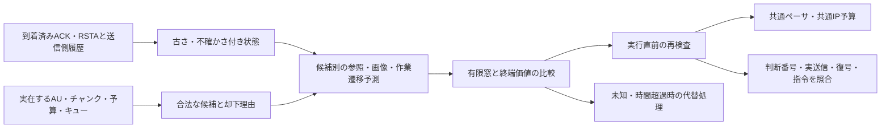

# G4実装計画：参照回復から作業利用までを判断する

2026-09-24、G3-05で決定した着手方針。[判断根拠](Reach_RT_G3_Decision.md)。**G4-01～05は未着手。本書の型・モジュール名は設計案で、既存APIではない。** ライブ処理はC++、実験計画・検算・集計はPythonを継続する。

## 1. 実装の狙い

現在のB2/B3は、通信方式の費用に状態由来の重みを掛ける。G4では「どの送信が、いつ参照を回復し、後続のどの画像を利用可能にし、作業に間に合うか」を候補別に予測する。状態を入れるだけで改善すると仮定せず、同じ構造から復号情報・作業情報を除いた版を用意する。

## 2. G4-01で最初に作るもの

**有限候補生成と実行接続**に限定して着手する。この段階で成功確率の予測やRの優位性を完成扱いにしない。

| 候補 | 実行に必要な事実 | 実行と記録 |
|---|---|---|
| REPAIR | 受信済みNACK等による欠損要求、実在するキャッシュ、世代・TTL・再送上限 | 再送可能なチャンクIDだけを列挙。要求・許可・実sendtoを別々に記録 |
| PROTECT | パリティ生成に必要な実チャンク群とXOR形式が利用可能 | 生成可能性と生成済みを分け、実パリティ長で課金。理想MDSとして扱わない |
| FRESH | 実際に出力済みの新しいAU、撮影時刻・IDR属性・長さ | 送信可能でも復号できるとは限らない。参照不確かさは予測へ渡す |
| REFRESH | IDR要求可能、未完了要求なし、500 msのクールダウン | 要求発行→出力待ち→実IDR確認→送信の別イベント。要求だけで成功にしない |
| DEFER | 常に選択可能。ただし期限・停止への影響を追跡 | 送らない理由、次回再評価条件、共通の試験送信規則を記録 |

候補はローカルな物理的実行可否で共通に生成する。「受信側の真の参照がない」という直接参照で、方式ごとに候補を増減させない。参照情報のマスク比較では候補集合を共通にして予測だけを変える。受信済み欠損要求など、通常プロトコルから得られる情報は全方式へ同じ条件で与える。

設計上は、判断ごとの読み取り専用入力 `DecisionSnapshot` と実行対象 `ActionTicket` を分ける。前者は判断時刻、実受信通知番号・生成時刻・受信時刻、キャッシュ版、残り予算・キューを持つ。後者は候補ID、種類、frame/chunk ID、世代、期限、必要な生成処理、見積費用、実行可否理由を持つ。実行直前にもキャッシュ失効・世代変更・予算を確認し、見積だけで送信を許可しない。型の実名はG4-01のコードレビューで確定する。

既存の `ReachBaseline`、`NetworkManager` の送信・再送、`H264Encoder` の要求／出力、`ReachIpBudget` に薄い接続層を設ける。既存内部APIの利用可否はG4-01で確認し、未公開操作を存在するものとして設計を進めない。最初は先頭4フレーム以内・最大64候補。状態は制御側の20 Hz通知由来、計画周期は20 msなので、同じ通知の再利用を新規観測と数えない。

### G4-01の完了条件

- 実在・欠損・失効・世代違い・予算不足・通知未到着・IDR待ちを入力し、候補と却下理由を確認できる。
- IDR要求と実出力をframe ID・時刻で対応付け、未出力IDR、存在しないパリティ、失効チャンクの実送信が0件。
- 重複したIDR要求を抑止し、クールダウンを記録する。通常プロトコルの共通IDR要求との競合も一つの窓口で扱う。
- 全実送信が既存ペーサ・方向別および共通IP予算を通る。再送・FEC・要求電文・状態通知・指令を免除しない。ローカル要求API自体は通信byteと混同しない。
- 送信見送り中も共通制御器の観測失効・指令期限・制動が維持される。認識や作業成功条件を調整して通信方式の効果に見せない。
- C++の単体・実UDPの短時間確認・既存方式の回帰を行う。共通処理を変えた範囲に応じてG1/G2の再確認範囲を決める。

## 3. G4-02：予測と校正

候補ごとに、キュー待ち・直列化・伝搬・再送・復号・認識・逆方向指令までの経路別時間を扱う。平均バイト数だけで期限内と判断しない。到着分布とその校正誤差を保存し、相関損失でも検証する。将来の固定障害トレースをオンライン予測器へ渡さない。

参照状態は通知生成時点の報告であり、受信時点の真値ではない。到着後の送信履歴から更新し、未通知・失効・世代不整合を明示する。250 msの通知有効期間、200 msの画像利用期限は初期仕様を継続。通知の古さと画像の古さを混同せず、既知でないものを確定値0/1へ押し込まない。

候補別の状態遷移と終端作業価値を、開発・校正用の別データで構築する。G3の全既視条件は開発用。G3-04のp=0.9、参照消去確率、64 byte通知、抽象2段階を、そのままライブの確率・費用・タスクへ移植しない。実RSTAは208 byte、実IDRは可変長。予測値と実測値を分け、未校正領域には `out_of_domain` を付けて代替処理へ進む。

完了時に、分割方法、入力範囲、到着・復号・作業予測の誤差、誤差が大きい条件を保存する。過去画像から求める位置余裕は確率的な信頼区間とは限らないため、それを作業成功確率として直接使わない。

## 4. G4-03：有限探索と代替処理

意思決定周期20 ms、予測窓200 ms、最大64候補をINITIALとして継続。評価は候補別の状態遷移と終端価値による `estimated_success − λ×expected_IP/byte_scale` を初期形とし、通信予算は罰則ではなく全経路で守る上限にする。短い予測窓の成功見込みを、60秒全体の95%保証と呼ばない。

実行時間は候補生成から選択・実行前検査までを測る。目標はp95≤2 ms、p99≤5 ms。初期の一判断計算打切りを5 msとし、チェック頻度・打切り後の実測超過を保存する。Windowsで5 ms以内を保証したとはしない。超過時は最後の候補を無条件再利用せず、その時点の期限・キャッシュ・予算を再検査する。合法なら共通の期限付き回復へ移り、なければDEFERして制御側の停止規則に従う。

`decision_id`から、採用通知、全候補、予測内訳、選択理由、却下理由、計算時間、代替理由、実行結果、実sendto、復号・画像利用・指令へ辿れるログを作る。真値は事後監査へ限定する。

## 5. G4-04：効果を切り分ける比較

二つの比較を分ける。

1. **システム比較**：固定した既存B0～B3とR。能力差を明記し、「情報だけの寄与」と呼ばない。共通実装を変更した場合は新しいexeで全方式を再確認・同予算再調整し、G3の旧成績と混ぜない。
2. **寄与比較**：同じ新候補生成・実行層・予測窓・計算上限で、共通情報のみ／＋復号／＋作業／両情報を比較。さらに同候補で状態をスカラー重みにだけ変換する方式を置き、動的な状態遷移評価の追加価値を調べる。

共通情報版にもACK・NACK・撮影時刻・鮮度・公開履歴から許される推定を与える。隠した情報を別名の特徴へ混入させず、相関する観測からの推測は妨げない。全方式で通知機会・サイズ・課金を同じにする比較と、通知費用自体の追加を測る補助比較は別実験とする。

H1は参照フィールド有無、H2は復号情報を保ったまま作業フィールド有無で検証する。同係数固定の比較で判断差を調べ、別途全方式に同じ調整機会を与えた比較も実施する。最良の条件・係数を保留テストの結果から選ばない。

厳密解との比較にはG3-03/04と同じ状態・観測・候補へ制限するアダプターを作り、未来オラクルではなく因果的最適解との差を測る。実RNVPの13候補や新しい5種類の操作を、抽象モデルの4候補に同じ名前だけで対応させない。最大・平均成功確率差、同率を除く行動差、計算時間・打切り率を保存する。

### 必ず含める条件

| 条件群 | 検証したいこと |
|---|---|
| 正常T1/T2 | 既存の完了を損なわないか。情報を加えるだけで常に速いとは仮定しない |
| 初期IDR欠損・参照P欠損 | パケット回復と実復号回復を区別できるか |
| 複合障害・小キュー | G3で残った失敗。送信見送りだけの節約を排除できるか |
| 処理停滞・生成待ち・大きいIDR | ネットワーク以外の待ちを予測できるか |
| 通知遅延・全欠落・順序逆転・失効 | 到着済み情報だけで判断し、無効果条件・代替処理が再現するか |
| 複数総予算・残り時間・参照既知/未知 | H3の成立範囲と不成立範囲、H1の推測可能な対照 |
| 未校正の回線・CPU負荷 | 範囲外・計算超過を効果と混ぜず記録できるか |

これらは次工程の検証要求であり、新規実施済みの試験ではない。回線条件はG2の時刻基準トレースで対応させ、送信数を乱数キーにしない。無効試行を成功へ置換せず、原因分類と再試行規則を計画時に記録する。

## 6. G4-05：予備実験から確認実験へ

予備実験は仕様通り条件あたり10～20対応試行から開始する。G5の初期案100対応試行を十分と断定せず、必要な差・区間幅・対応不一致と実行時間から必要数を決める。反復の独立単位とseed・配置・回線の階層を固定する。

主比較、予算格子、校正分割、λ等の調整機会、入力範囲、無効条件、実行順をPILOT-LOCKする。主比較は保留テスト前に選び、試験した全条件と負の結果を残す。目標95%の点推定と片側95%信頼下限を分ける。正常時の−2ポイント非劣性目標、制約下の10ポイント改善目標、p95/p99計算時間目標を結果に合わせて変更しない。

G4の合格は、因果性・共通予算・実行時間管理を守る提案方式と、検証可能な確認実験計画が揃うこと。研究効果の合格はG5で別に判定する。次の具体的な作業は**G4-01：有限候補生成と実行接続**。
