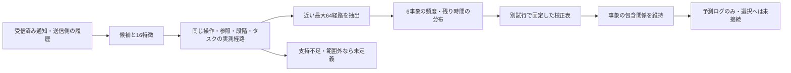

# Reach-RT G4-02：到着・作業価値の予測と校正

更新：2026-09-24。**G4-02完了。全体26/38項目、G4は2/5、研究ゲート4/7。次はG4-03。** [完了判定](../artifacts/reach_g4_prediction_20260924/verification/final_01/task_decision.json)。予測・校正の実装と誤差の記録を完了し、校正による改善やRの優位性を認定したものではない。

## 1. 実装の目的と説明用要約

> 送ることができる候補に対して、200 ms以内に画像が利用可能になり、復号され、指令としてロボットに届く見込みを付ける予測器を作りました。受信済みの状態通知と送信側で観測できる情報を入力し、近い条件で実際に起きた経路を参照します。到着と作業利用を別々に記録し、失敗経路も含めて予測します。学習・校正・確認を試行単位で分け、データ不足や通知失効では予測値を未定義にします。現在は予測を記録する段階で、次工程で選択処理へ接続します。

ライブ推論はC++、データ抽出・校正・監査はPython標準ライブラリ。外部機械学習サービスや新しい依存パッケージは使用しない。認識器・制御器・物理・成功条件は変更していない。

## 2. 候補ごとに何を予測するか

G4-01の7候補に、以下の6値と、到着・復号・指令適用までの残り時間のp50/p90を付ける。

| 値 | 正解ラベル・意味 |
|---|---|
| 画像利用可能 | 対象AUの再構成が画像期限と200 ms窓の両方に間に合う。すでに再構成済みなら残り待ち0 |
| 復号可能 | 同じ期限までに対象AUの実画素出力がある。すでに復号済みなら残り待ち0 |
| 参照状態 | 200 ms先までの最新受信側記録がSynchronized。候補の送信成功と別に扱う |
| 対象画像の指令利用 | 対象画像に基づく有効指令が画像期限内に実物理更新へ適用される |
| 後続画像の指令利用 | 200 ms内に、対象画像および判断時点の報告済み復号画像より新しい画像の指令が適用される |
| 新規作業完了 | 200 ms窓でロボットが未完了から実際の作業完了へ移る。すでに完了している窓は0 |

最後の値は**200 ms内の新規完了事象**であり、60秒全体の成功率ではない。参照状態は窓の終点付近の報告で、対象候補だけがその参照を回復したという意味ではない。後続画像や作業完了には、その後の固定送信規則の影響も含む。したがって、これらを「その操作だけの因果的な改善量」とは呼ばない。

REFRESHは実IDR出力へframe IDで対応付ける。IDR生成待ちと可変長の実送信を含む過去経路を使い、未出力のIDRサイズを既知として入力しない。DEFERには対象の新規AUがないため、画像・復号・対象画像の指令利用は構造的に0。保持済み画像や後続通信による参照状態・作業進行とは区別する。

失敗・期限内に起きなかった経路は遅延999という保存用値を使う。これは999 msの到着予測ではなく「この200 ms窓内には利用できない」。試行末尾で200 ms先まで観測できない判断は、失敗扱いせず右打切りとして学習・評価から除く。

## 3. 入力と因果性

`ActionExecution`が判断番号ごとに次を記録し、`PathPredictor`へ渡す。

- 操作・FECグループ・実IDR属性・タスク・報告された段階と参照状態。
- 撮影からの時間、実IP費用、ローカルペーサの待ちbyte／設定送信速度からの待ち時間と直列化時間。
- 到着済みTransportFeedbackによる損失・連続欠損のEWMA、最後のフィードバックからの時間。
- 採用済みRSTAの番号・生成／受信／推定時刻、通知と観測の古さ、報告位置・向き・位置誤差余裕、復号待ち時間、残り試行時間。
- 受信済み再送要求の欠損数。

16個の数値特徴と6個の区分値を使う。真のロボット位置、受信側の最新参照、将来の障害トレースは入力しない。実測真値は事後ラベルに限定する。予測入力の位置誤差余裕を、成功確率や統計的信頼区間へ直接変換しない。

通知が250 ms以上古い、未到着、ストリームが異なる場合は`notification_unavailable`。送信側の最新IDRより報告済み復号画像が古ければ、参照区分を`generation_unconfirmed`相当の4として扱い、現在の参照を確定しない。受信した通知の採用番号を再利用しても、新しい独立観測には数えない。

時刻は候補判断の開始時刻を基準とする。ローカルペーサのキューはその判断処理内で読み取る瞬時値であり、遠隔回線の実キューを知っているわけではない。回線内の待ち・損失・復号停滞・逆方向指令の遅れは、実測経路の累積待ちと成否に含める。未知の将来の回線停止を予知するモデルではない。

## 4. 予測・校正の構造



`ReachPrediction.h`は最大16,000個の学習経路を読み込み、操作・グループ・IDR・参照区分・作業段階・T1/T2を一致させる。数値特徴の固定スケールで距離を計算し、各軸2スケール以内、二乗距離9以内から近い64件までを選ぶ。8件以上かつ2つ以上の学習試行が必要で、満たさなければ`out_of_domain`。支持数は独立試行数ではないので、信頼区間として解釈しない。

同じ実測経路の画像・復号・指令の成否と遅延を一緒に保存する。独立パケット損失を仮定して平均通信量だけから期限判定する方式とは異なり、連続損失や待ちの相関を実測の組として保持する。ただし、観測していない経路構造を正しく外挿できる保証はない。

校正は、生の確率を固定5区間に分け、別の校正試行での実発生割合へ置き換える。各区間は16件・2試行以上を要求する。支持が足りない値は−1のままにし、`calibration_partial`で示す。校正後はDEFERの構造的0と「対象指令利用≤復号≤画像利用可能」を保持する。未定義をゼロへ置き換えない。

`terminal_supported`は近傍に新規完了の正例・負例の両方があることだけを示し、十分な統計的検証が済んだという意味ではない。短時間窓での完了は希少であり、少数例の低い誤差を高い予測能力と解釈しない。

## 5. データ分割と開発記録

各20秒、正常／連続損失、T1/T2。実行順・分割・閾値・再試行なしを事前に`plan.json`へ保存。

| 用途 | 試行数 | 使用範囲 |
|---|---:|---|
| 学習 | 8 | 8,227経路。近傍の母集団だけに使用 |
| 校正 | 4 | 確率5区間の校正表だけに使用 |
| 開発内の別試行検証 | 4 | 校正前後の誤差と範囲内率を評価。学習・校正へ戻さない |
| ストレス | 2 | 100 kbps小キューと下り断。範囲外・失効・誤差を評価 |

送信規則は新規画像のFRESH/g2/g4/g8をframe IDで巡回し、既存の受信済み再送要求・IDR要求を共通処理する。予測値は規則を変えない。比較用の完成したRでも、操作の無作為割付でもない。frame IDとIDR周期等の交絡が残るので、候補間の差を因果的な効果として認定しない。

`development_01`で18試行を収集。その後、「判断時にすでに利用可能な画像」と「判断後の新着」を区別するラベルへ修正し、校正値の構造的整合を追加した。最初の12試行だけをv2定義で再ラベル化し、学習・校正を再固定。過去の検証・ストレス試行の正解は再学習に使わず、`study_02`で新たに検証4＋ストレス2試行を行う。合計の実収集は24試行だが、最終の役割別集合は8＋4＋4＋2であり、二重に成功数を加算しない。

初回ビルド`build_01`はWindowsの`getenv`警告をエラー扱いして失敗。環境変数読取をWindows APIへ置き換えた。収集用は`build_02`、修正版は`build_03`。双方のソースコピー・exeハッシュを区別する。過去のG4-01証拠も上書きしない。

この分割は同じ開発環境の別試行であり、G5の保留テストではない。初期姿勢、コーデック設定、PC、制御器、固定継続規則を変えた条件への汎化は未確認。200 ms予測を積み重ねるだけで長期成功確率になるとはしない。

## 6. 検証・証拠

[最終監査](../artifacts/reach_g4_prediction_20260924/verification/final_01/aggregate.json)、[誤差の結果画面](../artifacts/reach_g4_prediction_20260924/verification/final_01/index.html)、[実UDP各条件](../artifacts/reach_g4_prediction_20260924/verification/study_02/report.json)を参照。

監査は、全予測の採用通知・フィードバック・特徴を送受信ログから再計算する。別実装のPythonでC++の近傍・確率・経路分位点を検算し、校正表の分割と包含関係、実行時予測と再実行予測、事後ラベルと原実測を照合する。未来時刻・採用番号・損失・段階・位置・通知失効の6改変を検出する。

Brier scoreは各二値結果との二乗誤差平均。校正前後の比較は、校正値が存在する同じ判断集合でも示す。確率ごとの実発生割合・対象数・未定義数を保存し、範囲内だけの誤差で全体の性能を主張しない。現在の定義では、既存データの範囲に入っていても急な回線変化の直後には外れる予測があり得る。

修正版の別試行検証は、選択された候補のうち通知が利用可能で窓末尾まで観測できる4,095判断が対象。範囲内3,870、範囲外225。通知失効・未到着や右打切りはこの分母から別に除外し、各条件の`excluded`と全候補の状態数へ記録する。ストレス側は同じ定義で1,145判断中142が範囲内、1,003が範囲外。

| 予測対象 | 前後で共通の対象数 | 生の予測の誤差 | 校正後の誤差 |
|---|---:|---:|---:|
| 画像利用可能 | 3,864 | 0.026036 | 0.026702 |
| 復号可能 | 3,870 | 0.063540 | 0.065891 |
| 参照状態 | 3,870 | 0.158911 | 0.161012 |
| 対象画像の指令利用 | 3,859 | 0.133688 | 0.135867 |
| 後続画像の指令利用 | 3,870 | 0.132910 | 0.137375 |
| 新規作業完了 | 3,870 | 0.004024 | 0.004120 |

**今回の5区間校正は、全6項目で誤差を改善しなかった。** 校正表は診断用として保持し、次工程の選択へ無条件に採用することを推奨しない。作業完了の正例は範囲内検証で16件しかなく、同一完了イベントを重なる窓で数えたものも含む。低い誤差だけで作業完了を高精度に予測できるとは言わない。操作別・条件別の誤差、区分別の学習頻度だけを使う対照、有限のp50/p90に対する実測被覆率も最終JSONへ記録した。

新規予測C++37検査、G4-01単体684検査、既存単体2,000検査が合格。修正版exeは`83bbd3777120c3ce176baf1d91fc48595c97517ccb0f4550e18d84ddc041d76e`。G4-01の実UDP 7条件、B3正常、従来モード（表示98枚）の回帰も合格。初回の監査改変テストは、フィードバック未到着時の初期損失特徴を検査しておらず失敗したため、初期値0.01の照合を追加した。ネイティブ予測器・原データを変更せず、失敗記録を保持して再監査する。

## 7. 再実行・残工程

新しい出力名を使い、ライブ試験は並列実行しない。

```powershell
python tools/build_reach_prediction.py --name build_03 --build-name reach_g4_prediction_recheck
python tools/reach_prediction_study.py --name study_02 --build build_03 --build-name reach_g4_prediction_recheck
python tools/verify_reach_prediction_regression.py --build-name reach_g4_prediction_recheck
```

上記は修正版だけで8＋4＋4＋2試行を新規収集する。今回の再ラベル化履歴を再現するときは、保存した初回収集の`verification/development_01`を`--reuse-development`へ指定する。最終監査ツールは今回の混在履歴（build_02収集／build_03修正版）を明示的に検査する。

モデルは`paths.csv`と`paths.csv.cal`を一組として保存し、`--prediction-model`で起動時にコピーする。モデルのハッシュは`fit_lock.json`／`calibration_lock.json`と各実行コピーを照合する。CSV v1を修正版へ読み込ませず、v2ラベルとの取り違えを防ぐ。

次の**G4-03「ReachSchedulerと代替処理」**で、候補別予測を有限探索へ接続し、20 ms周期・計算上限・打切り・範囲外時の代替を実装する。今回のモデルは固定継続規則に条件付けた予測なので、選択規則が変わることによる分布変化と再校正を扱う必要がある。p95/p99計算時間と5 ms打切り、4画像の組合せ探索、因果的な寄与分離、Rの優位性は今回の完了範囲に含めない。
