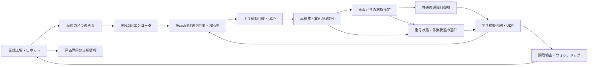

# Reach-RT 研究・実装・評価仕様書

## 0. 文書管理

| 項目 | 内容 |
|---|---|
| 研究名 | Reach-RT |
| 学術上の題目 | 圧縮映像の復号状態を考慮した、遠隔作業の成立条件と通信資源制御 |
| 対外説明用の題目 | 通信品質が変動する環境で、遠隔点検の作業成功率を維持する映像伝送制御 |
| 版 | 0.1.22 |
| 作成日 | 2026-09-18 |
| 更新日 | 2026-09-25：G4-04の情報寄与比較・厳密解との差・無効果/悪化条件を反映 |
| 状態 | G0～G3通過、G4-04完了。同候補5方式・実通信104試行・有限モデル160比較を検証。全体28/38、G4は4/5、研究ゲート4/7、次はG4-05。統計的優位性、校正改善、G4全体・提案方式Rの効果は未認定 |
| 基盤 | TR2 / RNVP、C++、DirectX 12、Media Foundation、H.264、UDP |
| 初期成果物 | Windows PC 1台で動く閉ループ実験アプリ、比較画面、再現可能な実験記録、研究報告 |
| 対象外 | 実機の安全認証、実商用網での性能保証、企業の採用・研究評価の保証 |

本書は、会話で選定したReach-RTとPC上の遠隔点検デモを仕様化する。BlindDrop-RTの暗号化・選択的攻撃耐性を研究の必須要件には取り込まない。既存のBlindDrop文書とは独立した研究仕様である。

本書の数値は、明記した既存コードの事実を除き、設計初期値または研究目標であり、達成済みの実験結果ではない。「各評価項目85点以上」は客観的な合格規格ではないため、点数を保証せず、評価の根拠となる成果と証拠を定義する。

### 0.1 規定語

- **MUST**：該当段階の完成に必須。
- **SHOULD**：原則として実施。省略理由と主張への制限を記録する。
- **MAY**：追加研究として任意。
- **INITIAL**：着手時の初期値。予備実験で変更できる。
- **PILOT-LOCK**：予備実験後、本評価前に固定する値・手順。
- **TARGET**：未達成の目標。未達でも結果を隠さず報告する。
- **VERIFIED-CODE**：作成日時点のコードに存在することを確認した機能。性能の確認を意味しない。

### 0.2 本書の読み方

研究の狙いは1～4章、実装は5～12章、画面・成果物は13～14章、実験と完了条件は15～19章に記載する。付録には設定例と実装前チェックリストを示す。

### 0.3 実装手順と進捗の記録

実装の順序、現在の状態、各作業の完了条件、次に行う作業は[実装手順・進捗管理](Reach_RT_Implementation_Progress.md)を参照する。実際の変更内容、検証結果、未解決事項は[作業ログ](Reach_RT_Work_Log.md)へ作業の区切りごとに追記する。本書は研究要件を保持し、最新の作業状態は進捗管理ファイルで管理する。

G0の実行証拠、機能の実装意図、コーデック制約、比較方式、制御器の初期設計は[G0確認書](Reach_RT_G0_Assessment.md)に記録する。[初期設定JSON](reach_rt_initial.json)は設計資料であり、現アプリへの設定読み込みはG1で実装する。

G1-01で実装したモード切替・設定検査・共通時計・記録と、その意図・検証結果は[G1-01実装説明](Reach_RT_G1_Foundation.md)を参照する。現在実行できる設定は[基盤用JSON](../config/reach_rt_g1_foundation.json)。設計用JSON全体を読み込む実装ではなく、世界・映像・制御の接続に合わせて拡張する。`foundation_completed`は基盤時計の完走を表し、作業成功やG1全体の合格ではない。

## 1. 目的と想定利用

G1-02/03の実装、前提、検証結果は[G1-02/03実装説明](Reach_RT_G1_Robot_Video.md)、接続確認用の条件は[robot JSON](../config/reach_rt_g1_robot.json)を参照する。仮想カメラの実画素を実コーデック・UDPへ接続し、出力PTSと画像内番号で元の撮影情報を照合する。`robot_video`の指令は時間で決める接続確認用であり、`robot_video_completed`を閉ループの作業成功と扱わない。

G1-04で追加した`visual_control`は受信画像から推定・指令生成を行う。実装の意図、真値境界、画素面積によるマーカー描画・認識の較正、誤差/期限/未検出の扱い、実通信６ケースは[G1-04実装説明](Reach_RT_G1_Visual_Control.md)、条件は[visual JSON](../config/reach_rt_g1_visual.json)を参照する。指令は診断用のローカル接続で適用し、逆方向UDPはG1-05。認識の初期閾値をG5の固定値や安全保証と扱わない。実装の完了判定は[進捗表](Reach_RT_Implementation_Progress.md)で管理する。

G1-05で追加した`command_udp`は、RCMD v1の固定長電文を実UDPで送り、受信側でセッション・連番・値・絶対期限を検査する。100 msの指令期限と250 msの有効受信監視を別々に扱い、期限切れで所定の制動を開始する。通信断・復帰を含む７ケースの結果、通信形式、前提は[G1-05実装説明](Reach_RT_G1_Command_UDP.md)、実行条件は[command JSON](../config/reach_rt_g1_command.json)を参照する。容量キュー付き回線モデルはG2で扱う。

G1-06の条件・独立判定・失敗記録・ゲート判定は[G1-06検証説明](Reach_RT_G1_Closed_Loop.md)を参照する。初期姿勢18通り、60秒の観測窓、目標領域と1秒保持、物理特性を維持する。予備検証でT1が出口前に停止したため、共通制御器v2ではT1のALIGN開始/解除を目標まで0.025/0.04 m、T2は従来の0.08/0.10 mとする。またT1の壁余裕は、推定誤差・画像年齢・制動中の移動を差し引いた後の追加分を0.05 mから0.02 mへ変更した。G0のINITIAL値に対する共通修正であり、成功判定の緩和や実機安全性の保証ではない。

v0.1.7では[G1-06改善説明](Reach_RT_G1_Stability.md)の共通修正を追加する。認識・ログ出力を共有ロックから分離し、非同期MFTの入力要求を回数で保持する。研究用観測は表示用の鮮度破棄と分離し、認識・制御側の撮影年齢200 msを守る。過去500 ms・最大16観測の画像推定履歴と、横方向の物理的な到達範囲＋2 cmの揺れ許容を使って不整合を拒否する。位置誤差余裕の固定項を2 cmから2.5 cmへ変更し、壁余裕には経時移動量をyaw余裕・最大角速度込みで横方向へ投影して差し引く。これらはINITIALの較正変更であり、真値を制御へ入力しない。全採用画像の実測誤差が記録余裕内にあることを新しい18条件判定へ追加する。キュー上限、時計追従限界、成功条件、60秒窓、物理特性、追加壁余裕2 cmは維持する。

工場内の低速ロボットが撮影する映像を遠隔側に送り、遠隔側が受信映像から移動指令を生成する状況を対象とする。通信品質が低下したとき、過去フレームの再送、FECによる復元、新しいフレームの送信、IDRによる参照状態の更新のうち、どの処理に通信資源を使うべきかを決める。

**中心となる問いは、「今送れる限られたバイトを何に使えば、衝突を避け、制限時間内に作業を完了できるか」である。**

作業は「狭い通路を通過する」「点検対象の前で所定位置・姿勢に停止する」の2種類から始める。異常診断AIそのものの精度向上は対象にしない。最初の成果は、遠隔点検に必要な移動・位置合わせを支える通信方式の検証である。

NTTドコモソリューションズが参加する公開実証には、ロボットの遠隔操作、低遅延映像伝送、設備点検が含まれるため、本研究の応用説明には接点がある。ただし本研究の条件は独自の合成条件であり、同社の設備・ネットワークに問題が存在することを示すものではない。[企業の共同実証発表](https://www.nttcom.co.jp/english/news/en26060101.html)

## 2. 研究範囲と成立の前提

### 2.1 PC完結版で実施すること

| 項目 | 必須の範囲 |
|---|---|
| 作業環境 | 仮想工場、床面、静止障害物、点検対象、低速の平面移動ロボット |
| 映像入力 | 仮想ロボットに固定された単眼カメラ。実際に描画した画素を取得 |
| 映像処理 | 実H.264エンコード、RNVPパケット化、実H.264デコード |
| 通信 | ローカルUDPと、容量・キュー・遅延・損失を持つ模擬回線 |
| 遠隔認識 | 復号後の画素から推定。初期版は既知寸法の視覚マーカー等を用いる固定方式 |
| 遠隔制御 | 全方式で同じ固定制御器。受信映像から得た状態推定と過去の指令のみを入力 |
| 指令経路 | 映像とは逆方向のUDP経路。遅延・損失・指令期限を実装 |
| 提案の変更対象 | 映像データ・FEC・再送・IDR更新への通信資源配分 |
| 評価 | 作業成功率、必要通信量、停止時間、復号状態、遅延、計算時間 |

実機、カメラ、5G契約、IOWN回線、クラウドはPC版の必須条件ではない。Windows PCの性能は利用環境で測定し、未確認の最低CPU/GPU要件を断定しない。

### 2.2 固定する前提

1. 単一ロボット・単一映像ストリーム・単一遠隔制御器を対象とする。
2. 主評価は自動制御で行う。キーボードによる手動操作はデモ用とし、統計的な主結果には混ぜない。
3. 初期版は平面移動、静止障害物、既知のカメラ内部パラメータ・マーカー寸法とする。初期位置、配置、照明などはシナリオにより変化させる。
4. 真の位置・速度・障害物距離はシミュレータ内部と評価器だけが持つ。遠隔制御器、状態フィードバック生成器、通信スケジューラに直接渡さない。
5. 通信スケジューラは、送信済みデータと到着済みフィードバックだけを利用する。未来の損失、未到着の受信状態、試験用の正解ラベルは使わない。
6. 全方式で同じ認識器、制御器、停止条件、映像解像度、初期符号化条件を使う。
7. 物理状態・映像・通信・指令が相互作用する閉ループを主評価とする。録画映像の再生だけでは作業成功率の主張をしない。
8. 通信断時は全方式に同じロボット側ウォッチドッグを置く。常時停止は期限内完了の失敗として扱う。

### 2.3 初期版の非目標

一般環境での自律運転、歩行者回避、SLAMの新規提案、大規模学習モデル、複数カメラの選択、自由なコーデック切替、攻撃者対策、実機の安全保証は含めない。これらを先に追加して通信方式の寄与を不明確にしない。

PC版で説明できるのは、明示したモデル・シナリオ・PC構成における結果である。実ネットワーク、実ロボット、長期運用への一般化は別の検証段階とする。

## 3. 先行研究との関係と新規性の候補

| 先行研究 | 既に扱われている内容 | 本研究で別途立証すべき点 |
|---|---|---|
| [Hairpin, NSDI 2024](https://www.usenix.org/conference/nsdi24/presentation/meng) | 期限内回復に向けたデータ・再送・冗長パケットの組合せ | 同等に強い回復方式に対し、受信側の復号状態と作業状態を加える価値 |
| [Tooth, NSDI 2025](https://www.usenix.org/conference/nsdi25/presentation/an) | フレーム長とネットワーク状態を考慮した細粒度FEC | フレーム単位の保護だけでは説明できない作業完了・参照回復の効果 |
| [TAMS, 2026年8月の公開プレプリント](https://arxiv.org/abs/2608.09731) | 遠隔操作の作業段階に応じた複数映像へのビットレート配分 | 単眼映像の再送・新規送信・参照更新の選択と、その成立条件 |
| [Age of Loop, 2021](https://arxiv.org/abs/2106.00415) | 閉ループの情報鮮度と通信資源の関係 | 同じ鮮度でも復号可能性によって選択が変わる事例と系統的効果 |
| [Viability / Task-Oriented Communications, 2023](https://arxiv.org/abs/2311.14917) | 目標・生存可能性に沿った通信資源配分 | 圧縮映像の参照関係、回復期限、実装制約を組み込んだ具体的なモデルと検証 |

この表は周辺研究の入口であり、網羅的な新規性確認ではない。主張を確定する前に各論文の本文・訂正・実装条件を精読し、追加調査を行う。TAMSを査読済み成果と断定しない。

**新規性の候補は次の3点の組合せに置く。**

1. **必要な状態情報の特定**：平均遅延・損失率・AoIが同じでも、受信側の参照状態と作業余裕が異なれば最適な送信判断が異なることを示す。
2. **限定モデルでの成立境界**：受信状態・残り時間・通信予算から、作業を成立させられる領域と難しい領域を定義し、小規模モデルでは厳密解と比較する。
3. **実時間での実装と因果的な検証**：実コーデックを通る閉ループで、状態情報の追加による改善をアブレーションで分離する。

「タスクを考慮した」「FECと再送を統合した」「AoIを用いた」ことだけを新規性としない。

## 4. 研究課題・仮説・反証条件

| ID | 研究課題 / 仮説 | 検証 | 反証または主張縮小の条件 |
|---|---|---|---|
| H1 | 復号状態の情報は、ネットワーク統計と鮮度だけでは得られない判断価値を持つ | 統計を揃えた小規模反例、復号状態を除く比較 | 強い鮮度ベース方式と差がない |
| H2 | 作業状態を加えると、同等の通信予算で期限内作業成功率が改善する | 同じ復号状態モデルを持ち作業情報を持たない方式と比較 | 改善が制御器変更や通信量増加だけで説明できる |
| H3 | 成功率の条件を満たすための通信資源を削減できる | 複数予算で成功率―通信量曲線を作る | 同一成功率での優位がない、または信頼区間が広い |
| H4 | 小規模厳密解に近い判断を実時間で実行できる | 因果的な厳密解との最適性差、実行時間分布 | 近似誤差が大きい、計算遅延が効果を打ち消す |

H1～H4全てを実システムで満たすことは未確認である。G3-05では、H1を限定モデルで条件付き支持、H2を未実証、H3を限定モデルの実例のみ、H4を未実証・近似の不足を特定と判定した。H1の実測は初期の示唆に留まる。効果がゼロの条件、悪化する条件、実行不能な条件も成果に含める。少数の好都合な場面だけで全般的優位を主張しない。[仮説ごとの根拠と継続条件](Reach_RT_G3_Decision.md)を参照。

## 5. 現行エンジンとの対応

以下は作成日時点のソース確認に基づく。作業ツリーには既存の変更があるため、実験時はcommit IDに加えて差分のハッシュも記録する。

| 既存箇所 | 確認内容 | Reach-RTでの追加 |
|---|---|---|
| `network/NetworkRuntimeMode.h` | Loopbackと送受信モード | 閉ループ研究モードの統合 |
| `network/H264Encoder.h` / `.cpp` | エンコード、ビットレート変更、キーフレーム要求、GOP/B picture設定処理 | 出力ストリームの制約検証、IDR要求と実際の出力の対応記録 |
| `network/FrameReassembler.h` | 欠損チャンク、回復状態、期限付きNACKの状態 | 復号器との連携、参照世代の状態、受信状態通知 |
| `network/NetworkManager.*` / `UdpReceiver.*` | 映像送受信、フィードバック、回復機構 | 提案ポリシーの接続、追加状態メッセージ |
| `network/PacketPacer.*` | パケットの送信ペーシング | 各アクションに共通の予算・期限制約 |
| `network/NetworkConditionSimulator.*` | 損失・遅延・並べ替え・複製、`TR2_NETWORK_SIM_SEED`によるseed指定 | バイト単位の容量・キュー、時間依存トレース、双方向の独立状態 |
| `network/NetworkExperimentRunner.*` / `Reporter.*` / `Replay.*` | 実験・記録・集計・再生の基盤 | 作業単位のmanifest、対応比較、決定ログ、信頼区間 |
| `application/AppMain.cpp` | ローカル映像送受信パイプライン | 仮想カメラ、制御指令、物理更新の接続 |
| `application/AppImGuiLayer.cpp` | Network Lab、Inspector、Profiler | 遠隔点検の比較画面、判断理由、実測集計 |

現行`NetworkCondition`には容量bpsの項目を確認できないため、既存の遅延設定だけを「帯域制限」として利用してはならない。seed指定は既存機能だが、送信パケット数が変わると乱数の消費順も変わるため、同じseedだけで同じ時間依存回線条件になるとは限らない。

## 6. 全体構成と情報の境界



### 6.1 実行境界

MVPは1プロセス内の論理モジュールでよいが、映像・指令・フィードバックはシリアライズし、指定した模擬回線とUDPを通す。共有メモリ経由でネットワーク遅延を飛び越える状態参照は禁止する。

評価器は読み取り専用の購読先とする。評価器の真値をスケジューラに戻すAPIを作らない。UIには評価用俯瞰図を表示できるが、必ず「評価用の真値」と表示する。

### 6.2 時計と実行

- PC内の実時間試験は共通の単調時計を用い、マイクロ秒単位でイベントを記録する。
- 物理更新はINITIAL 100 Hz、遠隔制御は20 Hz、映像は30 fpsとする。
- 物理の積分刻みは固定し、描画周期と分離する。処理遅延時の追いつき処理上限と失敗判定をPILOT-LOCKする。
- 実コーデックの処理時間、待ち時間、OSによる遅延は実時間試験に含める。測定値を理想的な仮想時計に置換しない。
- 小規模理論検証用の離散イベント試験は別モードとし、実時間性能の結果と区別する。
- CPU/GPUの混雑による期限超過も記録する。通信障害と誤分類しない。

## 7. 仮想作業と共通制御器

### 7.1 ロボットと環境

INITIALは平面上の円形衝突形状とし、半径0.20 m、速度上限0.30 m/s、角速度上限0.8 rad/sとする。加減速限界、摩擦、カメラ取付位置、視野角は設定ファイルに明示する。停止指令を即時速度ゼロの瞬間移動として扱わず、制動時間を物理モデルに含める。

遠隔側では、受信画像から通路のマーカー、目標マーカー、障害物の可視特徴を抽出し、相対位置・方位と推定誤差を算出する。完全な認識器を仮定しない。検出失敗、誤検出、過去画像の再利用を記録する。初期版の既知マーカー前提は論文とデモで明示する。

### 7.2 タスク定義

| タスク | INITIAL条件 | 成功条件 | 失敗条件 |
|---|---|---|---|
| T1：通路通過 | 長さ約3 m、幅0.65～0.90 m、初期位置・角度を変化 | 全経路で衝突せず、60秒以内に出口領域へ入り停止状態を1秒維持 | 接触、場外、時間切れ |
| T2：点検位置合わせ | 目標まで約2 m、見通しと照明を変化 | 衝突せず、60秒以内に目標から位置誤差0.10 m以内・方位誤差5度以内・速度0.02 m/s以下を1秒維持 | 接触、場外、時間切れ |

距離・許容誤差・制限時間はPILOT-LOCKとし、通信なしの理想条件で共通制御器が安定して成功できることを先に確認する。成功判定は評価器の真値で行う。オンラインの推定上の完了と実際の完了を別に記録する。

これらは通信研究のための合成タスクであり、実際の設備の点検精度・安全距離の規格ではない。

### 7.3 共通制御器

初期版は画像由来の相対位置・方位に基づく固定の経路追従・位置合わせ制御とする。調整は理想通信と予備実験用条件で行い、全方式で固定する。

入力は最新の利用可能な受信画像の推定結果、推定結果の時刻、誤差の範囲、過去に送った指令、既知のタスク条件である。出力は速度・角速度・有効期限である。制御器の停止閾値をReach-RTだけ緩めない。

### 7.4 不確実性と停止

観測が古くなるにつれて推定誤差の範囲を拡大する。初期実装は予備実験で校正した誤差上限と、既知の速度・加速度上限から算出する。共分散を確率保証と読み替えない。

観測喪失、推定の不整合、指令期限切れ、モデルの有効範囲逸脱で停止する。ウォッチドッグのINITIALは250 ms、感度分析は100 / 250 / 500 msとする。値はPILOT-LOCKで、実機安全を保証する値ではない。

## 8. 映像・復号状態の仕様

### 8.1 符号化条件

| 項目 | INITIAL |
|---|---|
| 解像度 / fps | 640×360 / 30 fps |
| 符号化目標ビットレート | 1.5 Mbps |
| GOP | 30フレーム、周期的IDRあり |
| B picture | なし |
| 参照構造 | 初期理論モデルは直前参照の単純なIP列 |
| FEC | まず既存XOR、群サイズ2 / 4 / 8 / 無保護を候補 |
| 通常の表示期限 | 撮影から200 ms。PILOT-LOCK |

Media Foundationの設定成功だけで参照構造を保証したとしない。NAL、SPS/PPS、slice header等の解析または検証用デコーダにより出力構造を検査する。単純な参照制約を満たさないバックエンドは理論モデル一致試験から分離し、保守的な参照世代モデルで評価する。

`RequestKeyFrame()`の呼び出しと実際のIDR出力を区別する。非IDRのI pictureを参照状態の完全なリセットと見なさない。要求が無視・遅延される場合も記録する。

G0（2026-09-21）では、90 AUの検査でBなし・SPS最大参照数1・実IDRを観測したが、完全な参照グラフは未検証である。初期実コーデックでは保守的なIDR世代モデルを採用し、厳密な直前参照IPモデルとの一致を主張しない。GOP30を要求したIntel Quick Sync出力で通常IDR間隔28を観測したため、実NALを基準にする。

また、既存受信処理の監査で、記録した180復号出力すべてが現在入力より50 ms古いPTSを持つことを確認した。撮影ID・撮影単調時刻→encoder入力/出力PTS→decoder出力PTSの照合をG1-03で実装・検証することをMUSTとする。対応不明の画像を新しい観測として制御へ渡さない。現在の遅延統計を研究用の正しい鮮度と見なさない。詳細と適用範囲はG0確認書4章を参照する。

### 8.2 受信状態

次の状態を明示的に管理する。

| 状態 | 意味 |
|---|---|
| `AwaitingRandomAccess` | 有効な初期IDR等を待っている |
| `Synchronized` | 現在の保守的な参照モデルで復号の前提が満たされる |
| `ReferenceUncertain` | 必要な参照の欠損や検証不能により利用可否が不確実 |
| `RecoveryPending` | 期限内の修復・再同期を試みている |

少なくとも、最後に完全受信したframe ID、実際に復号出力されたframe ID、最後に制御に使ったframe ID、参照世代、未回復チャンク、復号待ち時間を区別する。

フレーム再構成成功を復号成功と同一視しない。デコーダのエラー隠蔽で画像が返った場合も、完全な参照復旧とみなさない。不確実状態でも画像を認識器へ渡すか、保守的に棄却するかは全方式で同一に固定する。

G2-04（2026-09-22）では、再構成→AU検査→実デコーダ受理→実画素出力→表示／認識／制御の各採否を記録した。世代は実IDRの入力受理時に進め、現在世代の画素出力で同期を確認する。世代・受理時刻は出力PTSに対応する入力から取得する。欠番後のflush／IDR待ち、未回復チャンク、出力前破棄を別記録する。検知した不確実な画像は表示・認識へ採用しない。完全な参照グラフや未報告のエラー隠蔽の不存在は未証明。詳細と検証範囲は[G2-04説明](Reach_RT_G2_Decode.md)を参照。

### 8.3 3種類の期限

1. **表示期限**：その画像を新しい表示画像として採用できる期限。
2. **参照回復期限**：将来フレームの参照として修復する価値が残る期限。
3. **作業上の期限**：その観測に基づく指令が現在の作業に間に合う期限。

表示期限を過ぎたフレームでも、復号器が参照として受け入れられる場合は将来価値を持ち得る。ただし、過去の参照を修復すれば既に処理したフレームが自動的に直るとは仮定しない。必要な後続AUを保持して順序どおりに再投入できるかを検証し、非対応の場合はそのアクションを実行不能とする。代替はIDR更新とする。

G2-04の実装では、撮影＋200 msの表示・観測期限、再構成器が実設定した回復期限、実験終了時刻、各指令の生成＋100 ms期限を区別する。回復期限の0は未設定／不明とする。さらに処理済みID・欠番flush・世代による参照の順序制約を適用する。遅着した過去AUの巻き戻し再投入は非対応として棄却する。処理停滞時の「表示期限後に順序どおり受理したAUから、同世代の後続画像が再び表示可能になる」挙動を実デコーダで確認した。

## 9. 回線・予算・制御メッセージ

### 9.1 模擬回線

G2-01で上り映像と下りRCMDの実UDP中継・容量FIFO、G2-02で時刻基準の損失・遅延と乱数分離、G2-03で共通IP予算と既存RNVP応答の下り接続を実装した。実装意図・構造・検証結果は[G2-01説明](Reach_RT_G2_Link.md)、[G2-02説明](Reach_RT_G2_Trace.md)、[G2-03説明](Reach_RT_G2_Budget.md)。`state_feedback`と`ip_budget`を省略すればG2-02以前、`link_model`も省略すればG1経路を維持する。以下の手順1～4と可変遅延による順序逆転を実装済み。予算不足は送信前棄却とする。新しい受信・作業状態通知はG2-05で同じ下り回線と予算へ接続した。独立した回線複製設定は未実装（通知の複製はG2-05の診断送信で検査）。

実装上の定義：方向別のキュー占有は送信中を含む全IP長。FIFO・tail-drop、同時刻では完了解放を先に処理する。容量は時刻0からの区分一定bpsで、送信途中の変化を積分し、完了時刻を1 µs単位で切り上げる。容量0でも未処理量を保存し、再開後に継続する。モデル時刻と実sendtoの遅れを別に記録する。G2-03モードの下りはRCMDと既存RNVP応答が同じFIFO・容量・障害表を共有し、配送後に宛先を分ける。新しい状態通知の実装完了を意味しない。

G2-02の損失・遅延はモデルの直列化完了時刻で参照する。時間区間は左端を含み右端を含まない。損失区間のパケットは直列化後に破棄し、伝搬遅延は最大1秒で、完了時刻に選んだ値を固定する。送達予定時刻と実送信時刻の差をOS実行遅れとして記録する。終了時の伝搬中残留は別計上する。生成モデルは時間セル単位のブラックアウトであり、パケット独立損失率とは異なる。複製は暗黙に発生させない。

上り（映像）と下り（指令・状態通知）に別々の容量、キュー、遅延、損失状態を持たせる。INITIALは上り容量を0.75 / 1.5 / 3 / 6 Mbps、下りを0.5 Mbpsとする。

MUSTとなる回線処理は次の順序である。

1. 共通送信予算を検査し、送信待ちキューへ入れる。
2. キュー容量を超えたパケットを、固定したtail-drop規則で破棄する。
3. 容量`C(t)`に従ってバイトを直列化する。サービス済み量は`integral C(t) dt`で求め、送信中の容量変化を反映する。
4. 伝搬遅延・ジッタを加え、時刻依存の損失状態に従って送達・破棄する。
5. 設定された重複・並べ替えを適用し、イベントを記録する。

無線再送やTCPの挙動を暗黙に追加しない。合成回線の定義を明記する。INITIALキュー上限は16 KiBとし、4 / 16 / 64 KiBで感度分析する。方向別に単位を記録する。

### 9.2 バイト計上

主評価の通信量は**送信試行したIP層バイト数**と定義する。IPv4オプションなしの場合、各UDPデータグラムについて、UDPペイロード長にUDPヘッダ8 byteとIPヘッダ20 byteを加算する。RNVP、FEC、再送、ACK、状態通知、制御指令をすべて含め、方向別と合計を出す。

NICの実測物理帯域、Ethernetのwire byte、無線の占有時間とは呼ばない。模擬回線内で失われた送信試行も送信量に含む。送信前に棄却されたデータは別の`discarded_before_send_bytes`に記録し、IP送信量には含めない。ボトルネックで実際にサービスされた量も別記録する。

ペーサは時刻` t `までの累積バイト上限、共通の瞬間レート上限、設定されたバースト上限を守る。FEC・再送・IDRも同じ予算を消費する。符号化ビットレートを通信総量とみなさない。

G2-03の実装は実sendto直前の送信許可ゲート。全体と該当方向のtoken bucket・累積上限を同時検査し、片方で拒否した場合は両方とも消費しない。初期トークンは設定バースト量、アイドル中もその量以上に蓄積しない。期間Δtの送信量上限は`burst_ip_bytes + rate_bps × Δt / 8`。レート上限はバーストを許容する包絡線の意味で使う。予算不足のパケットは待機させず送信前棄却とし、観測期間の終端以降に新規送信しない。方向上限は最低保証帯域・優先予約ではない。

台帳は提示IP費用、実sendto試行IP費用、送信前棄却のIP換算費用、送信エラーを区別し、方向／電文種別の和を監査する。模擬回線の損失や終了残留は返金しない。ボトルネックのサービス済み量は部分送信を含む整数bit×µs単位で別記録する。中継実装の入口・出口を二重課金しない。予算を通る実送信口を使わない新規プロトコルは、比較へ採用する前に同じゲートと監査へ接続する。

### 9.3 フィードバック

INITIALは50 ms周期、状態遷移時に追加通知できるが、最短間隔20 msと共通バイト上限を設ける。最新状態を優先し、古い通知を無制限に蓄積しない。

G2-05（2026-09-22）では50 ms周期のRSTA v1を実装した。既存RNVPヘッダは変更せず、独立した固定長208 byte電文に`ReachCapability`・`ReceiverState`・`TaskState`の論理情報をまとめる。capabilityを毎回通知し、単発の初期通知の成功を前提にしない。通常1電文236 IP byteをACK・指令と同じ下りFIFO・障害条件・共通予算へ計上する。最短20 msを検査し、状態遷移による追加送信は今回は未実装。`state_feedback: true`で有効にし、模擬回線と共通予算を必須とする。フィールド・符号化・値域・欠測の詳細は[G2-05プロトコル付録](Reach_RT_G2_Feedback.md)に固定した。

必須の論理フィールドは以下とする。バイナリのオフセット・type IDは実装段階のプロトコル付録で予約衝突を検査して固定する。既存RNVP v1ヘッダを無断で拡張しない。

| メッセージ | 必須フィールド |
|---|---|
| `ReachCapability` | schema version、対応機能、session ID |
| `ReceiverState` | session ID、sequence、生成時刻、最後の受信/復号/制御利用frame ID、参照世代、状態、復号待ち時間 |
| `TaskState` | 根拠となるframe ID、生成時刻、推定作業段階、推定相対位置・方位、誤差範囲、残り作業時間、観測喪失フラグ |
| `MotionCommand` | session ID、command sequence、生成時刻、有効期限、根拠frame ID、速度、角速度、停止理由 |

固定幅整数、エンディアン、値の単位、欠測値、長さ上限を定義し、C++構造体の生メモリを送信しない。NaN、範囲外値、未知バージョン、不正長を拒否する。古いsession・重複・期限切れ指令を実行しない。

初期版は研究用loopbackに限定し、暗号化認証は前提に含めない。外部ネットワーク・実機接続を行う版では別途認証・認可と運用設計を追加する。

### 9.4 因果的な状態

送信側で用いる状態は、到着した通知を経過時間に応じて更新した**推定**である。通知が失われた場合は不確実性を広げる。参照世代が未確認なら保守的に扱う。逆方向が理想的な条件は診断用に限定し、主評価では逆方向の遅延と損失を含める。

G2-05では、送信側推定器の入力を実recvfrom電文・ローカル単調時計・事前のsession条件に限定する。通知の古さは生成時刻、観測の古さは撮影時刻から求める。通知は250 ms以上で失効、観測は200 ms以下のみ利用候補とする。位置／方位の余裕を既知の速度上限0.30 m/s／0.8 rad/sと観測の古さから広げる。これは確率保証ではない。下り全損失時に受信側で118画像が復号されても、送信側の80推定がすべて未到着状態を維持することを確認した。判断結果は状態入力の利用可否であり、G4の送信方策そのものは未実装。

## 10. Reach-RTの送信判断

### 10.1 入力と候補

入力状態を以下とする。

```text
z(t) = {
  履歴から推定した回線状態,
  送信待ち/送信済みフレームとチャンク,
  到着済み通知から推定した受信・参照状態,
  受信映像由来の作業状態と不確実性,
  残り作業時間,
  残り通信予算
}
```

候補は`REPAIR`（キャッシュ内欠損チャンク再送）、`PROTECT`（利用可能な群へのFEC）、`FRESH`（利用可能な新規フレーム送信）、`REFRESH`（IDR要求と出力後の送信）、`DEFER`（送信見送り）とする。

候補は排他的な5択に限定せず、次の時間窓に実行する組合せとして評価できる。ただし存在しないパリティや未出力のIDRを直ちに送れると仮定しない。IDR生成待ち、SPS/PPS、フレーム増大量も費用に含める。

### 10.2 基本目的

理論上の目的は、有限の作業時間`T`について次とする。

```text
minimize E[B_total(pi)]
subject to P(no_collision AND completed_by_T | pi, model) >= 1 - epsilon
           共通の送信容量・計算時間・プロトコル制約を満たす
```

`pi`は因果的なポリシー、`B_total`は9.2節のバイト数である。`epsilon`は限定モデル内の設計変数であり、現実の事故確率保証ではない。停止したまま期限を超えた試行は成功に含めない。

実システムでは正確な成功確率は未知であるため、予備実験で校正した予測器による近似を用いる。短い時間窓内の予測だけで作業全体の確率制約を満たしたと主張しない。

### 10.3 初期アルゴリズム

1. 到着済み通知を取り込み、古さを含む受信・作業状態の推定を更新する。
2. 参照状態、キャッシュ、残り予算から実行可能な候補を生成する。
3. 各候補について、キュー待ち、直列化、伝搬、復号・認識・逆方向指令の時間を予測する。
4. 期限内に制御へ反映される可能性と、参照回復後の後続画像の価値を評価する。
5. 作業失敗リスクの推定、作業進行、バイト費用を用い、固定した規則で候補を順位付けする。
6. 共通予算の範囲で実行し、候補・選択・却下理由・実測結果を保存する。

INITIALは意思決定周期20 ms、予測窓200 ms、最大64候補とする。事象駆動の再計算を許すが、周期ごとのCPU予算を超えない。IDR要求はINITIAL 500 msのクールダウンを持たせ、未完了の要求を重複発行しない。

最初は有限候補の探索・テーブル・短い動的計画法で構築する。大規模な強化学習は必須としない。予測窓外の作業価値を扱う終端評価は、学習用シナリオだけで作成・校正する。

計算予算超過時は最後に検証済みの実行可能な候補、または共通の期限付き回復方式にフォールバックする。`fallback_reason`と発生回数を残す。実行可能な候補がない場合はその事実を通知し、共通制御器の停止判断に従う。

### 10.4 到着予測の検証

予測値は平均値だけでなく上側分位点と予測誤差を保存する。キーフレームサイズは履歴からの予測と実出力を区別する。到着予測・作業失敗予測の校正誤差を独立に評価し、未観測条件で外れることを報告する。

### 10.5 初期実装での候補採点

着手時の規則を曖昧にしないため、初期版は以下の有限探索とする。

1. 未完了の先頭4フレーム以内から、最古の参照回復、新しい利用可能画像、IDR更新を目的とした候補を生成する。FEC候補と`DEFER`を含め、最大64候補に制限する。
2. 候補ごとに、校正用データから固定した少数の回線遷移サンプルを使い、予測窓内の受信・参照状態を更新する。未来の実回線トレースは参照しない。
3. 予測窓終端の「作業段階、推定誤差、制御利用画像の古さ、参照状態、残り作業時間、残り予算」を、予備実験または限定モデルから作った価値表へ入力する。
4. 候補の採点を`score(a) = estimated_success(a) - lambda * expected_ip_bytes(a) / byte_scale`とする。`lambda`、`byte_scale`、離散化幅、遷移サンプル数は検証集合で固定し、予算ごとの曲線を得る。
5. 同点なら、通信量が少ない候補、制御に利用できる予測時刻が早い候補、固定の候補ID順で選ぶ。スレッドの実行順で結果を決めない。

`estimated_success`はモデル上の推定値であり、保証ではない。この採点は10.2節の制約付き問題の近似として扱い、同じ観測条件の厳密解との比較で妥当性を確認する。価値表の作成に必要な状態が観測から区別できなければ、beliefを拡張するか、近似誤差を報告する。実験後の成否や真値をオンラインの入力に使わない。

価値表に該当する校正データがない場合、成功確率を勝手に補完せず、範囲外として保守的な共通方式へ移る。より高度な最適化へ変更する場合は、別のpolicy versionとして比較する。

### 10.6 G3判定に基づくG4着手方針

G3-05で、復号情報を中心に研究を継続すると決定した。現行B2/B3のスカラー重みは同候補なら実効係数λ/vへの変更に相当するため、G4では候補別の参照回復・後続画像・作業利用の遷移と終端価値を評価する。単なる係数調整方式も対照として残し、新しい状態遷移評価の寄与を分ける。

G4-01で合法な候補生成と実行接続を実装した。実在キャッシュ・XOR生成可能性・出力済みAU・IDR要求待ちを明示し、要求発行とIDRの実出力・実送信を区別する。実行直前に世代・TTL・期限・共通IP予算を再検査する。同候補で情報を比較する実験では、物理的実行可否による候補集合を共通にし、隠れた受信側真値を候補生成へ混ぜない。

初期実装は最新4画像のメタデータと、DEFER/FRESH/PROTECT g2・g4・g8/REPAIR/REFRESHの7候補。PROTECTは新規画像＋実XORの一組、REPAIRは受信済み選択再送要求の実チャンク、REFRESHは生成要求であり、出力確認後のIDR送信には改めて課金する。IDR要求の500 ms抑制、撮影後200 msの送信期限、2回の再送要求上限を扱う。候補段階の費用は予約ではなく、送信時の共通／方向別byte・レート制約で最終判定する。G4-01当時はイベント駆動の固定選択。G4-03で最大22候補を周期選択する層へ拡張した。[初期構造・検証](Reach_RT_G4_Actions.md)を参照。

G4-02で実測経路による200 ms窓の到着・復号・参照状態・対象／後続画像の指令利用・新規作業完了を予測し、開発用の別試行で校正した。最大64近傍、8件・2試行の支持を必要とし、未通知・失効・範囲外・校正不足を未定義として示す。予測は固定継続規則の下での条件付き頻度であり、単独操作の因果的寄与や60秒成功確率ではない。通知208 byteとUDP/IPを実課金し、IDR要求を可変長の実出力へ対応付ける。[定義・分割・誤差・限界](Reach_RT_G4_Prediction.md)。G3の既視条件も開発用として扱い、G5保留テストへ再利用しない。

校正は固定5区間の実発生頻度を使用し、16件・2校正試行に満たない区間を未定義にする。画像利用・復号・指令の包含関係とDEFERの構造的0を保つ。新しい4試行では4,095判断中3,870が範囲内だが、校正後の誤差改善を全6事象で確認できなかった。校正表を完成した高精度モデルとして無条件採用しない。作業完了正例も16窓と少なく、操作別・条件別の誤差とともにG4-03以降の課題として残す。

G4-03で20 ms周期・200 ms窓・最新4画像から最大22候補（仕様上限64）を実装し、一判断の計算打切りをINITIAL 5 msとした。校正改善がなかったため、生の対象画像指令利用頻度からIP費用を差し引く実験用の順位付けだけを選択に使う。IDR生成要求は共通回復処理で扱う。適格候補の一つでも支持不足なら全体を共通回復へ戻し、選択後の期限・世代・予算再検査で失効した場合はDEFERとする。通知失効・モデルなし・計算打切りも同じ代替へ接続した。予測内部は64経路行ごと等で中断を確認し、不完全な推論結果を使用しない。

p95≤2 ms・p99≤5 msは実測目標で、Windows上の時間保証ではない。10条件5,790判断の各条件p95最大1.429 ms、p99最大2.074 ms、周期スキップ0、判断時間5 ms超過0。判断・投入・周期開始遅れを分けて記録する。合成の計算予算枯渇条件は実CPU過負荷とは区別し、方策変更後の予測精度・成功率改善はまだ認定しない。[実装意図・構造・検証・限界](Reach_RT_G4_Scheduler.md)。

G4-04では既存方式とのシステム比較と、同実行層での共通情報／復号追加／作業追加／両情報の寄与比較を分けた。H2は復号情報を保ったまま作業情報を除いて測る。λ=0.1固定の同一候補再評価と、同じ2係数×2条件で調整した実通信を区別する。104試行の計測監査が合格したが、5マスク方式は調整時の成功が両係数とも0で、通信量で係数が決まった。通常T1の改善傾向、通常T2の完了遅延、小キューの全方式未完了を記録し、各1試行から優位性を認定しない。[比較の実装・結果・限界](Reach_RT_G4_Comparison.md)を参照。有限モデル160比較では短期目的が厳密解を下回る78比較を確認したが、実RNVPの成功確率差とは扱わない。G4-05で設定・主比較・試行数・無効条件・区間推定を固定する。固定時点の[G4実装計画](Reach_RT_G4_Implementation_Plan.md)は保持する。G4は現在4/5項目完了、全体ゲートは未通過。

## 11. 理論モデルと成立境界

### 11.1 小規模モデル

有限スロット、有限チャンク数、単純なIP参照鎖、2段階の作業、有限の回線状態、既知の状態遷移確率から始める。フィードバック遅延と欠落も状態に含める。

情報が部分観測なら履歴またはbelief状態を用いる。実装用の短い状態ベクトルが自動的にマルコフ性を満たすとは仮定しない。状態要約が十分であることを証明できなければ、近似であると記す。

G3-03（2026-09-24）の初期モデルは、参照有無・作業段階0/1/2・隠れた良悪回線・未到着通知列を状態とする。全ての到着観測に条件付けたbeliefを有理数で更新し、有限時間の動的計画法で最適成功確率を求める。4候補WAIT/P/P_REPEAT/Iを情報マスク間で共通化する。このモデルの候補はライブの13候補とは別であり、I生成や反復保護を実エンジンへ追加したものではない。

時刻・回線確率・初期分布・2段階の成功条件は理論検証用の設計値。データ1パケット1,272 IP byte、モデル通知1件64 IP byteを全方式へ課金する。通知64 byteは実RSTA形式ではなく、認識誤差・指令・制動・AoI・実コーデック動作は抽象化の対象外とする。詳細な状態・遷移・合法候補・終了条件・計算範囲は[G3-03説明](Reach_RT_G3_Exact.md)へ記録する。

165条件で、B1/B2/B3の情報マスクに対する因果的最適解と両情報の解を計算した。全現在状態を知る因果的上限と、未来も知る事後オラクルを別々に保存する。独立の全世界列挙16条件、情報の包含関係、通知未到着・全欠落、確定的な成功不能条件と照合した。H>4は本版では拒否するが、それ以上で厳密解が不可能という証明ではない。

現行近似は別の単一画像・同じ13候補モデルで診断する。実C++関数の独立損失下の配送確率一致、経路別の再送量により平均量による期限判定が外れる例、相関損失による誤差、状態スカラーvが実効λ/vを変える性質を記録した。モデル内の一段階目的値差とライブの作業成功率差を混同しない。Hairpin Appendix B.1の限定式も照合したが、公開実装全体の再現・RS能力差の解消とはしない。

因果的な最適成功確率を`V*(z, B, T)`とし、モデル内の成立集合を次で定義する。

```text
F_epsilon = { (z, B, T) : V*(z, B, T) >= 1 - epsilon }
```

小規模では列挙または動的計画法でこの集合を計算する。実装ポリシーの達成集合は内側の達成可能領域となる。計算対象とポリシークラスを限定した結果を、任意のコーデック・タスクに関する普遍的限界と呼ばない。

G3-04（2026-09-24）はG3-03を保持した別の有限モデルで、最後の利用可能画像の撮影時刻を状態に追加した。AoIは現在時刻からその撮影時刻を引く。出力済み画像を制御側に保持したまま復号器の参照だけを消去できると仮定し、同じ通信履歴・AoI・作業段階でも参照保持が異なる履歴対を構成する。この受信側ローカル事象の確率は設計値で、実機から同定した値ではない。

比較は、到着済みACK・撮影時刻・作業段階と全履歴を使うAGE最適解と、同じ通知の参照保持だけを追加するREF最適解。両方式に共通の候補・事前分布・通知費用を与え、未到着情報は判断に使わない。独立到達確率0.9、残り1段階・1スロット・映像2パケット、参照保持事前確率1/2の例で、参照なしの唯一の最適はI、参照ありはP_REPEAT。成功確率はAGE 81%、REF 90%。「通信統計とAoIだけで常に十分」という主張の反例であり、H1の普遍的な成立を意味しない。

目標は95%のまま、総IP予算から固定通知予約64(H+1) byteを引いて映像予算を計算する。340条件中316を厳密計算し、予約超過24を実行不能として区別した。残り2段階・3スロット・総6,656 IP byteの例はAGE 94.041%、REF 96.39%。通知未到着・全欠落・参照が既知で推測可能な条件の無効果も保存した。境界は試験した格子上の結果で、未試験点へ断定的に補間しない。固定総予算では期限延長による通知予約増加が映像予算を減らし得る。

この追加モデルも実RSTAのバイト形式、認識誤差、運動、指令、制動、AoIによる画像失効、実H.264を再現しない。AGE/REFはライブB1/B2とは異なる。9テスト群・独立列挙50比較・全条件再現・旧証拠不変が合格。[実装意図・モデル・証明・限界](Reach_RT_G3_H1.md)と[結果画面](../artifacts/reach_g3_h1_20260924/study_01/index.html)に記録した。

### 11.2 必要な成果

- ネットワーク統計とAoIが同じでも最適選択が異なる、検算可能な2状態の例。
- 通信予算、残り時間、参照状態による成立領域の図。
- 完全情報の事後最適解、同じ観測条件の因果的最適解、実装近似解の区別。
- 厳密計算できるサイズと、近似が必要になるサイズの報告。
- 限界・誤差境界を証明できた場合は仮定と証明。できない場合は経験的な差として報告。

事後に未来の損失を知るオラクルは診断上の上限に限定する。実方式との公平な実用比較に混ぜない。

## 12. 実装モジュールと依存順

以下は提案する責務名であり、現行に存在するAPI名ではない。具体的な配置は既存のビルド構成に合わせる。

| モジュール | 責務 | 主な出力 |
|---|---|---|
| `VirtualInspectionWorld` | 固定刻みの物理・カメラ・衝突評価 | カメラ画素、評価専用真値 |
| `VisionTaskEstimator` | 復号画像から状態・不確実性を推定 | TaskState |
| `RemoteTaskController` | 全方式共通の速度・角速度制御 | MotionCommand |
| `BidirectionalLinkModel` | 容量・キュー・損失・遅延・seedの適用 | 配送イベント、方向別統計 |
| `DecoderStateTracker` | 再構成と実復号・参照状態を対応付け | ReceiverState |
| `ReachStateEstimator` | 遅れた通知から送信側の状態を推定 | スケジューラ入力 |
| `ReachScheduler` | 候補生成・評価・実行判断 | DecisionRecord |
| `ResearchTrialRunner` | 試行初期化、順序、固定設定、終了 | manifest、イベント、結果 |
| `ResearchReporter` | 対応比較、信頼区間、図表 | JSON / CSV / Markdown |
| `ReachWorkbench` | 実行・比較・再生・詳細表示 | デモ画面 |

依存順は「世界と共通制御器 → 実映像閉ループ → 双方向回線 → 復号状態 → 比較方式 → 提案方式 → 本評価」とする。比較方式より先に提案方式だけを磨かない。

## 13. 画面仕様

### 13.1 主画面

画面タイトルは`Reach-RT / Remote Inspection Workbench`とする。INITIALは1280×720以上を想定し、1920×1080で比較映像と指標を同時に見られる配置を目指す。

```text
┌ 研究名 / 実行・再生モード / シナリオ / 実行ID ──────────────────┐
│ 既存方式の受信映像                  │ Reach-RTの受信映像        │
│ 画像の古さ・復号状態・作業状態      │ 画像の古さ・復号状態・作業状態│
├─────────────────────────────────────────────────────┤
│ 時間軸：容量低下 / 欠損 / 修復 / IDR / 停止 / 再開 / 完了      │
│ この試行：完了時刻 / 停止時間 / IP送信量 / 衝突・時間切れ       │
│ 複数試行：成功率と95%区間 / 試行数 / 条件別比較                 │
├─────────────────────────────────────────────────────┤
│ 詳細：候補、判断理由、到着予測、期限、実到着、参照状態           │
└─────────────────────────────────────────────────────┘
```

画面の主役は受信映像と作業結果にする。パケット数や内部フラグは詳細ペインに置く。送信側の鮮明な画像を受信画像の代わりに表示しない。

### 13.2 操作

- シナリオ選択、方式選択、開始、停止、再実行。
- 通常通信、容量低下、バースト欠損、短い通信断のプリセット。
- 再生時の一時停止、時刻スクラブ、判断イベントへのジャンプ。
- 比較結果・設定・ログの出力。
- 手動デモ中に条件変更した場合は「対話デモ」と表示し、本評価データと分ける。

### 13.3 比較表示の公平性

主評価は同じPCで方式ごとに順番に実行する。2方式同時実行によるCPU/GPU競合を主結果に入れない。

左右比較は、同じ初期条件と外生回線トレースで**別々に実行した閉ループの実測記録**を、試行開始時刻に合わせて同期再生する。完了時刻に合わせた時間伸縮は禁止する。ライブの1方式を表示する場合と、録画比較の場合を明示する。

模擬回線での実測、録画再生、設計モックを画面上で区別する。まだ値がない欄は`未測定`とし、見栄えのために成功率や改善率を生成しない。1試行の成否と複数試行の成功率を別欄にする。

### 13.4 表現品質

状態は色と文字・記号の両方で示す。小さい文字のログを常時大量表示せず、映像・結果・理由の順で視線が移る構成にする。指標の単位と対象時間を明記する。成功例、改善がない例、失敗例を切り替えて説明できるようにする。

会話中に作成したHTML画面案は配置を検討するためのモックであり、Reach-RTの実装や性能の証拠には含めない。

## 14. 記録・再現性・成果物

### 14.1 1試行の保存物

```text
reach_runs/<experiment_id>/<trial_id>/
  manifest.json
  resolved_config.json
  link_trace.json
  events.jsonl
  decisions.jsonl
  frames.csv
  packets.csv
  task.csv
  summary.json
  received_view.mp4          # デモ用、性能測定への録画負荷を記録
```

この構成は新規仕様であり、現時点で生成できるコマンドが存在するとは限らない。実装完了時に起動・一括実験・レポート生成の実コマンドを追記する。

### 14.2 必須メタデータ

commit ID、未コミット差分ハッシュ、実行ファイルハッシュ、設定ハッシュ、OS、CPU、GPU、ドライバ、コーデック名とhardware/software区分、描画設定、ディスプレイ同期設定、各乱数seed、回線trace ID、世界配置ID、認識器・制御器・ポリシー版、実行順序、録画有無を記録する。

シーン、回線、認識誤差、ポリシー探索の乱数系列を分離する。初期版の回線状態は時刻基準の外生トレースとして生成し、パケット送信数が変わっても同じ容量変動・障害時間帯を与える。実際に落ちるパケットは方式の送信時刻に応じて変わることを認める。

G2-02で生成器`reach-time-trace-sha256-v1`を実装。方向×容量／損失／ジッタの6系列を名前付きSHA-256キーと時間セル番号で分離し、シーン／認識／探索の3系列は将来用に予約する（現在これらの処理に乱数を加えたものではない）。生成条件・各キー・生成器版・生成器ハッシュ・固定表のハッシュを保存し、起動時に生成結果と期間を照合する。実UDPへ適用した方向別の原表・ハッシュ・共通時計原点も記録する。比較時に固定するのは外生状態であり、方式依存のキュー占有や損失数ではない。

ハードウェアコーデックと実時間OSはビット単位の完全再現を保証しない。固定入力・設定の再現、イベント再生、統計的な再現を区別する。

### 14.3 決定ログ

各決定には、時刻、根拠フィードバックIDと古さ、参照世代、作業推定、残り予算、候補一覧、予測到着、予測価値、選択・却下理由、計算時間、フォールバック、後から対応付けた実際の到着・利用結果を記録する。

判断時点に未知だった結果は、後付けの評価フィールドに分離する。UIで予測と実測を混同しない。

### 14.4 提出成果物

1. 実行可能アプリと依存関係・ビルド手順。
2. 固定した実験設定、trace生成器、seed一覧。
3. 主結果を再計算できる生ログと集計スクリプト。
4. 小規模モデル、厳密解、反例、成立領域の図。
5. 1～2分の比較デモと、失敗例を含む詳細説明。
6. 研究報告書：仮説、関連研究、方法、結果、限界、再現方法。

## 15. 比較方式とアブレーション

| ID | 比較対象 | 役割 |
|---|---|---|
| B0 | 現行RNVPの期限付き再送・FEC・適応制御を固定した方式 | 現在のエンジンからの改善を測る |
| B1 | 予備実験で調整した期限・RTT・損失ベースの回復方式 | 弱い既存設定だけを相手にしないための主比較 |
| B2 | 復号参照状態を考慮し、作業情報を持たない方式 | 復号状態の寄与と作業情報の寄与を分離 |
| B3 | 作業情報を持つが、参照状態を要約・除去した方式 | 作業情報だけでは不足する条件を確認 |
| R | 復号状態＋作業状態を用いるReach-RT | 提案方式 |
| O | 小規模の因果的最適解と事後オラクル | 理論・近似誤差の診断。主実用比較には混ぜない |

B1～Rの作用空間、キャッシュ容量、FEC実装、IDR要求機能、計算予算は可能な限り揃える。B0だけが機能面で異なる場合は、その差も記載する。アブレーションは情報を除くだけで極端に不利にせず、同じ予備実験予算で再調整する。

G3-01では既存RNVPのペーシング・帯域推定・適応FEC・期限付き再送を使うB0を固定した。B1は到着済みの通常RNVPから損失・連続損失・RTTを推定し、実AU長・撮影期限・現在キュー残量に対して、FECなし／群2・4・8×再送要求上限0・1・2と見送りの13候補を比較する。500 ms以上AU提出がない場合、同じ期限・共通IP予算内で試験送信を評価する。B2/B3/Rも候補・試験送信規則・調整機会を共有する。両基準方式ともRSTAの通信費用は負担するが、その詳細状態を判断には使わない。通知を送らない既存システム全体との比較とは区別する。

G3-02ではB1の共通候補に有用性の重みvを加える。B2は到着済みRSTAの同期状態・復号世代・過去の復号待ち時間だけ、B3は作業段階・観測年齢・位置誤差余裕・期限だけを使い、それ以外の状態値を公開前にゼロ化する。未知・失効時と試験送信ではv=1に戻す。B3の観測年齢が復号不成立の影響を間接的に含み得るため、情報論的な完全独立は主張しない。重みは初期ヒューリスティックで、校正済み確率や最適方策ではない。

B1/B2/B3を同じ5係数×2調整条件で独立に調整し、固定後4条件で対応比較する。実行した判断ごとに、同じ入力・同じλでv=1としたB1相当も検算する。この一段階の比較は、別方策の作業軌跡・成功結果の予測ではない。実装・数式・証拠・開発中の無効試行は[G3-02説明](Reach_RT_G3_Ablation.md)へ記録する。

G3-02の共通実行条件では、子プロセスAboveNormalと1 ms高精度待機を使用する。時計の追随上限・撮影期限・成功条件は維持する。研究ログは上限付きメモリへ保持し、計測後に保存する（通信台帳・回線は128 MiB、その他の研究ログは32 MiB/ストリーム）。上限超過・保存失敗は試行を認定しない。ジッタバッファの既存棄却ガードも直接記録し、再構成済み画像が復号へ進まなかった理由を監査する。これらはWindowsの実時間保証ではない。

B1はRNVP/XORの独自近似方式であり、Hairpin/Toothの再現ではない。IDR要求は共通処理で、13候補によるIDR生成の最適化は未実装。固定レート・単一PC・中央初期姿勢での初期調整であり、仕様16.4の反復評価や最終固定を代替しない。実装の意図・式・前提・制限は[G3比較方式説明](Reach_RT_G3_Baseline.md)を参照する。

最新方式に対する優位を主張するには、Hairpin/Tooth等の本文を読んだ上で、適用可能な強い方式の再現・統合を追加する。独自の近似実装は`Hairpin-inspired`等と明記し、原論文方式を再現したと称さない。再現不能なら比較対象を限定した結論にする。

主実験では符号化条件を固定して通信配分の効果を分離する。次に、同じ外側のビットレート適応を全方式に適用した現実的な条件を実施する。Reach-RTだけの解像度低下や品質劣化でバイト削減を作らない。

追加アブレーションは、IDR候補なし、参照期限と表示期限を同一化、理想的な状態通知、通知遅延あり、予測器の誤校正、異なるGOPとする。

## 16. 実験設計

### 16.1 データ分割

開発・校正用、方式選択用の検証、最終テストを分離する。最終テストは異なる配置・初期姿勢・障害時刻・seedを含む。パラメータと主比較を固定した後に実行する。最終テストを見て変更した場合は、新しい版と新しい保留テスト集合を用意する。

### 16.2 初期の回線ファミリー

| ID | 条件 | 目的 |
|---|---|---|
| N0 | 6 Mbps、片道10 ms、損失なし | 正常時の余計な悪化・実装不良の確認 |
| N1 | 0.75 / 1.5 / 3 Mbpsの定容量 | 成功率―資源曲線 |
| N2 | 6→1.5 Mbpsの低下を2秒間、発生時刻は外生的に変化 | 混雑・キューの影響 |
| N3 | 時間基準の良好/不良状態、校正平均損失1 / 3 / 5% | 相関した欠損と参照回復 |
| N4 | 100 / 300 / 500 msの完全な通信断 | 停止・再同期・再開 |
| N5 | 上下りの片道遅延を独立に10 / 40 / 80 ms、ジッタ0～20 ms | 通知の古さ、指令往復の影響 |
| N6 | 容量低下＋相関損失＋逆方向遅延の未使用の組合せ | 汎化と成立しない領域 |

すべてINITIALの合成条件であり、実5G/IOWNの測定分布ではない。全直積を無計画に実行せず、単独要因と重要な交互作用を事前選定する。実トレースを後に用いる場合は取得条件と利用許諾を記録する。

### 16.3 1試行の手順

1. モジュールの事前初期化・コーデックの起動を終える。ただし試験世界の未来画像や遠隔側の真の初期姿勢は渡さない。
2. 世界・バッファ・状態・乱数を所定の初期状態へ戻す。
3. `t=0`で世界、撮影、回線を同時開始し、初期IDRと最初の指令を含めて全通信を計上する。
4. 観測が得られるまでロボットを停止させる。開始待ち時間も作業時間に含む。
5. 最大60秒実行し、最初の成功時刻または失敗理由を記録する。
6. 成功・接触後はロボットを停止状態にするが、主資源比較では共通の60秒終了まで映像・通信の計測を継続する。
7. 終了後の遅着パケットは作業成功や予算内の回復に加算せず、診断用に記録する。

共通観測時間の通信量を主に用い、早期に失敗して通信を止めた方式が低コストに見える偏りを避ける。完了までのバイト数は成功試行に限定された補助指標であると明記する。

方式の実行順は試行ブロック内でランダム化または均衡化する。同じ初期条件・外生回線を使っても、制御結果が異なるので各方式の入力映像が異なることを許す。

### 16.4 試行数

予備実験は条件あたり10～20の対応試行から開始する。最終評価は条件あたり100対応試行を初期案とし、予備実験で観測した対応の不一致率、検出したい差、必要な信頼区間幅から試行数を決定する。100回で十分な統計的検出力があると断定しない。

同じseedでの技術的な繰り返しを、独立なシナリオ100種類と同一視しない。階層構造（配置、回線、seed、実行繰り返し）を記録し、独立性の単位に合わせて推定する。

## 17. 指標と統計

### 17.1 主指標

| 指標 | 定義 |
|---|---|
| 作業成功率 | 衝突せず、所定の停止条件を期限内に達成した試行数 / 有効な全試行数 |
| 成功率差 | 同じ条件でのReach-RTと事前固定した主比較方式の差。百分率ポイントで表示 |
| 成功率―通信資源曲線 | 共通予算・容量の系列に対する成功率。上下り別と総量を記録 |
| 成立に必要な予算 | 事前に定めた成功率目標を満たす最小の試験済み予算。未試験点への断定的補間をしない |

INITIALの成功率目標は95%とする。点推定95%と、片側95%信頼下限が95%以上であることは異なるため、両方を分けて表示する。どの方式も条件を満たさない場合は「成立未確認」とする。

### 17.2 補助指標

- 衝突率、時間切れ率、停止回数・停止時間、通信復帰から作業再開までの時間。
- 完了時間。失敗を除いて速さだけを比較せず、打切りを含む表示または失敗に共通の上限時間を与えた指標を併記する。
- 制御利用AoI：制御に利用した最新画像の撮影からの経過時間。
- 制御ループの古さ：現在適用中の指令の根拠画像の撮影からの経過時間。新しい独自指標の発明とは主張しない。
- フリーズ時間：新しい復号画像が更新されない連続区間。INITIAL 200 ms以上の区間の全長を合計し、単に画素が同じな静止シーンと区別する。
- 参照不確実時間、IDR要求から再同期までの時間、期限内に使われた修復の割合。
- IP送信量、FEC/再送/IDR/通知の内訳、予算超過回数、キュー破棄。
- 意思決定・エンコード・復号・認識のp50/p95/p99時間、実時間更新の遅れ。
- 画質は補助指標。PSNR/SSIMを使う場合は同一試行の元画像とframe IDで対応させる。

「不要な停止」は、真値を見て主観的に決めない。定義できるまでは総停止時間と停止理由を使い、事後オラクルで分類する場合は評価専用であると明記する。

### 17.3 統計手順

G3-01の初期確認では、5係数×2調整条件でλ=0.3を選び、検証前に固定した。最終版の当初20試行中、正常T2のB0は撮影周期の取りこぼしで無効終了（原因未特定）。原記録を不合格のまま残し、全試行終了後の別計画で同条件のB0/B1を一組追加した。対応比較では正常T2の追加両試行を使用し、元の有効B1を補足記録として保持する。計22試行、完全監査した60秒窓21件、無効1件。無効の原因を外部要因と確定したものではなく、初回計画の実行不成立も研究上の制限として残す。

調整後4条件の成功はB0が2/4、B1が3/4だが、これは追加確認を含む記述的結果である。成功率の推定・仮説検定・最終テストの結論には使わない。後続の統計評価では、無効条件の事前定義と原因分類を改めて固定する。[試行の扱い](../artifacts/reach_g3_baseline_v3_20260922/verification/study_01/trial_disposition.json)、[結果と限界](Reach_RT_G3_Baseline.md)を参照。

G2-06（2026-09-22）は統計的性能比較に先立つ統合確認である。事前固定8条件と、小キューによる初期IDR入力不成立を切り分けるため別途事前固定した追加1条件を、各60秒・中央初期姿勢で実行した。16,200撮影、10,800指令、54,000物理刻み、10,800送信側推定、154,624,750 IP byteを照合し、計測9/9合格、作業結果は成功5・時間切れ4。画像推定値から固定制御器を再計算し、受信指令から運動・接触・保持・時間切れを再計算した。停止指令に残る不採用画像の番号は、実際に制御利用した画像のAoIと区別する。詳細は[G2統合計測](Reach_RT_G2_Integration.md)。これを9試行からの成功確率推定や提案方式の優位性としない。

対応試行の差を基本に、シナリオ単位の対応bootstrap等で95%信頼区間を示す。成功率単体には二項の区間推定を用いる。再標本化の単位と手法を固定する。必要に応じて対応二値データの検定を用いるが、p値だけで結論を決めない。

条件をまとめる場合の重みは事前に固定する。主比較はR対B1とし、B2/B3は寄与の説明とする。複数の主仮説検定を行う場合はHolm等の補正を事前指定する。区間推定が広い場合は「差を判断できない」と記す。

ソフトウェアの失敗を都合よく除外しない。実装クラッシュ・制御不能は方式の失敗として記録する。外部要因で無効とする条件は事前に定義し、全方式の対応ブロックを再試行する。元ログと除外理由は保存する。

## 18. 目標値と完了判定

### 18.1 実装の完成条件

| ID | MUSTの受入条件 |
|---|---|
| A1 | PC 1台で実H.264、双方向UDP、受信画像に基づく制御が閉ループで動く |
| A2 | 容量・キュー・遅延・損失を個別検証でき、全方式の予算計上が同一である |
| A3 | 真値や未来回線の情報が制御・提案方式へ漏れない構造と検査がある |
| A4 | B0/B1/B2/B3/Rを設定で選べ、共通条件の対応試験が実行できる |
| A5 | 実測映像、決定ログ、作業結果がframe IDと時刻で対応する |
| A6 | 新しい環境で手順に従って起動・小規模試験・集計を再現できる |
| A7 | 画面に実行/再生/モック、単発結果/複数試行結果、予測/実測の区別がある |

### 18.2 研究上のTARGET

| 目標 | 初期値と判定方針 |
|---|---|
| 作業成功率 | 事前指定した制約条件で、強い比較方式より10百分率ポイント以上改善を目指す。対応差の区間を併記 |
| 資源削減 | 同一の成功率条件・作業期限で、必要な試験済みIP予算を20%以上減らすことを目指す |
| 通常時の維持 | 正常条件で成功率差の片側95%下限が−2百分率ポイントを下回らないことを目指す。十分な試行数が必要 |
| 計算時間 | 意思決定p95で2 ms以下、p99で5 ms以下を目指す。対象PCを併記 |
| 最適性差 | 小規模の同一観測モデルで厳密解との差を測定。許容差は尺度を定めてPILOT-LOCK |
| 説明可能性 | 改善・無効果・悪化のそれぞれについて、復号状態・期限・作業余裕から説明できる |

これらは工学的な初期目標であり、先行研究が保証した値ではない。効果を確認してから都合のよい主目標だけを選ばない。未達でも実装完了は判定できるが、仮説が支持されたと報告しない。

### 18.3 「高く評価される研究」に必要な証拠

| 評価観点 | 本書で要求する証拠 |
|---|---|
| 社会的価値 | 明確な点検タスク、期限内完了、通信制約下の適用範囲、成立しない条件 |
| 学術的価値 | 検証可能な仮説、小規模の形式化・厳密解、強い比較、寄与分離 |
| 新規性 | 本文まで読んだ先行研究との具体的差分、既存指標で説明できない状態依存の効果 |
| 実装力 | 既存映像エンジンへの統合、実コーデック、実時間制約、堅牢な記録 |
| 再現性 | 固定設定・生ログ・集計・環境情報・失敗結果の公開可能な形での整理 |
| 企業への説明力 | 映像、判断、作業結果、通信費用を短時間で結び付けて説明できるデモ |

これらを満たしても採点者による85点以上を保証しない。現時点で未踏領域や世界初を確定したとは扱わない。

## 19. 開発段階・検証ゲート・リスク

### 19.1 段階

| 段階 | 作業 | 次に進む条件 |
|---|---|---|
| G0：条件確定 | 文献本文確認、PC性能測定、参照構造確認、主タスク固定 | 比較対象と実装可能なコーデック制約が明確 |
| G1：閉ループ基盤 | 仮想世界、画素からの推定、固定制御器、指令UDP | 理想条件で2タスクが安定して成功 |
| G2：回線・観測 | 容量キュー、双方向障害、復号状態、完全ログ | 障害から映像・制御への影響を説明できる |
| G3：研究成立確認 | 小規模反例、厳密解、強いB1/B2/B3 | 新しい状態情報に判断価値が見える、または負の結果を特定 |
| G4：提案と予備実験 | ReachScheduler、予測校正、アブレーション | 因果性・予算・実時間制約を守る |
| G5：確認実験 | 設定固定、保留テスト、統計集計 | 全条件・失敗を含む結果が揃う |
| G6：成果物 | 比較UI、実測再生、配布物、報告 | 第三者が手順を追って主要結果を確認できる |

工数と日程はG0で測る。見た目の完成と研究仮説の成立を別の進捗として管理する。G3で効果がない場合は、失敗の原因を確認し、研究課題を狭めるか改める。UI完成を理由に優位性を主張しない。

G2は2026-09-22に通過。個別G2-01～05の証拠とG2-06の統合記録を[G2ゲート判定](../artifacts/reach_g2_feedback_20260922/verification/integration_01/gate_decision.json)へ集約した。作業失敗4件も説明対象に含み、画像が復号できても指令期限切れで動かない場合と、再構成できても初期IDRを入力できず停止する場合を区別した。再構成後の旧画像棄却19件は、先行する新画像の取出しログと固定したジッタバッファの棄却条件から導いた判定であり、直接観測した棄却イベントと区別する。

### 19.2 重点検証

G3は2026-09-24に通過。G3-05で固定証拠を統合し、情報に価値がある限定条件、負の結果、現行方式の不足とG4で改善する構造を説明できるため、研究成立確認のゲートを満たすと判定した。[G3ゲート判定](../artifacts/reach_g3_gate_20260924/review_01/gate_decision.json)、[判断根拠](Reach_RT_G3_Decision.md)。入力306ファイルの保存ハッシュ・集約の整合を確認し、旧証拠とライブコードを保持した。全仮説の実証、実コーデック一般の優位性、提案方式Rの実装・効果の認定ではない。

現在はG4-04まで完了し、G4は4/5、全体28/38項目、研究ゲート4/7。単体計3,080検査、実通信104試行の監査、同一状態8,028問、有限モデル160比較、G4-01の7条件・G4-02・G4-03・B3・従来モードの回帰が合格。61,920判断で周期スキップ0、試行別p95最大1.901 ms／p99最大3.195 msだが、個別の5 ms超過5件を記録した。次はG4-05「予備実験の終了判定」。G4～G6は未通過。校正改善・統計的優位性・全18姿勢の再試験・Rの効果は未認定で、実装完了と研究効果の判定を分ける。

将来実装時には、次の意味のあるテストを行う。

- 一定容量に対する既知バイト列の直列化時間、容量変化中の送信、キュー溢れ。
- 指令の重複・並べ替え・期限切れ・通信断とウォッチドッグ。
- 受信通知が遅れても送信側に即時反映されないこと。
- IDR/Pフレームの欠損、遅着修復、再同期と実復号結果。
- パケット内訳と方向別・総バイト数の一致。
- 未来の回線を変更しても、その時点以前の決定が変わらない因果性検査。
- スケジューラ入力を固定し評価専用真値を変えても、スケジューラの出力が変わらない依存検査。
- ログからの指標再計算と、画面表示値の一致。

### 19.3 リスクと対応

| リスク | 対応 |
|---|---|
| Media Foundationで参照関係を十分に把握できない | 検証可能なバックエンド・制約へ限定し、世代単位の保守モデルと厳密モデルを分ける |
| 認識器の誤りが通信差を覆う | 理想通信で先に校正し、マーカー条件を明示。真値制御は診断専用 |
| 制御器が弱すぎる | 理想通信と複数の遅延条件で妥当性を確認し、全方式共通で固定 |
| 送信を減らしただけで成功率が落ちる | 成功率条件を満たす点だけで資源削減を主張する |
| 予測器が過信する | 校正誤差・未使用条件を評価し、保守的な代替判断を用意 |
| UI録画や同時比較で計算性能が変わる | 主測定は順次実行。録画負荷を分離測定し、記録条件を固定 |
| 類似する先行研究が見つかる | 差分と題目を更新し、既知の結果を新規成果としない |
| PC結果が実機に移らない | 結論をシミュレーションに限定し、実機検証を別フェーズにする |

## 付録A. 設定ファイルの概念例

次は仕様上の例であり、現行アプリが読み込める実装済み設定ではない。全値はINITIALである。

```json
{
  "schema_version": 1,
  "research_mode": "reach_rt",
  "policy": "reach",
  "task": "inspection_alignment",
  "trial_duration_s": 60,
  "world": {
    "scenario_id": "pilot_alignment_01",
    "seed": 101,
    "physics_hz": 100,
    "max_speed_mps": 0.30
  },
  "video": {
    "codec": "h264",
    "width": 640,
    "height": 360,
    "fps": 30,
    "target_bitrate_bps": 1500000,
    "gop_frames": 30,
    "b_frames": 0,
    "display_deadline_ms": 200
  },
  "link": {
    "trace_id": "pilot_capacity_drop_01",
    "seed": 201,
    "uplink_capacity_bps": 3000000,
    "downlink_capacity_bps": 500000,
    "queue_limit_bytes_per_direction": 16384,
    "propagation_delay_ms_per_direction": 40,
    "accounting": "ipv4_udp_attempted_bytes"
  },
  "budget": {
    "uplink_ip_bytes": 22500000,
    "downlink_ip_bytes": 3750000,
    "pacer_burst_bytes": 2400
  },
  "control": {
    "controller_id": "fixed_visual_controller_v1",
    "rate_hz": 20,
    "watchdog_ms": 250
  },
  "feedback": {
    "period_ms": 50,
    "min_event_interval_ms": 20
  },
  "scheduler": {
    "period_ms": 20,
    "horizon_ms": 200,
    "max_candidates": 64,
    "idr_cooldown_ms": 500
  },
  "recording": {
    "save_received_video": false,
    "save_decisions": true,
    "save_packet_events": true
  }
}
```

例の予算上限は、上り3 Mbps×60秒÷8＝22,500,000 byte、下り0.5 Mbps×60秒÷8＝3,750,000 byteから設定している。これらを必ず使い切る必要はなく、映像の1.5 MbpsにFEC・再送等を加えた実際の総量を測定する。容量が時間変化する場合は、累積容量と予算の両方を守る。

## 付録B. 実装着手時の確認表

- [ ] 使用PC、GPU、コーデック、描画・録画条件を記録した。
- [ ] 2タスクのシーン・制御器・認識条件を決めた。
- [ ] 単純IP参照モデルと実エンコーダ出力の一致を確認する方法を決めた。
- [ ] 双方向の容量・キューとバイト計上を設計した。
- [ ] 真値、受信側の状態、送信側の推定を分離した。
- [x] B1～B3の情報・作用空間・調整予算を定義した（G3-02、2026-09-23）。
- [ ] 先行研究の本文を確認し、比較実装と主張の範囲を決めた。
- [ ] 初期設定を予備実験で調整し、本評価前の固定手順を用意した。
- [ ] 成功例に加えて無効果・失敗例を保存する構成にした。
- [ ] 実装完了、仮説支持、実機検証を別の達成事項として扱っている。
